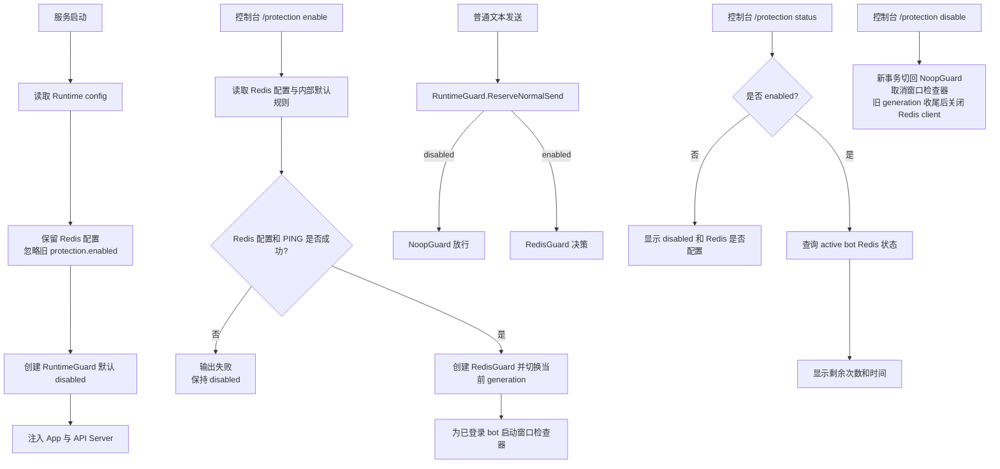

# console-protection-control design

## 0. 术语约定

- 运行期保护开关：运行中的 service 内存状态，控制普通文本发送是否经过 Redis 保护 guard。grep 结论：当前只有 `runtimeconfig.ProtectionConfig.Enabled`，没有运行期可切换状态。
- Redis 配置：TOML 中保留的 `redis.url`、`redis.password`、`redis.key_prefix`。grep 结论：当前和 `[protection].enabled` 组合决定启动时是否连接 Redis。
- 保护状态：针对当前 bot 查询到的保护模式状态，包含是否启用、是否冻结、剩余下发次数、主动对话窗口剩余时间、冻结原因和 Redis 错误。grep 结论：当前 `protection.Guard` 只有决策/写入接口，没有只读状态接口。
- 保护控制台命令：新增 `/protection enable`、`/protection disable`、`/protection status`。grep 结论：当前控制台命令都是 `/login`、`/bots`、`/bot`、`/del`、`/exit`、`/quit` 这类 slash command；`status` 已在 Linux deploy script 中表示 systemd 状态，为避免冲突，本 feature 将 status 收进 `/protection` 子命令。
- 受保护发送事务：一次 `ReserveNormalSend -> iLink SendMessage -> ReleaseNormalSend/RecordReminderSend` 的完整生命周期。运行期 disable 只能阻止新事务，不能把已开始事务的后半段切换成 no-op。

## 1. 决策与约束

需求摘要：发送保护的开启与否不再由 Runtime config 的 `[protection].enabled` 决定。配置文件只保留 Redis 连接配置；服务启动后保护默认关闭，用户进入控制台执行 `/protection enable` 时才读取 Redis 配置、连接 Redis 并启用保护。控制台新增 `/protection status`，显示当前 active bot 离触发次数限制和 24h 主动对话时间限制还剩多少。

成功标准：
- 新生成的默认 Runtime config、部署脚本默认配置和用户文档不再包含 `[protection]` section；只保留 `[redis]` section。
- 服务启动不因为 Redis 未配置、Redis 不可用或旧 `[protection].enabled=true` 自动启用保护；保护开关由控制台命令控制。
- 执行 `/protection enable` 时，程序使用已加载 Runtime config 中的 Redis 配置创建 Redis guard；Redis URL 缺失、格式非法、认证失败或连接失败时命令失败，服务保持保护关闭。
- 执行 `/protection disable` 后，普通文本发送恢复 no-op guard 行为，后台保护窗口检查器停止，Redis client 被关闭。
- `/protection status` 在 active bot 上显示：保护是否开启、是否冻结、冻结原因、距离次数提醒还剩多少条、距离时间提醒还剩多久、主动对话窗口剩余时间；保护关闭或 Redis 状态不可读时也给出明确输出。
- HTTP API 和控制台普通文本发送继续共享同一个保护决策，不能出现控制台已启用但 API 仍绕过的路径。
- 旧配置中残留 `[protection]` section 时，服务仍能启动；其中 `enabled` 和规则字段不再作为开启来源，提示用户改用控制台命令。

明确不做：
- 不新增 HTTP 管理接口控制保护开关；本 feature 只做本地控制台命令。
- 不把开启状态写回 TOML、auth store 或 Redis；服务重启后保护默认关闭，需要用户重新执行 `/protection enable`。
- 不从控制台修改 Redis URL、Redis password 或 key prefix；这些仍来自 Runtime config。
- 不恢复或新增可配置的保护规则字段；`message_limit=10`、`message_warning_remaining=1`、`active_window=24h`、`time_warning_before=30m`、`time_check_interval=1m`、`reminder_text` 使用代码默认值。
- 不改变已有 `/bots/{botID}/messages`、`/bots/{botID}/typing` 的路径、鉴权方式或请求结构。
- 不在 status 输出、日志或错误中展示 `redis.password`、Redis URL password、`BotToken`、`APIToken`、`ContextToken` 或完整消息正文。

复杂度档位：沿用保护模式已有复杂度偏离，新增偏离为 State = runtime mutable（原因：保护 guard 从启动期固定值变为运行期可切换），Concurrency = shared in-process（原因：API handler、控制台会话、监听协程和后台检查器会同时读取保护控制器），Compatibility = migration-aware（原因：现有安装脚本和用户配置已经可能带 `[protection]` section，升级不能直接导致服务启动失败）。

关键决策：
- 运行期保护控制器实现 `protection.Guard`，并提供一次操作级别的 guard generation。新事务按 enabled 状态绑定 `NoopGuard` 或当前 `RedisGuard`；已开始事务继续使用同一 generation 收尾。理由：`api.Server` 已在启动时接收 guard，给它一个可动态委托的 guard 可以让 API 和控制台同步生效，不需要重建 HTTP server，同时避免 disable 打断 Redis 预留/释放/记录协议。
- `/protection enable` 是唯一启用入口。它读取启动时已经解析出的 Redis 配置和内部保护默认规则，创建 go-redis client、执行 `PING`，成功后原子切换为新的 Redis guard generation。
- `/protection disable` 让新事务走 `NoopGuard`，取消保护窗口检查器，并把当前 Redis generation 标记为 retired；该 Redis client 在已开始事务收尾后关闭。已存在 Redis 中的 per-bot 保护状态不删除；下次启用会继续读 Redis 状态。理由：删除状态会丢失保护依据，保留状态更符合 fail closed 的保护语义；延迟关闭可以避免污染 `out_count`、`reminder_pending` 和 `frozen`。
- 启用状态不持久化。理由：用户明确要求开启与否从配置文件拿掉；写进 auth store 或 Redis 都会引入新的隐式 source of truth，且 auth store 不应保存启动/运行控制项。
- 旧 `[protection]` section 进入兼容解析但不作为用户配置面。默认配置、文档和部署脚本移除该 section；加载旧配置时允许旧 key 被解析并忽略，日志提示“use /protection enable”。理由：现有部署脚本已经写入 `[protection]`，严格拒绝会破坏已安装用户。
- 保护规则收敛为内部默认值，放在保护模块或 runtime control 的默认配置中。理由：用户要求配置文件只留 Redis 配置；这次不继续维护规则字段作为 TOML 契约。
- status 查询不让 console 直接读 Redis key。新增只读接口由保护模块返回结构化 `Status`，console 只做格式化输出。理由：Redis key 和 Hash 字段是保护模块内部协议，暴露给 console 会让命令层耦合存储细节。
- status 针对当前 active bot。没有 active bot 时返回“请选择 bot”；保护关闭时不要求选择 bot也能显示整体开关状态，但无法显示 per-bot 剩余额度。
- 启用后对已登录 bot 启动保护窗口检查器；禁用时停止这些检查器。检查器需要可取消，不能像当前 `monitorProtectionWindow` 一样只在 bot 删除时退出。

假设：
- 用户说“status 子命令”指保护命令下的 `/protection status`，不是新增全局 `/status`。这样可以避免和部署脚本/systemd 的 `status` 语义冲突。
- 本次移除 TOML 中所有 `[protection]` 用户可调字段，而不仅是 `enabled`。如果仍需要调阈值/提醒文案，应另起需求讨论是否保留规则配置。

配置契约变化：

```toml
[redis]
url = "redis://localhost:6379/0"
password = ""
key_prefix = "webot-msg"
```

旧配置兼容：

```toml
[protection]
enabled = true
message_limit = 10
```

加载结果：服务不因该 section 启动失败，但 `enabled` 不会自动开启保护；规则字段不再作为用户配置契约。

控制台示例：

```text
输入：/protection enable
输出：Protection enabled. Redis key prefix: webot-msg

输入：/protection status
输出：Protection enabled for bot bot-1
      frozen: no
      messages before reminder: 3
      active window remaining: 8h12m
      time before warning: 7h42m

输入：/protection disable
输出：Protection disabled.
```

## 2. 名词与编排

### 2.1 名词层

现状：
- `runtimeconfig.Config` 包含 `Protection ProtectionConfig` 和 `Redis RedisConfig`，`resolveProtection` 会在 `Protection.Enabled=true` 时要求 `redis.url` 非空并校验 Redis URL。
- `cmd/webot-msg/main.go` 在启动时调用 `buildProtectionGuard`，根据 `Protection.Enabled` 返回 `NoopGuard` 或 `RedisGuard`；之后 guard 固定注入 `app.App` 和 `api.Server`。
- `app.App` 保存 `guard protection.Guard`、`protectionEnabled bool`、`reminderText`、`timeCheckInterval`，并在 `startMonitor` 时按 `protectionEnabled` 决定是否启动保护窗口检查器。
- `console.Controller` 只有 bot 管理和 `SendText` 方法，没有保护控制或状态查询能力。
- `protection.RedisGuard` 能原子预留发送、释放、记录提醒、记录主动对话和检查时间窗口，但没有读取状态并计算剩余额度的接口。

变化：
- Runtime config 的用户配置面移除 `[protection]`，只保留 `RedisConfig`。内部新增或保留非 TOML 的保护默认规则值，供运行期启用时使用。
- Runtime config 加载兼容旧 `[protection]` section：可以 decode 旧字段避免未知 key 失败，但 `Resolve` 不再因为旧 `enabled=true` 要求 Redis 可连，也不再把旧规则字段作为最终配置。
- 新增运行期保护控制器，建议契约如下：

```go
type RuntimeGuard struct {
    // 内部持有 NoopGuard 或 RedisGuard，并管理 Redis client 生命周期。
}

func (g *RuntimeGuard) Enable(ctx context.Context, cfg EnableConfig) error
func (g *RuntimeGuard) Disable() error
func (g *RuntimeGuard) BeginOperation() Operation
func (g *RuntimeGuard) RuntimeStatus(ctx context.Context, botID string) (Status, error)
```

- `EnableConfig` 由启动时解析出的 Redis 配置 + 内部保护默认规则组成，至少包含 `RedisURL`、`RedisPassword`、`KeyPrefix`、`MessageLimit`、`MessageWarningRemaining`、`ActiveWindow`、`TimeWarningBefore`、`TimeCheckInterval`、`ReminderText`。
- `Status` 是保护模块对 console 的只读值对象：

```go
type Status struct {
    Enabled bool
    RedisConfigured bool
    BotID string
    ActiveWindowReady bool
    Frozen bool
    Reason string
    OutCount int
    MessageLimit int
    WarningThreshold int
    MessagesBeforeReminder int
    ActiveWindowRemaining time.Duration
    TimeBeforeWarning time.Duration
    ReminderPending bool
}
```

- `protection.Guard` 可以保持发送决策方法不变；status 查询作为额外接口暴露，避免发送路径强制依赖 status。
- `console.Controller` 新增保护命令所需方法，例如 `EnableProtection(out io.Writer) error`、`DisableProtection(out io.Writer) error`、`PrintProtectionStatus(activeBotID string, out io.Writer)`；具体签名可由实现阶段按现有 console 风格收紧。

### 2.2 编排层



现状：
- 保护开关在启动期定型：`protection.enabled=false` 时不创建 Redis guard；`true` 时启动失败或创建 Redis guard。
- API server 和控制台发送入口共享启动时注入的 guard，但 guard 本身不可切换。
- 保护窗口检查器只在 `startMonitor` 时根据布尔值启动；启动后没有 disable 取消路径。

变化：
- `main` 不再按 `protection.enabled` 构造最终 guard，而是构造默认 disabled 的运行期控制器，并把 Redis 配置和内部默认规则注入 `App`。
- `/protection enable` 由 `App` 调用运行期控制器；成功后启动所有当前 bot 的窗口检查器。后续 `/login` 新增 bot 时，如果保护处于 enabled，也要为新 bot 启动检查器。
- `/protection disable` 取消所有运行中的保护检查器，并让后续 API 和控制台发送路径自动走 `NoopGuard`；已经开始的保护发送事务继续持有原 Redis generation，直到 release/record 完成后再释放 Redis client。
- `/protection status` 先判断运行期保护是否 enabled；disabled 时显示整体状态，不读 Redis；enabled 时按 active bot 调用只读 status 查询。
- `RedisGuard` 新增只读查询逻辑：读取 state Hash 与 active key PTTL，计算 `MessagesBeforeReminder = max(0, threshold - out_count)`，计算 `TimeBeforeWarning = max(0, active_ttl - time_warning_before)`。active key 缺失时返回 `ActiveWindowReady=false`。

流程级约束：
- 错误语义：`/protection enable` 失败不改变当前 enabled 状态；如果当前已 enabled 且再次 enable 失败，应保留旧 guard 还是先关闭需要实现阶段明确，设计倾向保留旧 guard，避免一次错误配置导致保护突然关闭。
- 并发约束：enabled 状态、guard generation 和 Redis client 替换必须受锁保护；发送路径读 generation 时不能看到半初始化 guard；disable 不能在正在发送时关闭其正在使用的 client，也不能让同一次保护发送事务的 release/record 落到 no-op。
- 幂等性：重复 `/protection enable` 在 Redis 配置不变且 PING 成功时返回已启用或刷新连接均可，但不能重复启动同一个 bot 的多个检查器；重复 `/protection disable` 应返回已关闭。
- 兼容性：旧 `[protection]` section 不再出现在新模板中，但残留旧配置不应导致启动失败；旧 `enabled=true` 不自动开启。
- 可观测性：enable/disable/status 输出可以显示 Redis key prefix 和 botID，但不能显示 password 或完整带密码 URL。
- 卸载性：删除运行期控制器挂载、console `/protection` 分支、Redis status 查询和文档模板变化后，系统回到当前启动期保护模式；该 feature 的可见行为集中在控制台和 Runtime config 配置面。

### 2.3 挂载点清单

- Runtime config 用户配置面：移除新模板和文档中的 `[protection]`，保留 `[redis]`。
- 控制台命令：新增 `/protection enable|disable|status`。
- 保护 guard 注入点：`main` / `app` / `api` 改为共享运行期可切换 guard。
- 每个 bot 的保护窗口检查器：从启动期布尔控制改为运行期 enable/disable 可启动、可取消。
- RedisGuard 只读状态查询：新增 status 查询入口供 console 格式化输出。

### 2.4 推进策略

1. 配置契约收缩：让 Runtime config 新模板和文档只暴露 `[redis]`，同时兼容旧 `[protection]` section 不导致启动失败。
   退出信号：旧配置带 `[protection] enabled=true` 仍能启动解析，但保护默认 disabled；新默认配置不含 `[protection]`。
2. 运行期控制器骨架：新增默认 disabled 的可切换 guard，并让 API 与控制台发送路径都通过它。
   退出信号：保护 disabled 时现有发送测试仍通过；enable 前不会连接 Redis。
3. 控制台命令接入：实现 `/protection enable` 与 `/protection disable`，处理 Redis 配置读取、连接、PING、关闭和重复调用。
   退出信号：Redis 可用时 enable 成功并影响 API/控制台发送；Redis 不可用时命令失败且发送仍走 disabled 行为。
4. 检查器生命周期：把保护窗口检查器改为 enable 后为已有 bot 启动、login 后按当前 enabled 状态启动、disable 后取消。
   退出信号：disable 后不会继续发送保护提醒；重复 enable 不会创建重复检查器。
5. 状态查询：新增 Redis 只读状态计算和 `/protection status` 展示。
   退出信号：active bot 正常、冻结、缺 active window、Redis 不可用、保护关闭五类状态都有明确输出。
6. 文档与验收覆盖：更新 runtime config、Linux deploy 文档和 CodeStable 架构/需求说明。
   退出信号：`go test ./...` 通过，用户文档不再要求编辑 `[protection].enabled`。

### 2.5 结构健康度与微重构

##### 评估

- 文件级 — `internal/app/app.go`：440 行，已承担启动编排、控制台控制、发送、监听、消息广播和保护检查器生命周期；本次如果继续直接加 enable/disable/status 细节，会进一步混合运行期控制和业务编排。
- 文件级 — `internal/protection/redis_guard.go`：248 行，职责是 Redis 保护状态机；新增只读 status 查询属于同一状态协议，但应避免把 console 输出格式写入该文件。
- 文件级 — `internal/console/console.go`：128 行，职责是命令解析和交互输出；新增 `/protection` 分支属于现有职责延伸，但不应承载 Redis 连接或状态计算。
- 文件级 — `internal/runtimeconfig/config.go`：460 行，职责是 TOML 默认值、解析、校验和存储准备；本次应删除/兼容 `[protection]` 用户配置面，但不应把运行期开关逻辑放入该文件。
- 目录级 — `internal/protection`：当前已有 guard、Redis guard 和测试；新增运行期控制器/status 文件属于保护模块职责，不造成目录摊平。
- compound convention 检索：`.codestable/compound` 当前没有可用 convention 文档。

##### 结论：不做前置微重构

原因：本次能通过新增职责明确的保护运行期控制文件和 Redis status 查询文件承载新逻辑，现有文件只做挂接，不需要先进行“只搬不改行为”的拆文件。实现阶段应避免把 Redis enable/status 逻辑直接堆进 `console.go` 或 `app.go`。

##### 超出范围的观察

- `internal/app.App` 继续增长后可能需要把 control console 适配、monitor 生命周期和保护生命周期拆成独立协作者；这会改变模块组织，建议在后续专门走 `cs-refactor`，不阻塞本 feature。

## 3. 验收契约

关键场景清单：
- 输入：新生成默认 Runtime config 或 Linux deploy 默认配置 → 期望：不包含 `[protection]` section，只包含 `[redis]` section。
- 输入：旧 Runtime config 含 `[protection] enabled = true` 且 Redis 可用，直接启动服务 → 期望：服务启动成功但保护仍为 disabled；不会自动连接 Redis 或启动检查器。
- 输入：旧 Runtime config 含 `[protection]` 规则字段 → 期望：服务启动成功；规则字段不作为用户配置契约影响保护默认规则。
- 输入：Redis 未配置，控制台执行 `/protection enable` → 期望：输出 `redis.url` 相关错误，保护保持 disabled。
- 输入：Redis URL 格式非法或 password 冲突，控制台执行 `/protection enable` → 期望：输出字段级错误且不泄露 password，保护保持 disabled。
- 输入：Redis 配置正确且可连接，控制台执行 `/protection enable` → 期望：输出启用成功；API 和控制台普通文本发送开始经过 Redis guard。
- 输入：保护 enabled 后已有 bot 处于 active window 且 out_count=8 → 期望：`/protection status` 显示还剩 1 条到次数提醒，并显示 active window 剩余时间。
- 输入：保护 enabled 后 active key 缺失 → 期望：`/protection status` 显示尚无主动对话窗口，需要从微信 App 主动发消息初始化；普通文本发送仍按保护逻辑拒绝。
- 输入：保护 enabled 且 frozen=1 reason=count → 期望：`/protection status` 显示 frozen、reason=count，并提示需要微信 App 主动消息解除。
- 输入：保护 enabled 但 Redis 临时不可用，执行 `/protection status` → 期望：输出 Redis 状态读取失败；不发送用户文本，不泄露敏感配置。
- 输入：保护 enabled 后执行 `/protection disable` → 期望：输出关闭成功；后续普通文本发送不再经过 Redis guard；后台保护窗口检查器停止。
- 输入：保护 enabled 后普通发送已经完成 Redis 预留、但 iLink 发送失败前后并发执行 `/protection disable` → 期望：该发送仍使用原 Redis generation 执行 release，`out_count`、`frozen`、`reminder_pending` 不被污染。
- 输入：保护 enabled 后普通发送触发提醒、提醒真实发送成功前后并发执行 `/protection disable` → 期望：该提醒仍使用原 Redis generation 执行 record，Redis 状态和真实下发一致。
- 输入：重复执行 `/protection disable` → 期望：输出已关闭或关闭成功，不报错。
- 输入：重复执行 `/protection enable` → 期望：不会为同一个 bot 创建重复窗口检查器；最终保护仍 enabled。
- 输入：无 active bot 时执行 `/protection status` → 期望：能显示整体 enabled/disabled；若需要 per-bot 状态则提示先选择 bot。
- 输入：控制台输入未知 `/protection xxx` → 期望：输出可用子命令，不把它当普通文本发送。
- 输入：HTTP `/bots/{botID}/typing` 在保护 enabled 或 disabled 时调用 → 期望：仍不计入保护状态，也不受冻结影响。

明确不做的反向核对项：
- 新默认配置、部署脚本默认配置和用户文档不应再要求用户编辑 `protection.enabled`。
- 代码不应把 protection enabled 状态写入 TOML、auth store 或 Redis。
- 控制台 status 不应直接拼 Redis key 读写逻辑；Redis 状态读取应留在保护模块。
- HTTP API 不应新增保护管理 endpoint。
- 日志和 status 输出不应包含 Redis password、BotToken、APIToken、ContextToken 或完整消息正文。

## 4. 与项目级架构文档的关系

本 feature 完成后，acceptance 阶段需要更新 `.codestable/architecture/ARCHITECTURE.md`：
- 术语中“保护模式”从“默认关闭的发送保护开关”调整为“服务启动后默认关闭、由本地控制台运行期启停的发送保护能力”。
- `internal/runtimeconfig` 描述需要改为“保留 Redis 配置，不保存保护开启状态；旧 `[protection]` 只作兼容解析”。
- `internal/app` 描述需要补充运行期保护控制器、enable/disable 检查器生命周期和 `/protection status`。
- 数据与状态需要明确：保护开关是进程内运行期状态，不持久化；Redis 仍只保存 per-bot 保护计数和主动对话窗口。
- 已知约束需要补充：服务重启后保护默认关闭；启用失败不会静默放行为 enabled；用户必须通过控制台开启。

需求文档 `.codestable/requirements/bot-message-bridge.md` 和用户文档需要同步：
- “通过 TOML 开启保护模式”改为“通过控制台开启保护模式，TOML 只保存 Redis 连接配置”。
- Linux systemd deploy 文档中升级说明不再要求编辑 `[protection].enabled`，而是进入 `webot-msg console` 后执行 `/protection enable`。
