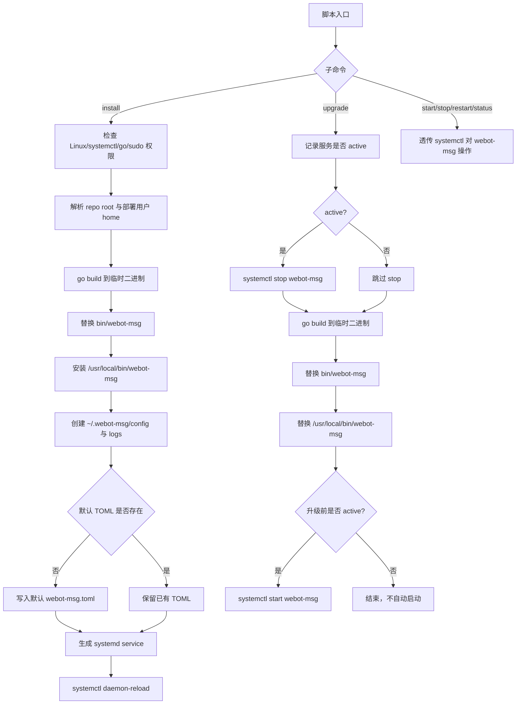

# linux-systemd-deploy design

## 0. 术语约定

- Linux deploy script：仓库内提供的 Linux 部署脚本，面向从源码目录执行的安装和升级，不是发行版包管理器。grep 结论：当前仓库没有 `scripts/` 目录，也没有部署脚本。
- Install：首次安装动作，先用 Go 编译 `cmd/webot-msg` 到仓库 `bin/`，再安装到 `/usr/local/bin/webot-msg`，并准备 `~/.webot-msg/` 运行目录、默认 Runtime config 和 `systemd` service。
- Upgrade：升级动作，先判断 `systemd` 中是否有运行中的 `webot-msg` 实例；运行中则 stop，编译新二进制并替换系统 PATH 中的安装文件，之后只在原本运行时重新 start。
- Runtime config：现有 TOML 启动配置，默认语义由 `internal/runtimeconfig` 和用户文档共同定义；部署脚本只生成默认配置文件，不新增配置 key。
- Service unit：`systemd` service 文件，使用 `ExecStart=/usr/local/bin/webot-msg` 启动 `webot-msg`。程序默认读取部署用户的 `~/.webot-msg/config/webot-msg.toml`，不依赖 `systemd` 展开 `~`。

## 1. 决策与约束

需求摘要：给当前项目添加 Linux 环境编译部署脚本，提供安装和升级两个核心命令。安装时编译二进制到 `bin/`，再安装到 `/usr/local/bin/webot-msg`，创建 `~/.webot-msg/` 及 `config/`、`logs/` 等二级目录，把默认配置文件放到对应位置，并生成 `systemd` service；升级时用 `systemd` 检查服务是否正在运行，运行中先 stop，编译最新二进制并替换系统 PATH 中的安装文件，替换后只在原本运行时 start。

成功标准：
- 执行安装命令后，仓库 `bin/webot-msg` 和 `/usr/local/bin/webot-msg` 都存在并来自当前源码。
- 安装会创建部署用户 home 下的 `~/.webot-msg/config/` 与 `~/.webot-msg/logs/`；默认配置文件位于 `~/.webot-msg/config/webot-msg.toml`。
- 默认配置文件内容与现有 Runtime config 契约一致：端口 `26322`、auth store `~/.webot-msg/config/auth.json`、iLink BaseURL `https://ilinkai.weixin.qq.com`、日志文件 `~/.webot-msg/logs/webot-msg.log`、日志大小 `100MB`。
- 安装会生成名为 `webot-msg.service` 的 `systemd` service，`ExecStart` 使用 `/usr/local/bin/webot-msg`。
- 服务可通过 `systemctl start|stop|restart|status webot-msg` 操作；脚本可以提供同名透传命令以降低使用成本。
- 升级时如果服务原本处于 `active` 状态，替换二进制前必须 stop，替换后必须 start；如果服务原本未运行，只替换二进制，不主动 start。

明确不做：
- 不引入 `.deb`、RPM、Homebrew、Docker、Ansible 等额外发布体系。
- 不改变 Go 程序的 CLI 参数、Runtime config schema、HTTP API 或登录/监听业务流程。
- 不把 bot token、API token、context token 或消息内容写入部署脚本输出、service 文件或默认 TOML。
- 不迁移、覆盖或删除已有 `~/.webot-msg/config/auth.json`。
- 不在脚本里实现多实例管理；默认只管理一个 `webot-msg.service`。
- 不实现开机自启策略开关以外的复杂运维能力，如健康检查、日志归档、备份、回滚和远程部署。

复杂度档位：脚本属于项目内部运维工具，但会写入 `systemd` 并替换运行中二进制，不能按一次性脚本的 L1 处理。偏离项为 Robustness = L2/L3 之间（原因：需要明确处理缺少 `go`、缺少 `systemctl`、编译失败、权限不足、服务 stop/start 失败等预期错误），Security = validated（原因：service 文件和 shell 命令不能引入命令注入或错误用户 home），Idempotency = idempotent（原因：install 可重复执行，不应破坏已有配置和登录态），Compatibility = Linux/systemd-only（原因：用户目标明确是 Linux systemd）。

关键决策：
- 部署脚本落在仓库脚本目录中，由 Bash 实现。理由：目标是 Linux 编译部署，依赖 `go` 与 `systemctl`，Bash 足够表达且不引入新的运行时。
- 二进制先保留在仓库 `bin/webot-msg`，再安装到 `/usr/local/bin/webot-msg`。理由：保留本地构建产物，同时让部署后 `which webot-msg`、`webot-msg console` 和 systemd `ExecStart` 使用稳定的系统 PATH 路径。
- 默认配置文件使用 `~/.webot-msg/config/webot-msg.toml` 这个用户可见路径，但 service 文件写入安装时解析出的绝对路径。理由：保留现有文档语义，同时避开 `systemd` 不展开 `~` 的问题。
- 安装生成的是 system service，脚本用 `sudo` 写入 `/etc/systemd/system/webot-msg.service` 并执行 `daemon-reload`。service 内通过 `User=` / `Group=` 指定部署用户运行程序，而不是让服务默认以 root 跑。
- 部署用户默认取执行脚本的当前用户；如果用户通过 `sudo` 执行脚本，则优先取 `SUDO_USER` 作为部署用户。对应 home 目录必须能解析成功，否则安装失败。
- 默认配置文件只在不存在时创建；已存在时不覆盖。理由：Runtime config 是用户可编辑配置，重复安装不能重置用户端口、日志路径或自定义 iLink 地址。
- `~/.webot-msg/config/` 按凭据相邻目录处理，创建时使用 owner-only 权限；`logs/` 可常规 owner 可写。脚本不读取或打印 auth store 内容。
- 升级前使用 `systemctl is-active --quiet webot-msg` 判断“有没有运行的实例”。只有 active 才认为需要停后再启；inactive、failed、unknown 都不触发升级后的自动 start。
- 二进制替换采用先编译到临时文件、成功后原子移动到 `bin/webot-msg`，再通过临时安装文件替换 `/usr/local/bin/webot-msg` 的策略，避免编译失败时破坏旧二进制。

假设：
- 部署目标是支持 `systemd` 的 Linux 发行版，且执行者可以通过 `sudo` 写 `/etc/systemd/system/` 和调用 `systemctl`。
- service 名固定为 `webot-msg.service`，暂不支持通过参数改名。
- 安装完成后是否立即 start 不在用户原话中明确；倾向：install 只生成并 reload service，不自动启动，用户用 `systemctl start webot-msg` 或脚本透传命令启动。这样不会在未扫码/未确认配置时自动进入登录流程。

## 2. 名词与编排

### 2.1 名词层

现状：
- `cmd/webot-msg/main.go` 已支持 `-c` 指定 TOML 配置，并把解析后的 auth path、iLink BaseURL、日志路径和端口传入应用。代码锚点：`cmd/webot-msg/main.go:13`、`cmd/webot-msg/main.go:17`、`cmd/webot-msg/main.go:41`。
- `internal/runtimeconfig/config.go` 定义默认路径和默认值：`~/.webot-msg/config/auth.json`、`~/.webot-msg/logs/webot-msg.log`、端口 `26322`、日志大小 `100MB`。代码锚点：`internal/runtimeconfig/config.go:16`、`internal/runtimeconfig/config.go:51`。
- 用户文档已经给出默认 TOML 示例和构建后启动方式 `./bin/webot-msg -c ~/.webot-msg/config/webot-msg.toml`。代码锚点：`docs/user/runtime-config.md:33`、`docs/user/runtime-config.md:58`。
- `.gitignore` 忽略 `/bin/` 和 `/config/auth.json`，说明本地构建产物和旧凭据不进入 Git；当前未忽略 `~/.webot-msg/`，因为它在用户 home 下不属于仓库。

变化：
- 新增 Linux deploy script，对外暴露安装、升级两个核心命令，并可附带 `start`、`stop`、`restart`、`status` 作为 `systemctl` 透传命令。
- 新增默认 Runtime config 模板来源，内容与 `docs/user/runtime-config.md` 保持一致；安装时将模板写入部署用户的 `~/.webot-msg/config/webot-msg.toml`，但不覆盖已存在文件。
- 新增 service unit 生成规则，包含 `Description`、`WorkingDirectory`、`ExecStart`、`Restart`、`User`、`Group` 等最小字段。`ExecStart` 示例：

```ini
ExecStart=/usr/local/bin/webot-msg
```

- 新增部署路径值对象或脚本变量：repo root、build binary path、installed binary path、deploy user、deploy home、config path、log dir、service path。所有进入 service 文件的路径都必须是绝对路径。
- 新增升级状态记录：在 stop 之前记录 `was_active=true|false`，替换完成后只根据该值决定是否 start。

接口示例：

```bash
# 安装
./scripts/linux-service.sh install

# 升级
./scripts/linux-service.sh upgrade

# 服务控制，等价于 systemctl start/stop/restart/status webot-msg
./scripts/linux-service.sh start
./scripts/linux-service.sh stop
./scripts/linux-service.sh restart
./scripts/linux-service.sh status
```

### 2.2 编排层



现状：
- 构建命令由文档约定为 `go build -o bin/webot-msg ./cmd/webot-msg`，但仓库没有自动化脚本。
- 运行配置能力已经存在，但默认 TOML 需要用户手写。
- 项目没有 service 管理入口，用户需要手动拼 `systemd` unit。

变化：
- Install 流程把“构建二进制、准备运行目录、写默认配置、安装 service unit”串成一个可重复执行的编排。
- Upgrade 流程把“判断运行状态、按需停止、编译替换、按需恢复运行”串成一个不改变原运行意图的编排。
- `start/stop/restart/status` 不改变项目业务，只作为 `systemctl` 操作入口；真实 service 能力仍来自生成的 unit。

流程级约束：
- 错误语义：缺少 `go`、缺少 `systemctl`、无法解析部署用户 home、编译失败、`sudo` 不可用、写 service 失败、`daemon-reload` 失败、stop/start 失败时脚本必须非零退出，并输出明确阶段。
- 幂等性：重复 install 不覆盖已有 `webot-msg.toml`，不删除 auth store；service unit 可以按当前仓库路径重写并 `daemon-reload`。
- 顺序：upgrade 必须先记录 active 状态，再 stop；编译成功前不能删除旧二进制；start 只发生在升级前 active 的场景。
- 权限：脚本自身不要求全程 root；写 systemd unit、安装 `/usr/local/bin/webot-msg` 和执行 systemctl 时通过 `sudo`。仓库 `bin/webot-msg` 和 `~/.webot-msg/` 归部署用户所有，系统 PATH 中的安装文件归 root 所有。
- 可观测性：每个阶段输出短日志，例如 build、create dirs、write config、write service、daemon-reload、stop/start；输出不包含凭据。

### 2.3 挂载点清单

- 脚本入口：Linux deploy script 的 `install` / `upgrade` / `start` / `stop` / `restart` / `status` 子命令。
- 默认配置文件：`~/.webot-msg/config/webot-msg.toml`，由 service 进程按默认路径读取。
- systemd service：`/etc/systemd/system/webot-msg.service`，用于 `systemctl` 管理进程。
- 构建产物：仓库 `bin/webot-msg`，用于保留本地构建输出。
- 系统命令：`/usr/local/bin/webot-msg`，service 的 `ExecStart` 直接引用它，部署后用户也可直接执行 `webot-msg console`。
- 用户文档：补充 Linux 安装、升级和 service 控制示例，避免只知道手写 TOML 的用户不知道新脚本入口。

### 2.4 推进策略

1. 编排骨架：新增脚本入口和子命令分发，先实现 help、依赖检查和部署路径解析。
   退出信号：在非 Linux/systemd 或缺少依赖时能明确失败；在 Linux 上能打印将使用的 repo root、deploy home、binary path 和 config path。
2. 构建与替换节点：实现 `go build` 到临时二进制，再替换 `bin/webot-msg` 并安装 `/usr/local/bin/webot-msg`。
   退出信号：install/upgrade 都能生成可执行的 `bin/webot-msg` 和系统命令 `webot-msg`；编译失败时旧二进制不被破坏。
3. 安装节点：创建 `~/.webot-msg/config/`、`~/.webot-msg/logs/`，写入默认 TOML，生成并 reload service。
   退出信号：重复 install 不覆盖已有 TOML；service 文件 `ExecStart` 使用 `/usr/local/bin/webot-msg`。
4. 升级节点：接入 `systemctl is-active`、按需 stop、替换二进制、按需 start。
   退出信号：服务 active 时升级后恢复 active；服务 inactive 时升级后不自动 start。
5. 服务控制与文档收尾：补齐 start/stop/restart/status 透传和用户文档。
   退出信号：用户可以用脚本或 `systemctl` 执行四类 service 操作，文档说明安装不覆盖已有配置和 auth store。

### 2.5 结构健康度与微重构

##### 评估

- 文件级 — `cmd/webot-msg/main.go`：73 行，职责是 CLI 入口和 Runtime config 编排；本 feature 不需要修改 Go 启动入口。
- 文件级 — `internal/runtimeconfig/config.go`：302 行，职责是 Runtime config 解析、默认值和目录准备；本 feature 应复用其用户可见契约，不应把部署逻辑塞进 Go 包。
- 文件级 — `docs/user/runtime-config.md`：146 行，职责是 Runtime config 用户指南；可以追加 Linux deploy script 链接或新建独立部署指南，避免把部署说明混进配置参考太多。
- 目录级 — 仓库根目录：当前没有 `scripts/` 目录；新增脚本目录不会造成目录摊平。
- 目录级 — `docs/user/`：当前只有 Runtime config 文档；新增部署指南或扩展现有文档都可控。
- compound convention 检索：当前 `.codestable/compound/` 不存在可用 convention 文档。

##### 结论：不做前置微重构

原因：部署脚本可以作为新的仓库脚本入口独立存在，不需要先移动 Go 代码或重组目录。实现阶段应避免为复用默认值去改动 Runtime config 公共 API；默认 TOML 模板可先保持脚本文本与文档一致，后续如模板复用增多再考虑单独抽 `configs/` 示例文件。

##### 超出范围的观察

- 当前 `config.DefaultPath` 仍保留旧 `./config/auth.json` 常量，而 Runtime config 默认值已经迁到 `~/.webot-msg/config/auth.json`。这是兼容历史代码的命名遗留，不影响本 feature；若后续要收敛命名，应走独立重构。
- 如果未来要支持多实例、多用户或发行版包安装，单个 Bash 脚本会不够，应另起 roadmap 或 feature，不在本次安装/升级脚本里扩展。

## 3. 验收契约

关键场景清单：
- 输入：在支持 `systemd` 且安装 Go 的 Linux 上执行 `./scripts/linux-service.sh install` → 期望：`bin/webot-msg` 被编译出来，`/usr/local/bin/webot-msg` 被安装，`~/.webot-msg/config/` 和 `~/.webot-msg/logs/` 存在，`~/.webot-msg/config/webot-msg.toml` 存在。
- 输入：首次 install 后查看 `~/.webot-msg/config/webot-msg.toml` → 期望：包含 `api.port = 26322`、默认 auth path、默认 iLink BaseURL、默认 log path 和 `max_size = "100MB"`。
- 输入：已有 `~/.webot-msg/config/webot-msg.toml` 后再次 install → 期望：配置文件不被覆盖，auth store 不被删除或修改。
- 输入：install 后查看 `/etc/systemd/system/webot-msg.service` → 期望：`ExecStart` 使用 `/usr/local/bin/webot-msg`。
- 输入：执行 `systemctl start webot-msg` / `stop` / `restart` / `status` → 期望：systemd 可以识别该 service 并执行对应动作。
- 输入：执行 `./scripts/linux-service.sh start` / `stop` / `restart` / `status` → 期望：脚本透传到同名 `systemctl` 动作。
- 输入：服务 active 时执行 `./scripts/linux-service.sh upgrade` → 期望：脚本先 stop，编译并替换 `bin/webot-msg` 与 `/usr/local/bin/webot-msg`，然后 start，最终服务恢复 active。
- 输入：服务 inactive 时执行 `./scripts/linux-service.sh upgrade` → 期望：脚本编译并替换 `bin/webot-msg` 与 `/usr/local/bin/webot-msg`，最终不自动 start。
- 输入：`go build` 失败时执行 install 或 upgrade → 期望：脚本非零退出，旧的 `bin/webot-msg` 和 `/usr/local/bin/webot-msg` 不被破坏。
- 输入：缺少 `systemctl`、无法 `sudo`、无法解析部署用户 home 或写 service 失败 → 期望：脚本非零退出并指出失败阶段。

明确不做的反向核对项：
- Go 程序不应新增部署专用 CLI 参数或改变 `-c` / `-port` 语义。
- 默认 TOML 不应包含 token、context token、消息内容或用户真实凭据。
- install 不应覆盖已有 `webot-msg.toml`，也不应删除 `auth.json`。
- upgrade 不应在服务原本未运行时自动 start。
- service 不应以 root 身份默认运行，除非执行脚本的部署用户就是 root。
- 本 feature 不应新增 Dockerfile、包管理器元数据或远程部署逻辑。

## 4. 与项目级架构文档的关系

本 feature 完成后，acceptance 阶段需要更新 `.codestable/architecture/ARCHITECTURE.md`：
- “结构与交互”补充仓库脚本提供 Linux systemd 部署入口，但 Go 应用主流程仍由 `cmd/webot-msg/main.go` 启动。
- “数据与状态”补充默认 Runtime config 可由部署脚本写入 `~/.webot-msg/config/webot-msg.toml`，auth store 仍是 `~/.webot-msg/config/auth.json`。
- “已知约束 / 边界情况”补充 Linux deploy script 只面向 systemd 单实例，不覆盖已有 TOML 或 auth store，升级只恢复原本 active 的服务。
