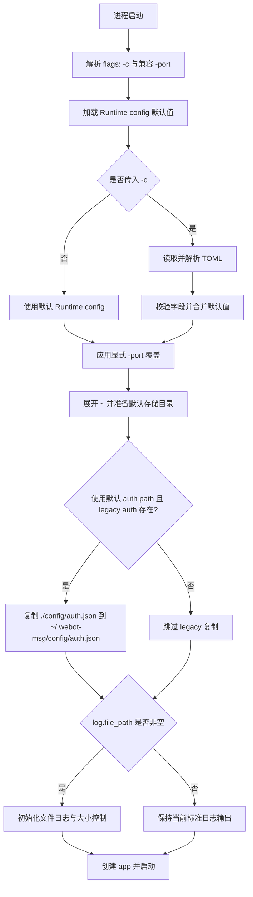

# runtime-toml-config design

## 0. 术语约定

- Runtime config：启动时读取的 TOML 配置文件，控制 API 端口、bot 状态文件路径、iLink BaseURL 和日志文件策略。grep 结论：当前代码没有同名类型，避免与 `config.AppConfig` 混淆。
- Storage base：默认存储根目录，固定为 `~/.webot-msg/`；所有默认存储路径都在该目录下按子目录划分。grep 结论：当前代码没有同名概念，是本 feature 新增的路径约束。
- Auth store：现有 `config/auth.json`，保存 bot token、API token、更新游标和消息上下文；本 feature 后默认迁移为 `~/.webot-msg/config/auth.json`。grep 结论：当前由 `internal/config.Store` 管理，本 feature 不改变其 JSON 数据结构。
- Log file policy：日志文件输出路径与最大大小配置。grep 结论：当前只有标准库 `log.Printf` 和 `fmt.Print*` 输出，没有独立 logger 或日志轮转概念。
- `-c`：新增 CLI flag，指定 Runtime config 文件路径。grep 结论：当前 CLI 只有 `-port`。

## 1. 决策与约束

需求摘要：启动时允许用户通过 `-c ~/.webot-msg/config/webot-msg.toml` 读取 TOML 配置，把当前硬编码或仅 flag 可调的 API 端口、auth store 路径、iLink BaseURL 放入配置文件；同时新增日志文件输出路径和最大大小配置，最大大小支持 `MB` / `GB` 等单位。所有默认存储路径统一落在 `~/.webot-msg/` 下，并按 `config/`、`logs/` 等子目录划分。

成功标准：
- 无 `-c` 启动时，使用内置默认值：API 端口 `26322`、auth store `~/.webot-msg/config/auth.json`、iLink BaseURL `https://ilinkai.weixin.qq.com`、日志文件 `~/.webot-msg/logs/webot-msg.log`。
- 有 `-c` 启动时，TOML 中的配置能覆盖对应默认值；未配置的存储路径仍回落到 `~/.webot-msg/` 下的默认子路径。
- 默认日志文件路径非空，标准日志写入 `~/.webot-msg/logs/webot-msg.log`；文件大小达到配置上限后触发大小控制，不无限增长。
- 配置错误时启动失败，并给出能定位字段的错误信息；未知 TOML key、非 HTTP(S) 的 `ilink.base_url` 都视为配置错误。
- 默认 auth store 目录与所有 auth 文件使用 owner-only 权限，避免默认路径迁移时放宽本地凭据可读性。

明确不做：
- 不改变 auth store 的 JSON schema，不做字段级凭据迁移；仅允许在默认路径变更时把旧 `./config/auth.json` 原样复制到新的默认 `~/.webot-msg/config/auth.json`。
- 不新增环境变量配置入口。
- 不改变 HTTP API endpoint、请求参数、token 校验语义。
- 不把 bot token、API token、context token 或完整消息正文写入日志文件。
- 不做按时间切割、压缩归档、保留天数、远程日志采集等完整日志平台能力。

复杂度档位：走项目内部工具默认档位；偏离项为 Compatibility = backward-compatible（原因：已有 `-port` 和无配置文件启动方式需要继续可用），Security = validated（原因：TOML 路径、日志路径和大小单位都来自外部输入，必须校验后再使用）。

关键决策：
- 新增 Runtime config 独立于 Auth store。理由：auth store 是运行态凭据与游标，不适合混入启动配置；独立 TOML 可以被模板化和提交示例，而 auth store 继续按凭据文件处理。
- 所有默认存储路径统一挂在 `~/.webot-msg/`。默认划分为 `~/.webot-msg/config/auth.json` 保存 bot 状态，`~/.webot-msg/logs/webot-msg.log` 保存标准日志。用户在 TOML 中显式配置的路径可以不在该目录下，但默认值不能再指向项目工作目录。
- 支持 `~` 展开。Runtime config 加载后会把默认路径和用户配置中以 `~` 开头的路径解析到当前用户 home 目录；无法确定 home 目录时启动失败并指向对应字段。
- TOML 采用严格配置模式。任何未被 `api`、`storage`、`ilink`、`log` 结构消费的 key 都会导致启动失败，防止拼写错误静默回落默认值。
- `-c` 为可选参数。未传时不尝试读取默认 TOML 文件，直接使用内置默认值，避免老用户升级后因为缺少配置文件启动失败。
- 保留 `-port`，并作为兼容性覆盖项。若同时提供 `-c` 和显式 `-port`，最终端口使用 `-port`，避免破坏现有脚本。
- 默认 auth store 路径从 `./config/auth.json` 迁到 `~/.webot-msg/config/auth.json` 时，为降低升级成本，若旧文件存在且新文件不存在，启动前原样复制旧文件到新位置；若新文件已存在，不覆盖。
- 默认 auth store 父目录必须使用 owner-only 权限；自定义 auth path 缺失的父目录按 owner-only 创建；auth 文件必须使用 owner-only 权限。legacy copy 的目标文件也是 owner-only，后续 `Store.Save` 不能把文件权限重新放宽。
- `ilink.base_url` 只接受 `http` 或 `https` scheme，并要求包含 host；其他协议在启动期失败。
- 日志配置只覆盖标准日志输出，控制台交互提示、二维码和收到的消息内容继续输出到终端，不进入日志文件，降低泄露聊天内容和凭据的风险。
- `log.max_size` 使用字符串配置，如 `"100MB"` / `"1GB"`，大小单位大小写不敏感；按二进制单位解析：`1KB = 1024B`、`1MB = 1024KB`、`1GB = 1024MB`。

假设：
- 日志文件大小控制采用最小可维护策略：达到上限时切换到新的当前日志文件，旧文件如何命名和保留数量由实现阶段选择低风险方案；本 feature 不把保留数量暴露为配置项。
- TOML 配置样例使用下面结构，字段名一经实现后视为用户可见契约：

```toml
[api]
port = 26322

[storage]
auth_path = "~/.webot-msg/config/auth.json"

[ilink]
base_url = "https://ilinkai.weixin.qq.com"

[log]
file_path = "~/.webot-msg/logs/webot-msg.log"
max_size = "100MB"
```

## 2. 名词与编排

### 2.1 名词层

现状：
- `cmd/webot-msg/main.go` 只定义 `-port`，然后用 `config.DefaultPath` 和 `ilink.DefaultBaseURL` 创建 `app.App`。
- `internal/config/store.go` 的 `DefaultPath` 是 auth store 默认路径，当前为 `./config/auth.json`；`AppConfig` / `UserConfig` 表示持久化 bot 状态，不表示启动配置。
- `internal/ilink/client.go` 的 `DefaultBaseURL` 是 iLink 默认地址。
- 当前没有 `RuntimeConfig`、日志配置结构、大小单位解析值对象。

变化：
- 新增 Runtime config 值对象，表达启动配置，而不是复用 `config.AppConfig`。
- Runtime config 合并默认值与 TOML 文件内容后，生成启动所需的最终值：API port、auth store path、iLink BaseURL、log file path、log max size bytes。默认 auth store path 与默认 log file path 必须位于 `~/.webot-msg/` 下；未知 TOML key 会被拒绝。
- 新增路径展开与目录准备逻辑，对 `~` 开头的路径做 home 展开，并确保 `~/.webot-msg/config/`、`~/.webot-msg/logs/` 等父目录在使用前存在。
- 新增 legacy auth store 兼容逻辑：仅在使用默认 auth path、旧 `./config/auth.json` 存在且新 `~/.webot-msg/config/auth.json` 不存在时，原样复制旧文件。
- 新增 auth store 权限约束：默认 auth 父目录为 owner-only，自定义 auth path 缺失父目录按 owner-only 创建，auth 文件保存和 legacy copy 后都为 owner-only。
- 新增大小值对象或解析函数，把 `"100MB"` / `"1GB"` 解析成字节数；非法单位、非正数、空字符串在需要日志文件时视为配置错误。
- `config.DefaultPath` 可保留为 auth store 默认值，但不再是唯一入口；`ilink.DefaultBaseURL` 同理。

接口示例：

```go
// 来源：cmd/webot-msg/main.go main
// 输入：未传 -c
// 输出：RuntimeConfig 使用默认值；auth store = ~/.webot-msg/config/auth.json，log file = ~/.webot-msg/logs/webot-msg.log

// 来源：cmd/webot-msg/main.go main
// 输入：-c ~/.webot-msg/config/webot-msg.toml
// 输出：读取 TOML，合并默认值，传入 app.New(authPath, baseURL) 与 app.Run(port)

// 来源：Runtime config 路径处理逻辑
// 输入：storage.auth_path = "~/.webot-msg/config/auth.json"
// 输出：展开为当前用户 home 下的绝对路径，父目录不存在时创建

// 来源：Runtime config 解析逻辑
// 输入：log.max_size = "1GB"
// 输出：1073741824 bytes

// 来源：Runtime config 解析逻辑
// 输入：log.max_size = "10XB"
// 输出：启动失败，错误指向 log.max_size
```

### 2.2 编排层



现状：
- 启动流程是线性 pipeline：解析 `-port` → `app.New(config.DefaultPath, ilink.DefaultBaseURL)` → `application.Run(*port)`。
- `app.Run` 内部继续加载 auth store、扫码登录、补 API token、启动监听和 HTTP API。
- 日志输出分散：`log.Printf` 用于错误和后台状态，`fmt.Print*` 用于控制台交互和收到的消息。

变化：
- 在 CLI 入口与 `app.New` 之间插入 Runtime config 加载与校验步骤。
- 端口、auth store path、iLink BaseURL 不再由入口硬编码直接提供，而是来自合并后的 Runtime config。
- 在启动 app 前展开 `~`、准备默认存储目录并初始化日志输出；若路径或日志配置错误，应用不进入登录或监听流程。
- 在使用默认 auth store path 时执行一次 legacy 文件复制，复制不改变 JSON 内容，不覆盖新文件。
- `app.Run` 的主业务编排不变，只接收最终端口与已经由 `app.New` 注入的 auth path / baseURL。

流程级约束：
- 错误语义：`-c` 指向的文件不存在、TOML 解析失败、字段类型错误、端口非法、home 目录无法确定、日志大小非法、默认存储目录无法创建、日志文件无法打开时，启动失败并返回明确错误。
- 配置严格性：TOML 未知 section / key、`ilink.base_url` 非 `http` / `https` scheme 都在启动期失败。
- 兼容性：未传 `-c` 时不要求 TOML 文件存在；显式 `-port` 优先级高于 TOML `api.port`；旧 `./config/auth.json` 仅在新默认 auth store 不存在时复制，不覆盖用户已有新文件。
- 安全性：日志文件不得记录敏感 token 和完整消息正文；控制台原本显示的内容不因文件日志配置而复制到日志文件。
- 凭据权限：默认 auth store 父目录和文件 owner-only；显式自定义 auth path 的新建父目录按 owner-only 创建，已有自定义父目录不被强制 chmod；日志文件不使用 auth store 权限策略。
- 可观测性：启用文件日志后，启动配置摘要只记录非敏感字段，例如 API port、auth path、base URL host 或完整 base URL、log file path、log max size；发生 legacy auth store 复制时记录源路径和目标路径，但不记录文件内容。

### 2.3 挂载点清单

- CLI flags：`-c` — 新增 Runtime config 文件路径入口。
- CLI flags：`-port` — 保留并改为显式覆盖 Runtime config 的兼容入口。
- 默认存储根目录：`~/.webot-msg/` — 新增默认路径约束，内部默认路径按 `config/`、`logs/` 子目录划分。
- TOML 配置 key：`api.port`、`storage.auth_path`、`ilink.base_url`、`log.file_path`、`log.max_size` — 新增用户可见配置契约，其中路径默认值必须位于 `~/.webot-msg/` 下。
- 日志输出初始化点：进程启动后、app 创建前 — 新增文件日志与大小控制挂入点。

### 2.4 推进策略

1. 编排骨架：让 CLI 入口先形成默认 Runtime config，再按现有路径启动 app。
   退出信号：未传 `-c` 时 `go test ./...` 通过，默认端口和 iLink BaseURL 与当前一致，默认存储路径落在 `~/.webot-msg/` 下。
2. TOML 加载与字段合并：接入 `-c` 文件读取，支持部分字段缺省回落默认值。
   退出信号：配置文件只写一个字段时，其余字段仍使用默认值。
3. 校验与单位解析：补齐端口、路径、BaseURL、日志大小的输入校验。
   退出信号：非法 TOML、非法路径展开和非法 `log.max_size` 能返回字段级错误。
4. 存储目录与日志文件策略：准备 `~/.webot-msg/` 子目录，根据 `log.file_path` 初始化标准日志文件输出和大小控制。
   退出信号：默认 auth/log 父目录会自动创建；日志文件路径非空时产生文件，超过上限后不继续无限追加。
5. 兼容性收尾：保留 `-port` 覆盖语义并补齐关键测试。
   退出信号：无 `-c`、有 `-c`、`-c + -port`、legacy auth 复制四类场景都有验证证据。

### 2.5 结构健康度与微重构

##### 评估

- 文件级 — `cmd/webot-msg/main.go`：20 行，职责是 CLI 入口；本次会新增 flag 解析和配置加载编排，如果直接塞入完整 TOML 解析会让入口承担计算职责。
- 文件级 — `internal/config/store.go`：222 行，职责是 auth store；本次不应把 Runtime config 放进该文件，否则会混淆启动配置与运行态凭据。
- 文件级 — `internal/app/app.go`：260 行，职责是应用编排；本次只需要继续接收 auth path / baseURL / port，不应引入配置文件解析。
- 目录级 — `internal/config`：当前 1 个文件；新增 Runtime config 解析文件不会造成目录摊平。
- 目录级 — 新的日志辅助目录或文件：当前没有 `internal/logging`；若实现选择新建目录，目录为空，不存在摊平问题。
- compound convention 检索：`.codestable/compound` 当前没有可用 convention 文档。

##### 结论：不做前置微重构

原因：现有文件规模不大，且可以通过新增 Runtime config 解析文件把计算逻辑从入口中隔离出来，不需要先做“只搬不改行为”的文件拆分。实现阶段应避免把 TOML 解析、大小单位解析和日志 writer 全部堆进 `main.go`。

##### 超出范围的观察

- 当前项目同时使用 `fmt.Print*` 和 `log.Printf` 输出运行信息。统一日志抽象会改变控制台交互与消息输出边界，超出本 feature 的“启动配置 + 标准日志文件策略”范围；建议后续确有需要时走 `cs-refactor` 或单独 feature。

## 3. 验收契约

关键场景清单：
- 输入：不传 `-c`，执行 `go run ./cmd/webot-msg -port 26322` → 期望：使用 `~/.webot-msg/config/auth.json`、`~/.webot-msg/logs/webot-msg.log` 和默认 iLink BaseURL。
- 输入：不传 `-c`，旧 `./config/auth.json` 存在且 `~/.webot-msg/config/auth.json` 不存在 → 期望：启动前把旧文件原样复制到新默认路径。
- 输入：不传 `-c`，旧 `./config/auth.json` 和新 `~/.webot-msg/config/auth.json` 都存在 → 期望：不覆盖新文件。
- 输入：TOML 中 `api.port = 18080`，启动 `-c ~/.webot-msg/config/webot-msg.toml` → 期望：API server 监听 `18080`。
- 输入：TOML 缺省 `storage.auth_path` 与 `log.file_path` → 期望：默认回落到 `~/.webot-msg/config/auth.json` 与 `~/.webot-msg/logs/webot-msg.log`。
- 输入：TOML 中 `storage.auth_path = "~/.webot-msg/config/auth.json"` → 期望：路径展开到当前用户 home 目录，父目录不存在时自动创建。
- 输入：TOML 中 `storage.auth_path = "./tmp/auth.json"` → 期望：auth store 从该路径加载和保存。
- 输入：TOML 中 `ilink.base_url = "https://example.com"` → 期望：iLink client endpoint 使用该 base URL 拼接。
- 输入：TOML 中 `ilink.base_url = "ftp://example.com"` 或 `"file://host"` → 期望：启动失败，错误信息指出 `ilink.base_url`。
- 输入：TOML 中有未知 section 或拼错 key，例如 `[storage] authpath = "..."` → 期望：启动失败，错误信息指出未知 key。
- 输入：TOML 中 `log.file_path = "~/.webot-msg/logs/webot-msg.log"` 且 `log.max_size = "10MB"` → 期望：标准日志写入该文件，文件大小不无限超过配置上限。
- 输入：TOML 中 `log.max_size = "1GB"` → 期望：解析为 1073741824 bytes。
- 输入：TOML 中 `log.max_size = "abc"`、`api.port = -1` 或 `~` 路径无法展开 → 期望：启动失败，错误信息指出具体字段。
- 输入：同时传 `-c` 且 TOML `api.port = 18080`，命令行显式 `-port 19090` → 期望：最终监听 `19090`。

明确不做的反向核对项：
- `config.UserConfig` / auth store JSON 字段不应新增 Runtime config 字段。
- 默认 `storage.auth_path` 与默认 `log.file_path` 不应再指向项目工作目录下的 `./config/` 或 `./logs/`。
- auth store 文件不应以 group/world 可读权限创建或保存。
- HTTP API 路由仍只包含现有 `/bots/{botID}/messages` 与 `/bots/{botID}/typing` 行为，不应新增或改变鉴权方式。
- 代码中不应新增读取环境变量作为配置入口的逻辑。
- 日志文件中不应主动写入 `BotToken`、`APIToken`、`ContextToken` 或完整消息正文。
- TOML 配置不应暴露日志保留天数、压缩归档或远程日志地址。

## 4. 与项目级架构文档的关系

本 feature 完成后，acceptance 阶段需要更新 `.codestable/architecture/ARCHITECTURE.md`：
- `cmd/webot-msg/main.go` 的入口描述从“解析 `-port` 后用默认配置路径和 iLink base URL 创建应用”改为“解析 `-c` / `-port`，加载 Runtime config 后创建应用”。
- “数据与状态”应继续说明 auth store 的 JSON schema 不变，并补充默认 auth store 从 `./config/auth.json` 迁到 `~/.webot-msg/config/auth.json`；Runtime config 是独立 TOML，不保存凭据。
- “已知约束”应补充：默认存储路径统一在 `~/.webot-msg/` 下；未传 `-c` 使用内置默认值；`-port` 作为兼容覆盖项；日志文件配置不得记录敏感 token 或完整消息内容。
