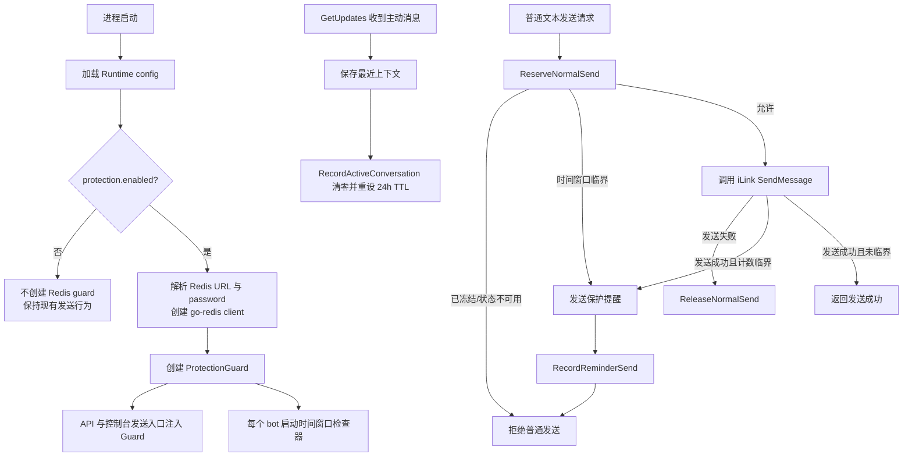

# wechat-send-protection design

## 0. 术语约定

- 保护模式：默认关闭的发送保护开关；开启后，系统在微信侧限制快触发时发送提醒，并在用户从微信 app 主动发消息前拒绝普通文本发送。grep 结论：当前代码没有同名概念。
- 主动对话：用户从微信 app 给机器人发来的消息，表现为 `GetUpdates` 返回带 `from_user_id` 和 `context_token` 的 `WeixinMessage`。grep 结论：现有代码只保存最近消息上下文，没有保存主动对话时间。
- 下发消息：本地工具通过 iLink `/ilink/bot/sendmessage` 发出的文本消息，包含 HTTP API `/bots/{botID}/messages`、控制台普通文本和保护模式提醒消息。grep 结论：当前真实下发统一在 `internal/ilink.Client.SendMessage`。
- 冻结状态：保护模式已经发送或尝试发送提醒后，普通文本发送被拒绝，直到下一次主动对话重置计数与时间窗口。grep 结论：当前无发送冻结状态。
- Redis 保护状态：保护模式使用 Redis 保存的 per-bot 计数、冻结原因、主动对话窗口 TTL 和提醒状态。grep 结论：当前项目没有 Redis 依赖或配置。

## 1. 决策与约束

需求摘要：用户可在 Runtime config 中开启保护模式，并配置 Redis 连接。开启后，系统按 bot 记录最近一次主动对话后的下发次数与 24h 主动对话窗口；当即将达到 10 次下发限制或 24h 限制时，系统主动给当前微信上下文发送提醒，随后冻结普通文本发送。用户从微信 app 主动发来一条消息后，系统解除冻结并重置计数和 24h 窗口。

成功标准：
- 默认配置下保护模式关闭；未配置 Redis 时现有发送行为不变。
- 保护模式开启后，普通文本发送和提醒消息都计入“下发消息”次数。
- 每次主动对话后，下发计数从 0 重新开始，24h 窗口重新开始。
- 计数规则默认按微信限制 `10` 执行；系统在普通下发累计到 `9` 后，用第 `10` 条下发额度发送提醒并冻结。
- 时间规则默认按 `24h` 执行；系统在窗口剩余时间小于等于 `time_warning_before` 时发送提醒并冻结。
- 冻结期间，HTTP API 普通文本发送返回明确错误；控制台普通文本发送也返回明确错误；保护提醒本身不走普通发送入口，避免递归阻塞。
- Redis 连接不可用或保护状态不可读写时，保护模式 fail closed：拒绝普通文本发送并返回明确错误，不静默放行。

明确不做：
- 不绕过微信限制，也不模拟或伪造用户从微信 app 发起的主动对话。
- 不改变 iLink `sendmessage` 的请求结构、消息类型或 `ContextToken` 获取方式。
- 不把保护状态写入 auth store JSON；auth store 仍只保存 bot 凭据、游标和最近上下文。
- 不改变 HTTP API 的鉴权方式，不新增公网管理接口。
- 不把 Redis password、BotToken、APIToken、ContextToken 或完整消息正文写入日志。
- 不把 `/bots/{botID}/typing` 计入下发限制，也不在冻结期间阻止 typing；当前证据只显示微信限制针对消息下发。
- 不支持多会话独立计数；本 feature 沿用当前“每个 bot 只保存最近一个 `IlinkUserID` / `ContextToken`”的会话模型。

复杂度档位：以项目内部工具默认档位为基础，偏离项为 Robustness = L3（原因：保护模式开启后，Redis 失败不能静默放行导致微信侧限制触发），Structure = modules（原因：API、控制台、监听和后台提醒都要共享同一套保护状态），Concurrency = distributed（原因：计数状态放 Redis，需要用原子命令避免并发发送重复提醒或越过阈值），Compatibility = backward-compatible（原因：默认关闭，现有配置和发送入口必须继续可用），Security = validated（原因：Redis URL、Redis password、时间配置和提醒文本来自配置文件）。

关键决策：
- 保护逻辑放在本地发送编排层，不放进 `internal/ilink`。理由：iLink client 只负责远端 HTTP 协议，不知道本地配置开关、Redis 状态、提醒文案和“收到主动对话后解冻”的业务语义。
- 新增共享的保护服务，由 HTTP API 和控制台发送入口共同调用。理由：当前 API 直接调用 `ilink.Client.SendMessage`，控制台走 `App.SendText`；只改其中一条会留下绕过路径。
- Redis SDK 使用 `github.com/redis/go-redis/v9`。官方 README 当前给出的安装与 import path 是 `go get github.com/redis/go-redis/v9` / `github.com/redis/go-redis/v9`，并支持 `redis.NewClient` 与 `redis.ParseURL`。
- Redis 连接信息进入 Runtime config，但保护模式关闭时不要求 Redis 可连接。保护模式开启时，Redis URL 缺失、解析失败、认证失败或连接失败都属于启动 / 发送保护错误。
- Redis 认证密码使用独立 `redis.password` 配置项，`redis.url` 推荐只表达地址和 DB。若 `redis.url` 自带 password 且 `redis.password` 也非空，启动失败并提示配置冲突，避免两个认证来源互相覆盖；日志和错误输出必须脱敏 Redis URL 中的 userinfo 和 `redis.password`。
- Redis key 使用 `{botID}` hash tag，形如 `webot-msg:protect:{<botID>}:state` 和 `webot-msg:protect:{<botID>}:active`。规则配置全局共用，但 Redis 状态按 botID 隔离；这样 `bot-A` 的计数、冻结和 24h TTL 不会影响 `bot-B`，即使后续用 Redis Cluster，涉及同一 bot 的 Lua 多 key 操作仍落同一 slot。
- 计数状态使用 Redis Hash，24h 主动对话窗口使用带 TTL 的 String。Hash 适合保存 `out_count`、`frozen`、`reason` 等字段；String TTL 适合用 `PTTL` 直接计算距离 24h 限制还剩多久。
- 多步状态转换使用 Lua 脚本通过 `EVAL` / go-redis `Script` 执行。理由：`INCR + EXPIRE + HSET` 这类组合需要原子判断和条件写入，避免并发普通发送重复发送提醒或超过阈值。
- 提醒消息也计入下发次数。理由：微信侧看到的是一次真实下发；如果不计入，系统内部计数会比微信侧少，保护模式会错误放行。
- 初次开启保护模式但 Redis 中没有该 bot 主动对话窗口时，默认进入冻结并要求用户先从微信 app 发一条消息初始化状态。理由：Redis 不知道历史下发次数和 24h 起点，直接放行会把假设当事实。

假设：
- `active_window = "24h"`、`message_limit = 10` 是微信侧硬限制，默认不需要用户调整；保留配置项是为了未来微信侧规则变化时不改代码。
- `message_warning_remaining = 1`：普通消息累计到 `message_limit - 1` 后，系统发送提醒并冻结。
- `time_warning_before = "30m"`：距离 24h 窗口结束 30 分钟内提醒并冻结；该值写入配置，用户可调。
- 保护提醒发送目标使用当前 bot 保存的 `IlinkUserID` 与 `ContextToken`；没有上下文时无法主动提醒，只能冻结并返回“Context not ready / protection state locked”类错误。

配置契约草案：

```toml
[protection]
enabled = false
message_limit = 10
message_warning_remaining = 1
active_window = "24h"
time_warning_before = "30m"
time_check_interval = "1m"
reminder_text = "webot-msg 保护模式提醒：即将达到微信主动对话限制，请从微信 App 给机器人发一条消息后再继续发送。"

[redis]
url = "redis://localhost:6379/0"
password = ""
key_prefix = "webot-msg"
```

## 2. 名词与编排

### 2.1 名词层

现状：
- `internal/runtimeconfig.Config` 当前只有 `API`、`Storage`、`Control`、`Ilink`、`Log` 五组 TOML 配置，不包含 Redis 或保护模式配置。
- `internal/api.Server` 持有 `config.Store` 和 `ilink.Client`，`handleSendMessage` 校验文本和上下文后直接调用 `SendMessage`。
- `internal/app.App.SendText` 是控制台普通文本发送入口，读取 active bot 的上下文后直接调用 `SendMessage`。
- `internal/app.monitorWeixin` 拉取更新后调用 `persistUpdateState` 保存 `IlinkUserID` / `ContextToken`，但不记录主动对话时间，也不通知其他状态机。
- `internal/config.UserConfig` 只保存 bot token、API token、更新游标和最近上下文；没有发送计数、冻结状态或时间戳。

变化：
- Runtime config 新增 `ProtectionConfig` 与 `RedisConfig`。`ProtectionConfig.Enabled=false` 是默认兼容行为；开启后必须解析 Redis URL、处理 Redis password、校验限制数值和 duration 字段。
- 新增保护状态值对象，至少包含：
  - `out_count`：最近主动对话后的真实下发次数，普通文本和提醒都计入。
  - `frozen`：是否冻结普通文本发送。
  - `reason`：冻结原因，取值为 `count`、`time` 或 `count,time`。
  - `reminder_pending` / `reminder_sent_ms`：避免并发重复提醒，并记录提醒是否已尝试。
- 新增保护服务接口，供 API、控制台和监听编排共用：

```go
// 来源：新增保护服务契约
type Guard interface {
    ReserveNormalSend(ctx context.Context, botID string) (Reservation, error)
    ReleaseNormalSend(ctx context.Context, botID string) error
    RecordReminderSend(ctx context.Context, botID string) error
    RecordActiveConversation(ctx context.Context, botID string) error
    CheckTimeWindow(ctx context.Context, botID string) (Decision, error)
}
```

- `Decision` 表达 `Allow`、`Reject`、`SendReminderAndFreeze` 三种结果。`SendReminderAndFreeze` 只允许系统保护提醒使用，普通文本请求本身仍返回拒绝。
- `Reservation` 表达 `SendNormal`、`Reject`、`SendNormalThenReminder`、`SendReminderOnly` 四种普通文本发送计划。普通文本只有在 `ReserveNormalSend` 已经原子预留额度后才能调用 iLink；若 iLink 普通文本发送失败，必须调用 `ReleaseNormalSend` 释放预留。
- Redis key 设计：

```text
{prefix}:protect:{<botID>}:state   # Hash，保存 out_count/frozen/reason/reminder 状态
{prefix}:protect:{<botID>}:active  # String，值可为 "1"，TTL = active_window
```

- Redis Hash 字段：

```text
out_count             # integer
frozen                # "0" / "1"
reason                # "" / "count" / "time" / "count,time"
reminder_pending      # "0" / "1"
reminder_sent_ms      # unix ms，提醒发送成功后写入
last_active_ms        # unix ms，最近一次主动对话记录时间
last_error            # 可选，仅记录错误类别，不记录消息正文或 token
```

- Redis 命令 / 脚本：
  - 主动对话重置：Lua 内执行 `HSET state out_count 0 frozen 0 reason "" reminder_pending 0 last_active_ms <now>` + `SET active 1 PX <active_window_ms>`。
  - 普通发送前预留：Lua 内读取 `HMGET state frozen reason reminder_pending` 与 `PTTL active`；冻结则返回 reject；窗口缺失则冻结并拒绝；剩余时间进入 `time_warning_before` 则原子写入冻结状态并返回 `SendReminderOnly`；否则先递增 `out_count` 预留普通文本额度，若新值达到 `message_limit - message_warning_remaining`，写入 `frozen=1 reason=count reminder_pending=1` 并返回 `SendNormalThenReminder`。
  - 普通发送失败释放：Lua 内回退一次普通文本预留；若该预留导致 `reason=count reminder_pending=1`，同步清除冻结状态，让下一次发送重新参与原子判断。
  - 提醒发送成功记录：Lua 内执行 `HINCRBY state out_count 1` + `HSET state reminder_pending 0 reminder_sent_ms <now> frozen 1`。提醒失败时不清除 `frozen`，只记录非敏感错误类别。
  - 状态查询：实现可用 `HMGET` + `PTTL`，用于错误响应或后续控制台展示；本 feature 不新增查询 API。

接口示例：

```text
// 来源：HTTP API 普通发送
输入：保护开启，out_count = 8，active TTL = 10h，请求 /bots/bot-1/messages text=hello
输出：hello 发送成功；Redis out_count 变为 9；系统发送提醒；冻结普通发送

// 来源：HTTP API 普通发送
输入：保护开启，frozen = 1，请求 /bots/bot-1/messages text=hello
输出：HTTP 429，error 指出 protection mode locked，需要从微信 app 发消息

// 来源：监听主动对话
输入：GetUpdates 返回 bot-1 的 WeixinMessage，含 from_user_id 和 context_token
输出：auth store 更新最近上下文；Redis out_count 清零；active TTL 重新设为 24h；frozen 清除

// 来源：后台 24h 检查
输入：active TTL <= 30m 且 frozen = 0
输出：系统发送提醒；Redis frozen = 1 reason = time；普通发送被拒绝直到主动对话
```

### 2.2 编排层



现状：
- 启动流程创建 `app.App`，`app.Run` 内部创建 API server，API 和控制台各自调用 iLink 发送消息。
- 监听流程收到消息后只更新本地 auth store 的最近上下文，并打印 / 广播消息。
- 没有后台定时任务检查“距离 24h 主动对话限制还有多久”。

变化：
- 启动期在 Runtime config 解析后根据 `protection.enabled` 决定是否创建 Redis client 与保护服务。
- API server 和 `App.SendText` 通过同一个发送编排调用保护服务；保护服务关闭时使用 no-op guard，避免在业务路径到处写特殊分支。
- `monitorWeixin` 对每条有效主动消息，在保存上下文后调用 `RecordActiveConversation`；这一步是解除冻结的唯一正常路径。
- 每个 bot 启动一个轻量时间窗口检查器，按 `time_check_interval` 调用 `CheckTimeWindow`。当距离 24h 窗口结束小于等于 `time_warning_before` 时，发送提醒并冻结。
- 保护提醒发送使用当前 bot 的 `IlinkUserID` 与 `ContextToken` 直接调用 iLink，不走普通发送 guard；发送成功后仍用 `RecordReminderSend` 计入下发次数。

流程级约束：
- 错误语义：冻结期间 HTTP API 返回 `429`，JSON 中包含 `code=429`、`error` 和可选 `reason`；控制台返回错误文本。Redis 不可用时也按保护错误拒绝普通发送。
- 幂等性：主动对话重置可以重复执行；多条主动消息连续到达时最终都是 `out_count=0`、`frozen=0`、active TTL 重设为 24h。
- 并发约束：所有会改变 `out_count`、`frozen`、`reminder_pending` 的操作必须由 Redis Lua 脚本原子完成；不能用分散的 `GET` + `SET` 在 Go 侧拼判断。
- 顺序约束：普通文本发送前必须先通过 `ReserveNormalSend` 在 Redis 中原子预留额度；iLink 普通文本发送失败时必须调用 `ReleaseNormalSend` 回退预留。保护提醒发送成功后必须计数；失败时保持冻结并记录非敏感错误。提醒发送成功但 Redis 记录失败时，不能静默返回成功。
- 可观测点：日志只记录 botID、保护原因、Redis 错误类别、是否发送提醒成功；不记录提醒目标 token、context token 或用户原始消息正文。
- 兼容性：`protection.enabled=false` 时不连接 Redis，不启动时间检查器，不改变 API/控制台返回行为。

### 2.3 挂载点清单

- TOML 配置 key：`protection.enabled`、`protection.message_limit`、`protection.message_warning_remaining`、`protection.active_window`、`protection.time_warning_before`、`protection.time_check_interval`、`protection.reminder_text` — 新增用户可见保护模式契约。
- TOML 配置 key：`redis.url`、`redis.password`、`redis.key_prefix` — 新增 Redis 连接、认证密码和 key namespace 契约。
- 普通文本发送入口：HTTP API `/bots/{botID}/messages` 与控制台普通文本 — 修改为经过共享保护服务。
- 主动对话事件：`GetUpdates` 返回有效 `WeixinMessage` 后 — 新增保护状态重置 hook。
- 时间窗口检查器：每个已登录 bot 的后台检查循环 — 新增 24h 限制临界提醒挂入点。

### 2.4 推进策略

1. 编排骨架：新增保护配置与 no-op guard，让 API 和控制台发送入口都能经过同一层保护决策。
   退出信号：保护关闭时所有现有发送测试仍通过，且未要求 Redis 配置。
2. Redis 状态计算：接入 go-redis，定义 per-bot key、Hash/String 状态和 Lua 脚本返回的 `Decision`。
   退出信号：单元测试能覆盖主动对话重置、普通发送计数、冻结拒绝和 Redis 错误 fail closed。
3. 计数限制提醒：普通发送成功累计到临界值时发送保护提醒，提醒成功后计数并冻结。
   退出信号：第 9 条普通消息成功后触发提醒；之后普通发送被拒绝，直到主动对话。
4. 24h 时间窗口提醒：新增 per-bot 检查器，按 TTL 判断是否进入提醒窗口。
   退出信号：active TTL 进入 `time_warning_before` 后只发送一次提醒并冻结；重复检查不会重复提醒。
5. 主动对话解冻：监听收到有效微信消息后重置 Redis 状态，并保持现有 auth store 上下文更新行为。
   退出信号：冻结状态下收到主动消息后，下一次普通发送可继续执行并重新计数。
6. 文档与验收覆盖：补齐 Runtime config 文档、部署默认配置样例和关键行为测试。
   退出信号：`go test ./...` 通过，文档说明保护默认关闭、Redis 配置和冻结错误语义。

### 2.5 结构健康度与微重构

##### 评估

- 文件级 — `internal/app/app.go`：320 行，承担启动编排、控制台发送、监听、消息打印和 console broadcast；本次会接入主动对话 hook、时间检查器和控制台发送保护，若直接塞入全部 Redis 计算会继续加重职责。
- 文件级 — `internal/api/server.go`：153 行，职责是 HTTP 参数解析、鉴权和动作分发；本次只应新增保护决策调用，不应承载 Redis 计数算法。
- 文件级 — `internal/runtimeconfig/config.go`：336 行，职责是 TOML 默认值、解析、校验和存储准备；新增两个配置结构属于现有职责延伸，但 Redis client 创建不应放入该文件。
- 文件级 — `internal/ilink/client.go`：375 行，职责是外部 iLink HTTP 适配；本次不应把保护模式状态塞进 iLink 层。
- 目录级 — `internal/`：当前有 7 个一级子包；新增一个职责明确的保护子包不会造成单目录摊平。
- 目录级 — `internal/runtimeconfig`：当前 2 个文件，本次新增配置字段和测试不会造成目录摊平。
- compound convention 检索：`.codestable/compound` 当前没有可用 convention 文档。

##### 结论：不做前置微重构

原因：现有代码规模没有达到必须先“只搬不改行为”的程度；本 feature 可以通过新增独立保护模块承载 Redis 状态机，把 `app` / `api` 的改动限制在编排挂接上。实现阶段应避免把 Lua 脚本、Redis key 规则和保护状态计算直接写进 `app.go` 或 `api/server.go`。

##### 超出范围的观察

- `internal/api.Server` 与 `internal/app.App.SendText` 当前各自实现文本发送前置检查，未来如果发送渠道继续增加，可能需要抽出统一的 text sender 服务；这会改变模块依赖形状，建议在出现第三条发送入口时走 `cs-refactor`，本 feature 先用共享 guard 控制风险。

## 3. 验收契约

关键场景清单：
- 输入：默认配置或 `[protection] enabled = false`，不配置 Redis，执行现有 HTTP / 控制台文本发送 → 期望：行为与当前一致，不连接 Redis，不新增冻结错误。
- 输入：`enabled = true` 但 `redis.url` 缺失、格式非法或 Redis 认证失败 → 期望：启动或首次使用保护模式时报错，错误指向 Redis 配置且不泄露 password。
- 输入：`enabled = true`，`redis.url = "redis://localhost:6379/0"` 且 `redis.password = "secret"` → 期望：go-redis client 使用该 password 认证，启动日志不输出 password。
- 输入：`enabled = true`，`redis.url` 自带 password 且 `redis.password` 非空 → 期望：启动失败，错误指向 Redis password 配置冲突。
- 输入：`enabled = true`、Redis 可用、用户刚从微信 app 发来消息 → 期望：Redis `out_count=0`，active key TTL 约为 24h，`frozen=0`。
- 输入：主动对话后连续 8 条普通文本发送成功 → 期望：每次返回成功，Redis `out_count=8`，不发送提醒，不冻结。
- 输入：主动对话后第 9 条普通文本发送成功 → 期望：该普通消息发送成功；系统随后发送保护提醒；提醒计入下发次数；Redis `frozen=1 reason=count`。
- 输入：`bot-A` 主动对话后第 9 条普通文本触发提醒并冻结，同时 `bot-B` 只累计 2 条普通文本 → 期望：`bot-A` 后续普通发送被拒绝；`bot-B` 继续按同一套规则独立计数并允许发送。
- 输入：`frozen=1 reason=count` 后再调用 `/bots/{botID}/messages` → 期望：HTTP 429，响应提示需要从微信 app 发消息；iLink `sendmessage` 不应被调用发送用户原文。
- 输入：`frozen=1` 后控制台输入普通文本 → 期望：控制台输出保护模式锁定错误，不调用 iLink 发送用户原文。
- 输入：冻结后用户从微信 app 给机器人发消息 → 期望：auth store 更新最近上下文；Redis 清零计数、解除冻结并重设 24h TTL；下一条普通文本可发送。
- 输入：active TTL 小于等于 `time_warning_before` 且未冻结 → 期望：后台检查器发送一次提醒并冻结；重复检查不会重复提醒。
- 输入：active key 缺失但保护模式开启 → 期望：普通文本发送被拒绝，并提示需要先从微信 app 发消息初始化保护状态。
- 输入：普通文本 iLink 发送失败 → 期望：不增加 `out_count`，不因失败请求触发提醒。
- 输入：提醒 iLink 发送失败 → 期望：普通发送保持冻结；日志只记录非敏感错误类别；后续普通发送仍被拒绝直到主动对话。
- 输入：Redis 在保护开启时不可用 → 期望：普通文本发送 fail closed，被拒绝且不调用 iLink 发送用户原文。
- 输入：调用 `/bots/{botID}/typing` → 期望：不计入 `out_count`，冻结状态不影响 typing。

明确不做的反向核对项：
- auth store JSON 不应新增保护状态、Redis URL 或 Redis password 字段。
- 代码中不应出现伪造微信主动消息、自动调用微信 app 发消息或绕过 `GetUpdates` 的主动对话实现。
- `internal/ilink.Client.SendMessage` 不应依赖 Redis 或保护模式配置。
- 日志中不应输出 `redis.password`、`redis.url` 中的 password、`BotToken`、`APIToken`、`ContextToken` 或用户原始消息正文。
- HTTP API 鉴权仍必须校验现有 `APIToken`，不能因保护模式新增绕过入口。

## 4. 与项目级架构文档的关系

- `ARCHITECTURE.md` 需要在术语中新增“保护模式 / Redis 保护状态 / 冻结状态”的当前定义。
- `ARCHITECTURE.md` 的结构与交互需要补充：API、控制台发送入口经过共享保护服务；监听收到主动对话时重置保护状态；每个 bot 有时间窗口检查器。
- `ARCHITECTURE.md` 的数据与状态需要补充：auth store 不保存保护状态，Redis 保存 per-bot 计数与 24h TTL；保护关闭时 Redis 不参与。
- `ARCHITECTURE.md` 的已知约束需要补充：保护开启时 Redis 不可用会 fail closed；提醒消息也算下发；保护模式沿用当前单最近上下文模型。
- `.codestable/requirements/bot-message-bridge.md` 在 acceptance 阶段需要更新用户故事、边界和变更记录：新增可选保护模式与 Redis 依赖，默认关闭且不改变现有发送能力。
