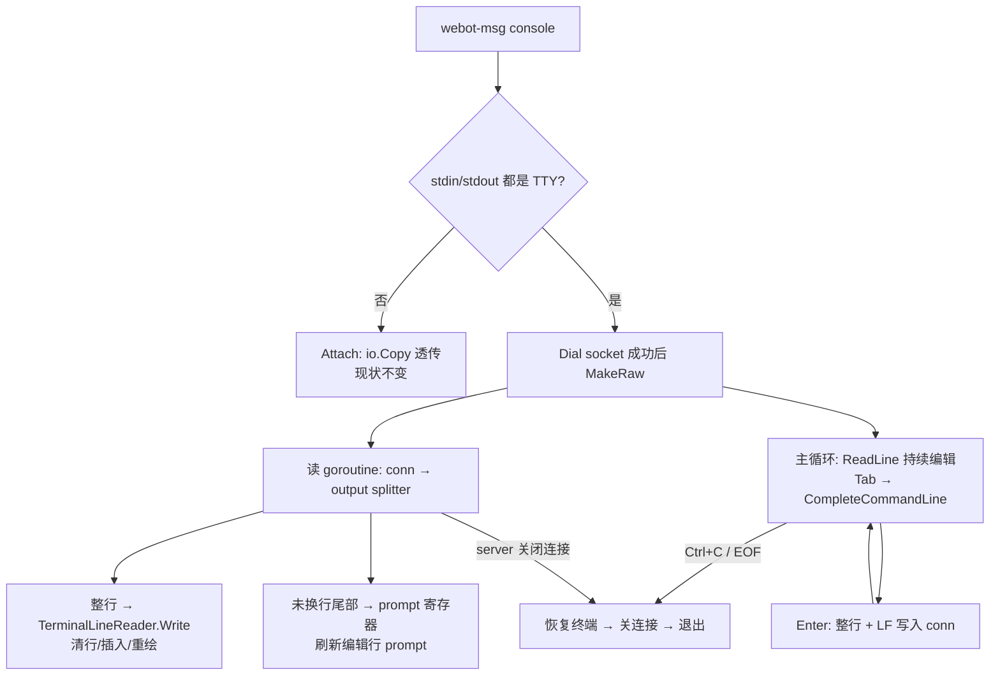

# control-console-tab-completion design

## 0. 术语约定

- Interactive attach（交互附着）：`webot-msg console` 在本地 stdin/stdout 都是 TTY 时启用的客户端行编辑模式——raw mode、本地回显、Tab 补全、整行发送。grep 防冲突结论：代码与 `.codestable/` 中无 `interactive`/`Interactive` 标识符，无冲突。
- Output splitter（输出切分器）：client 端纯状态机，把 server 推来的字节流切成「整行输出」与「未换行尾部」。grep 防冲突结论：`splitter` 无既有使用。
- Prompt 尾部：server 输出流中最后一个 `\n` 之后的未终结文本。Interactive attach 把它当作当前编辑行的 prompt 渲染，不做文案白名单匹配。
- Control console line mode（收窄）：沿用架构文档既有术语，但本 feature 后只描述非 TTY 路径（管道、脚本、`nc`/`socat` 直连）——保持 `io.Copy` 字节透传。原术语锚点：`ARCHITECTURE.md` 第 0 节、`internal/control/client.go:9`。
- 沿用不另起：Terminal line reader（`internal/console/terminal_reader.go:12`）、`CompleteCommandLine`（`internal/console/completion.go:8`）、command spec（`internal/console/commands.go:9`）。

## 1. 决策与约束

需求摘要：systemd 部署下用户只能通过 `webot-msg console` 进入运行中服务，而该路径按上一 feature（`2026-06-10-console-tab-completion`）的设计明确不提供 Tab 补全，按 Tab 无任何反应。本 feature 把补全带到 `webot-msg console`：client 在本地完成行编辑与补全，server 收到的仍是整行文本。受益者是 Linux 部署环境的控制台使用者。

成功标准：
- TTY 下 `webot-msg console` 中键入 `/pro` 按 Tab，当前行变为 `/protection `，Enter 后命令由 server 正常执行；补全候选与本地前台控制台完全一致（同一份 command spec）。
- 编辑期间收到异步广播消息（微信新消息），消息显示在编辑行上方，已输入内容保留且最终提交行不被污染。
- 旧版本 server 配新 client：server 收到的字节流只含「整行 + `\n`」，无任何协议头或控制字节。
- 非 TTY 输入（`printf '/exit\n' | webot-msg console`）行为与现状字节级一致。
- server 侧代码（`internal/control/server.go`、`internal/console/console.go` 命令循环）零行为改动。

明确不做：
- 不新增 socket 协议头、模式协商或版本握手；不改 server 端任何读写逻辑。
- 不扩展补全候选：仍只补 command spec 静态命令与固定子命令，不补 bot 序号、botID、文件路径、历史输入。
- 不给 `nc`/`socat` 等第三方客户端提供补全；不改非 TTY 管道路径的透传语义。
- 不做 SIGWINCH 动态窗口尺寸跟随（与本地前台路径同等程度：仅启动时取一次尺寸）。
- 不在本 feature 内动本地前台控制台（`console.Run` 路径）的任何行为。

复杂度档位：走「项目内部工具」默认组合，偏离两项——Terminal Interaction = raw-mode aware（沿用上一 feature 的偏离：Tab 是按键级行为）；Compatibility = cross-version（偏离默认 current-only 的原因：client 与 server 是同一二进制但可独立升级，socket 字节流契约必须冻结为「整行文本」）。

关键决策：
- 选纯客户端行编辑，拒绝两个替代方案。方案 A「client 透传按键 + server 端跑 `term.Terminal`」：旧 server 收到 raw 字节流没有行规程，新 client 连旧 server 直接乱掉，且 server 需要知道 client 终端尺寸，必然引入协商协议。方案 B「协议头协商双模式」：上一 feature 已明确拒绝，破坏 mixed-version 兼容。两个方案的名词层都会多出「会话模式协议」，纯客户端方案没有这个名词。
- Prompt 用「尾部启发式」识别：凡未换行尾部即当前 prompt。理由：server 端 prompt 全部来自 `ReadLine(prompt)` 的无换行写出（`internal/console/line_reader.go:32`），这是结构性事实而非文案约定；client 不耦合 prompt 具体文本，server 改 prompt 文案不破坏 client。已知代价见 2.2 流程级约束。
- 复用 `console.TerminalLineReader` 而非新写编辑器：`internal/control` 已 import `internal/console`（`server.go:14`），无循环依赖；Ctrl+C 的 `interruptReader` 语义、`AutoCompleteCallback` 挂接、`Write` 期间清行重绘（`x/term` `terminal.go:648`，本地二维码输出已依赖）全部现成。
- 持续 ReadLine 循环，不做「收到 prompt 才允许输入」状态机：type-ahead 字节留在编辑行不丢（对应 cooked mode 下内核行缓冲的既有体验）；空行也原样发送——`/bots` 二级 prompt 的「回车取消」语义依赖空行到达 server。
- Ctrl+C 语义：raw mode 下 0x03 不再产生 SIGINT，client 收到后恢复终端、关闭连接、退出进程；server 视角等于连接关闭，服务继续运行——与现状 cooked mode 下 SIGINT 杀掉 client 的外部可观察结果一致。
- 终端状态安全：先 `Dial` 成功再 `MakeRaw`；任何退出路径（EOF、interrupt、server 关闭、连接错误）都必须恢复终端状态。

## 2. 名词与编排

### 2.1 名词层

现状：
- `control.Attach(socketPath, in, out)`：唯一附着入口，双向 `io.Copy`，stdin EOF 后 `CloseWrite`。代码锚点：`internal/control/client.go:9`。
- `console.TerminalLineReader`：本地 TTY 行编辑器，构造时挂 `AutoCompleteCallback`；`ReadLine(prompt)` 阻塞编辑，`Write` 在编辑中插入输出并重绘。代码锚点：`internal/console/terminal_reader.go:20`、`terminal_reader.go:66`。
- `console.CompleteCommandLine(line, pos)`：纯函数补全计算。代码锚点：`internal/console/completion.go:8`。
- server 输出流的形状（client 端唯一输入契约）：除两类尾部外全部是 `\n` 结尾整行——① prompt（`line_reader.go:32` 的 `fmt.Fprint`）；② 异步广播消息自带的伪 prompt 结尾 `"\n> "`（`internal/app/app.go:584`）。已 grep 确认 `app.go`/`console.go` 无其他不带换行的写出。

变化：
- 新增 interactive attach 入口（动作：新增；动机：与 `Attach` 并列，TTY 时由 CLI 入口选用）：

```go
// internal/control 新增；in/out 须为已确认的 TTY
func AttachInteractive(socketPath string, in *os.File, out *os.File) error
```

- 新增 output splitter（动作：新增；动机：把「字节流 → 行事件 + prompt 尾部」的判定收敛成可单测的纯逻辑）。输入→输出示例：

```text
输入分块: "Console commands:\n  /login ...\n[bot-a] > "
输出:     行事件 ["Console commands:", "  /login ..."]，prompt 尾部 "[bot-a] > "

输入分块: "\n[Bot: a | Message from u]: hi\n> "   // 来源：internal/app/app.go printMessages
输出:     行事件 ["", "[Bot: a | Message from u]: hi"]，prompt 尾部 "> "

输入分块: "[bot-a"  之后又到 "] > "               // unix socket 分包
输出:     第一块 prompt 尾部 "[bot-a"（瞬时），第二块修正为 "[bot-a] > "
```

- `Attach` 原样保留为非 TTY 路径（动作：不变；动机：line mode 字节透传契约冻结）。
- `console.TerminalLineReader` 仅做必要的最小暴露（如编辑中刷新 prompt 的能力，若 implement 需要），不改既有方法签名。

### 2.2 编排层



现状：
- client 主流程是两条 `io.Copy` 的线性透传，无任何状态；行编辑、回显、退格全部由本地内核行规程（cooked mode）完成，Tab 只是缓冲区里的普通字节。代码锚点：`internal/control/client.go:16-27`。
- server 每连接跑 `console.RunWithIO` → `BufferedLineReader` 整行读取；输出经 `synchronizedWriter` 保证单次写原子。代码锚点：`internal/control/server.go:52-58`。

变化：
- client 在 TTY 下升级为「读 goroutine（splitter）+ 编辑主循环」两协程拓扑；行规程职责从内核移交给 `x/term`（回显、退格、Tab、重绘）。
- server 拓扑零变化；socket 上行方向的字节流形状不变（整行 + `\n`），下行方向 client 从「透传显示」变为「splitter 解释后显示」。

流程级约束：
- 错误语义：`Dial` 失败时尚未进 raw mode，直接报错退出；进 raw mode 后任何错误（连接断开、读写失败）都先恢复终端再退出，错误信息打印在恢复后的终端上。server 被 `systemctl stop` 时 client 必须感知连接关闭并正常退出，不挂死。
- 兼容性：上行字节流契约冻结为「用户行 + `\n`」；下行不假设 server 版本，splitter 只依赖「prompt 不带换行」这一结构性事实。非 TTY 路径字节级不变。
- 幂等性：Tab 补全纯本地计算，不产生任何 socket 写出；只有 Enter 提交整行。
- 顺序约束：splitter 的行事件与 prompt 更新必须按到达顺序进入 `TerminalLineReader`，不得并发写终端（单读 goroutine 串行处理）。
- 已知显示行为（接受，不算缺陷）：① 广播消息自带的 `"> "` 尾部会暂时取代完整 prompt 显示，与现状 cooked mode 视觉一致，下一次真实 prompt 到达即恢复；② socket 分包可能造成 prompt 瞬时显示半行，下一分块到达自愈；③ ReadLine 间隙的 type-ahead 字节回显可能延迟到下次 ReadLine 开始。
- 可观测性：补全候选与 help 同源（command spec），server 端无新增日志点；client 错误直接打到 stderr/恢复后的终端。
- 卸载性：删除 interactive attach 入口与 splitter、CLI 分流退回直接 `Attach`，行为完全回到现状；无配置、持久化、协议残留。

### 2.3 挂载点清单

- CLI 入口分流：`cmd/webot-msg/main.go` console 分支 — 修改（TTY → interactive attach；非 TTY → 既有 `Attach`）。
- Interactive attach 会话入口：`internal/control` 新增公开入口 — 新增。
- 本地编辑器挂接：client 端把 `console.TerminalLineReader`（含 `AutoCompleteCallback` → `CompleteCommandLine`）接到本地 stdin/stdout + raw mode — 新增。

（output splitter 是内部计算节点，不列挂载点；架构/用户文档更新归第 4 节。）

### 2.4 推进策略

1. 计算节点：output splitter 纯逻辑（行事件 + prompt 尾部 + 分包自愈）。
   退出信号：不连 socket，单测覆盖整行/分包/广播 `"\n> "` 尾部/空数据。
2. 编排骨架：interactive attach 会话（连接 → raw mode → splitter 读协程 + ReadLine 主循环 → 整行上行），CLI 入口 TTY 分流。
   退出信号：本地起 service 后 `webot-msg console` 中 `/pro<Tab>` 补全为 `/protection `，Enter 执行成功。
3. 中断与退出语义：Ctrl+C、Ctrl+D/EOF、server 主动关闭三条退出路径 + 终端状态恢复。
   退出信号：三条路径手工冒烟后 `stty` 确认终端状态正常，service 均继续运行。
4. 兼容守护：非 TTY 透传回归 + fake old server 测试（断言上行只有整行文本）。
   退出信号：`printf '/exit\n' | webot-msg console` 行为不变；兼容测试与 `go test ./...` 通过。
5. 文档与落档：架构术语收窄（line mode 仅非 TTY）、requirement 边界改写、用户文档补充。
   退出信号：文档与实际行为一致，验收契约逐条可核对。

### 2.5 结构健康度与微重构

##### 评估

- 文件级 — `cmd/webot-msg/main.go`：181 行，console 分支只改一处分流判定，改动密度低。
- 文件级 — `internal/control/client.go`：34 行、职责单一；interactive 逻辑不进此文件，新逻辑放新文件。
- 文件级 — `internal/console/terminal_reader.go`：161 行，本次最多增加一个小方法，职责不变。
- 目录级 — `internal/control`：现有 2 源文件 + 2 测试，新增 2 个源文件（interactive 入口、splitter）后仍远低于摊平阈值，命名无可分组前缀。
- compound convention 检索：`.codestable/compound/` 目前为空，无可循 convention。

##### 结论：不做

本次不做微重构，原因：被改文件行数与职责均健康，改动密度低；新逻辑按「新逻辑默认放新文件」落入 `internal/control` 新文件，目录不挤。

##### 超出范围的观察

- `internal/app/app.go:588`：本地前台 TTY 路径的异步消息用 `fmt.Print` 直写 stdout，绕过了 `TerminalLineReader.Write` 的清行重绘，raw mode 下 LF 无 CR 有楼梯式错位隐患，且与 control console 广播路径的渲染机制不一致。属既有问题、与本 feature 无关 → 建议另起 issue 评估是否统一走 terminal writer，本 feature 不动它。

## 3. 验收契约

关键场景清单：
- TTY 下 `webot-msg console` 键入 `/pro` 按 Tab → 行变 `/protection `，不执行命令；Enter 后 server 返回 protection usage/结果。
- 键入 `/protection st` 按 Tab → 行变 `/protection status`；键入 `/b` 按 Tab → 补到公共前缀 `/bot` 不加空格（与本地路径同规则）。
- 键入普通文本 `hello` 按 Tab → 行不变，不触发发送。
- 编辑中（已敲 `/pro` 未回车）收到广播消息 → 消息整行显示在编辑行上方，编辑行重绘且内容仍为 `/pro`，Enter 后 server 收到的行不含消息文本。
- `/bots` 后出现二级 prompt「Enter number to select...」→ 输入数字 Tab 不动；直接回车（空行）→ server 收到空行并按「取消」处理。
- `/login` 期间二维码多行输出 → 正常逐行显示，会话不乱。
- Ctrl+C → client 退出且终端状态恢复（无 raw mode 残留），service 与已有监听继续运行。
- Ctrl+D（空编辑行）→ 等价 stdin EOF：上行写端关闭，server 端会话结束，client 正常退出。
- service 未运行时 TTY 下执行 `webot-msg console` → 报连接错误退出，终端状态无残留。
- 交互会话进行中 `systemctl stop webot-msg` → client 感知连接关闭，恢复终端并退出，不挂死。
- `printf '/exit\n' | webot-msg console` → 走线模式透传，输出与现状一致。
- 新 client 连旧 server（fake server 断言）→ 上行字节流仅含用户输入行与 `\n`，无任何其他字节。

明确不做的反向核对项：
- `internal/control/server.go`、`internal/console/console.go` 命令循环零行为 diff（git diff 核对；测试文件与注释除外）。
- 代码中不出现 socket 协议头/魔数/版本字符串（grep 无 `WEBOT-MSG-CONSOLE` 一类常量新增）。
- 补全候选仍仅来自 `commandSpecs`（grep 确认 client 无新候选源）。
- 无新增 TOML 配置项、HTTP API 路由、auth store 字段、Redis key。
- 无 SIGWINCH 处理（grep 确认）。

## 4. 与项目级架构文档的关系

acceptance 阶段需要提炼回 `.codestable/architecture/ARCHITECTURE.md`：
- 名词：「Control console line mode」收窄为仅非 TTY 路径；新增「Control console interactive attach」术语（客户端行编辑 + 本地补全 + 整行上行）。
- 动词骨架：第 2 节 `internal/control` 段落补 client 端两协程拓扑（splitter + 编辑循环）；第 6 节「Tab 补全只在直接前台…」约束条目改写。
- 流程级约束：上行字节流契约冻结（整行 + LF）、prompt 尾部启发式依赖「prompt 不带换行」的结构性事实——server 侧今后若要写不带换行的非 prompt 输出需意识到会影响 interactive client 显示。

`.codestable/requirements/bot-message-bridge.md`：边界条目「`webot-msg console` 暂不提供 Tab 补全」需删除并改写；用户故事补一条 systemd 部署下控制台补全。

用户文档：`docs/user/linux-systemd-deploy.md` 与 `docs/user/runtime-config.md` 中关于 console 行为的描述补充「TTY 下 `webot-msg console` 支持 Tab 补全；管道/脚本输入保持按行读取」。本次不改启动参数、路径或部署方式，`scripts/linux-service.sh` 无需变更（对照 attention.md 检查项）。
