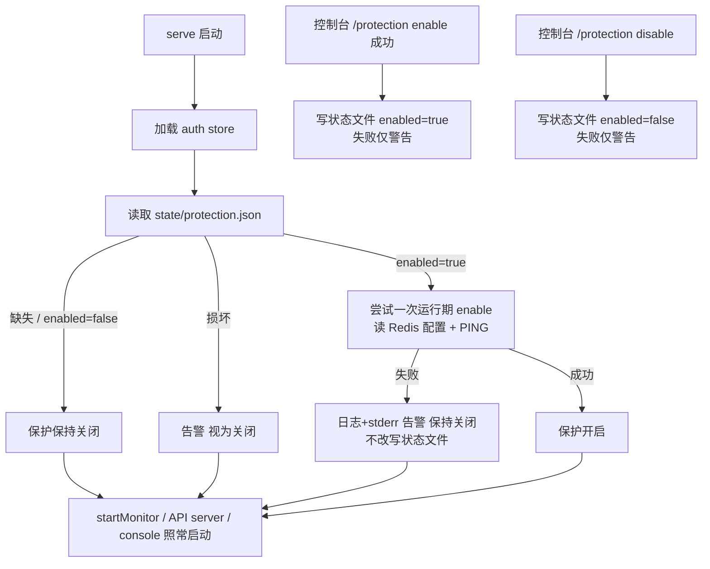

# protection-state-persistence design

## 0. 术语约定

- 保护开关状态文件：`~/.webot-msg/state/protection.json`，由 service 进程写入的运行期状态文件，只记录保护开关是否开启。grep 结论：与架构术语"Redis 保护状态"（per-bot 计数 / 冻结，存 Redis）是两个东西，命名上用"开关状态"区分；`internal/protection` 已有 `Status`（status 查询值对象），新类型避免裸用 `State` 命名。
- 启动恢复：serve 启动时读取保护开关状态文件，若为开启则尝试一次运行期 enable。grep 结论：当前代码无任何恢复逻辑；`app.go` 的 `persistUpdateState` 是 auth store 持久化，与本概念无关。
- state 目录：`~/.webot-msg/state/`，新增的运行期状态目录，与 `config/`（用户配置 + 凭证）、`logs/` 平级。grep 结论：当前 `~/.webot-msg` 下无 `state/` 目录。

## 1. 决策与约束

需求摘要：用户执行 `/protection enable` 后，保护开启状态写入 `~/.webot-msg/state/protection.json`；服务重启或升级（换二进制后重启）后自动恢复保护开启，无需重复执行 `/protection enable`。`/protection disable` 同步落盘为关闭。

**决策变更声明**：本 feature 推翻 `2026-06-10-console-protection-control` design 中"启用状态不持久化"的决策。当时的理由是避免引入隐式 source of truth；现在用户明确要求重启免重复 enable，保护开关的持久 source of truth 改为状态文件。TOML 仍只保存 Redis 连接配置，该边界不变。

成功标准：
- enable 成功后重启服务（Redis 可用）→ 保护自动恢复开启，`/protection status` 显示 enabled，发送经过 Redis guard，已登录 bot 的窗口检查器运行。
- disable 后重启 → 保护保持关闭。
- 从未执行过 enable（文件不存在）→ 启动行为与现状完全一致，无告警。
- 状态文件为开启但启动时 Redis 连接失败 → **只尝试一次**，失败记日志告警、保护保持关闭，用户可手动 `/protection enable`；状态文件不被改写（保留用户意图，下次重启再试一次）。
- 状态文件损坏（非法 JSON）→ 服务正常启动，视为关闭并告警；下次 enable 成功后文件被重写为合法内容。

明确不做：
- 不做后台重试 / 定时重连：恢复失败后不会在 Redis 恢复时自动开启（用户已拍板"只尝试一次"）。
- 不新增 TOML 配置项控制状态文件路径：路径固定，不随 `storage.auth_path` 自定义而移动。
- 不在状态文件中保存 Redis URL、password、key prefix、保护规则或任何 token：Redis 配置仍来自 Runtime config，规则仍是代码默认值。
- 不把开关状态写入 TOML、auth store 或 Redis。
- 不新增 HTTP 管理接口或新的控制台命令：持久化对用户透明，命令面不变。

复杂度档位：沿用 `console-protection-control` 已记录的偏离（State = runtime mutable、Concurrency = shared in-process、Compatibility = migration-aware），本次无新增偏离。旧安装无状态文件 → 视为关闭，升级兼容。

关键决策：
- 状态文件由 **service 进程**在 `EnableProtection` 成功后 / `DisableProtection` 后写入；control console 只是客户端不接触文件。理由：换成 console 侧写文件，systemd 部署下 console 与 service 可能不同用户 / 环境，且 service 自己恢复时还得读，源头必须在 service。
- 写文件失败不导致 enable/disable 命令失败，只在命令输出和日志中警告。理由：命令的核心语义是切换当前进程的保护开关，文件只是重启恢复凭据；反过来会让磁盘问题阻断保护开启。
- 启动恢复发生在 auth store 加载之后、monitor 与 API server 启动之前。理由：避免出现"状态说开启但 API 已开始放行未保护发送"的窗口。
- disable 写入 `{"protection_enabled": false}` 而不是删除文件。理由：显式状态比文件存在性更可读、可调试。
- 文件写入用临时文件 + rename 原子替换，目录 0700、文件 0600。理由：与 auth.json 的权限约定一致，防止半截文件被当损坏处理。

假设：
- "升级"指替换二进制后重启进程，状态文件天然保留，无需额外迁移逻辑。

状态文件契约示例：

```json
{"protection_enabled": true}
```

## 2. 名词与编排

### 2.1 名词层

现状：
- `protection.RuntimeGuard`（`internal/protection/runtime_guard.go`）：进程内运行期开关，`Enable(ctx, EnableConfig)` / `Disable()`，无持久化。
- `app.App`（`internal/app/app.go`）：`EnableProtection` / `DisableProtection` 处理控制台命令，调用 RuntimeGuard 并管理检查器，状态只在内存。
- `runtimeconfig`（`internal/runtimeconfig/config.go`）：持有 `~/.webot-msg` 下各默认路径常量（auth / socket / log）与 `~` 展开逻辑，无 state 路径概念。

变化：
- **新增** 保护开关状态 store，归属 `internal/protection` 模块（新文件承载，文件名 implement 定）。动机：文件格式是保护模块内部协议，app 只调 Load/Save。建议契约：

```go
// 来源：新增，参考 internal/config/store.go 的文件读写风格
type StateStore struct { /* path 注入 */ }

func NewStateStore(path string) *StateStore
// 文件不存在 → 返回零值（关闭），不报错；损坏 → 返回零值 + error，调用方告警后继续
func (s *StateStore) Load() (PersistedState, error)
// 原子写：MkdirAll(0700) + 临时文件 + rename，文件 0600
func (s *StateStore) Save(state PersistedState) error

type PersistedState struct {
    ProtectionEnabled bool `json:"protection_enabled"`
}
```

- **新增** `runtimeconfig` 默认 state 路径常量（如 `DefaultProtectionStatePath = "~/.webot-msg/state/protection.json"`）并在 `Resolve` 中展开为绝对路径。动机：`~` 展开逻辑已在该模块，路径不暴露为 TOML key。
- **修改** `app.Options` 注入解析后的状态文件路径（或注入构造好的 store）。

### 2.2 编排层



现状：
- `app.Run`（`internal/app/app.go:90`）线性启动序列：EnsureDir → store.Load → 必要时扫码登录 → EnsureAPITokens → 信号处理 → control server → startMonitor 循环 → API server → 控制台循环。保护开关始终从关闭起步。
- `EnableProtection` / `DisableProtection` 只改内存状态并启停检查器。

变化：
- `app.Run` 在 store 加载后、startMonitor 循环前插入启动恢复步骤：Load 状态 → enabled=true 时复用现有运行期 enable 编排（`RuntimeGuard.Enable` + 内存标记），输出走 log 而非控制台 writer；检查器随后续 `startMonitor` 按 `protectionIsEnabled()` 自然启动，不需要恢复步骤单独启动。
- `EnableProtection` 成功路径末尾追加 `Save({true})`；`DisableProtection` 末尾追加 `Save({false})`；Save 失败输出警告，命令仍按成功返回。

流程级约束：
- 错误语义：恢复失败不阻止服务启动；恢复失败不改写状态文件；Save 失败不改变命令结果，但必须有可见警告。
- 幂等性：重复 enable/disable 重复写文件无害；原子 rename 保证读侧永远看到完整 JSON。
- 并发约束：多个 console 会话可能并发 enable/disable，状态文件以原子替换落盘、last-writer-wins，与内存开关的并发语义一致；不引入新锁层级。
- 可观测点：启动恢复成功 / 失败 / 文件损坏各打一条日志（交互终端下失败同时输出 stderr）；不打印 Redis password 或完整带密码 URL。
- 卸载性：删除恢复步骤、两处 Save 调用、state store 文件和默认路径常量 → 系统回到"重启后保护默认关闭"的现状；磁盘残留的 protection.json 成为无主文件，无副作用。

### 2.3 挂载点清单

- 状态文件：`~/.webot-msg/state/protection.json`（含新增 `state/` 目录）— 新增
- 启动恢复步骤：`app.Run` 启动序列中"读状态并尝试恢复"一步 — 新增
- 持久化挂接：`EnableProtection` / `DisableProtection` 成功路径写状态文件 — 修改
- 默认路径常量：`runtimeconfig` 的 state 路径默认值与解析 — 新增

### 2.4 推进策略

1. 计算节点：实现保护开关状态 store（Load/Save、缺失 / 损坏 / 原子写语义）。
   退出信号：单测覆盖文件缺失、损坏 JSON、正常往返、权限四类场景。
2. 持久化挂接：enable/disable 成功后写状态文件，路径从 runtimeconfig 解析注入。
   退出信号：enable 后文件内容为 `true`，disable 后为 `false`；Save 失败时命令仍成功且有警告输出。
3. 启动恢复：`app.Run` 插入恢复步骤。
   退出信号：状态为开启 + Redis 可用 → 启动后 status 显示 enabled；Redis 不可用 → 启动成功、保持关闭、日志有告警且状态文件未被改写。
4. 测试与文档：补齐验收场景测试，更新用户文档（升级说明改为"保护状态自动恢复，无需重复 enable"），按 attention.md 检查 `scripts/linux-service.sh` 与 `docs/user/linux-systemd-deploy.md` 是否需同步。
   退出信号：`go test ./...` 通过；文档不再要求升级后重新执行 `/protection enable`。

### 2.5 结构健康度与微重构

##### 评估

- 文件级 — `internal/app/app.go`：599 行已超阈值，职责仍混合启动编排、控制台控制、发送、监听、保护生命周期；但本次只在 `Run` / `EnableProtection` / `DisableProtection` 三处做小挂接（合计约 20 行），新逻辑全部落在 protection 模块新文件。
- 文件级 — `internal/runtimeconfig/config.go`：约 470 行，本次只加一个默认路径常量和一处展开，改动极小。
- 文件级 — `cmd/webot-msg/main.go`：187 行，只注入一个 option，健康。
- 目录级 — `internal/protection`：现有 6 个文件（guard / redis_guard / runtime_guard 及测试），新增 1-2 个文件不构成摊平。
- compound convention 检索：`.codestable/compound` 目前为空，无可用 convention。

##### 结论：不做前置微重构

原因：新逻辑有明确的新文件归属，被改文件均为小挂接；拆 `app.go` 的收益不抵风险，且该问题已有既往观察记录。

##### 超出范围的观察

- `internal/app/app.go`：持续增长（前一 feature 时 440 行 → 现 599 行），启动编排、保护生命周期、控制台输出广播宜拆为独立协作者。延续 `console-protection-control` design 的同一观察，建议后续专门走 `cs-refactor`，不阻塞本 feature。

## 3. 验收契约

关键场景清单：
- 输入：Redis 可用，执行 `/protection enable` → 期望：`~/.webot-msg/state/protection.json` 存在，内容 `protection_enabled=true`，文件 0600、`state/` 目录 0700。
- 输入：enable 成功后重启服务（Redis 可用）→ 期望：启动日志含恢复成功记录；`/protection status` 显示 enabled；普通文本发送经过 Redis guard；已登录 bot 的窗口检查器运行。
- 输入：`/protection disable` 后重启 → 期望：文件内容 `protection_enabled=false`；启动后保护关闭，无恢复尝试。
- 输入：状态文件不存在（全新安装 / 旧版本升级）→ 期望：启动行为与现状一致，保护关闭，无告警。
- 输入：状态文件为开启，启动时 Redis 不可用 → 期望：服务正常启动；保护保持关闭；日志（交互终端下含 stderr）有告警提示可手动 `/protection enable`；状态文件内容未被改写；Redis 随后恢复也不会自动开启。
- 输入：状态文件内容为非法 JSON → 期望：服务正常启动、保护关闭、有损坏告警；之后 enable 成功会把文件重写为合法内容。
- 输入：状态文件路径不可写时执行 `/protection enable` → 期望：命令输出含持久化失败警告，但保护在当前进程内已开启。
- 输入：先 enable 再 disable 再重启 → 期望：保护关闭（最后写入者生效）。
- 输入：启动恢复失败后，用户手动 `/protection enable` 成功 → 期望：保护开启且文件被重写为 `true`，下次重启恢复成功。

明确不做的反向核对项：
- 代码中不应存在恢复失败后的后台重试 / 定时重连逻辑。
- TOML 解析不应新增状态文件路径相关 key；`runtimeconfig` 的 TOML 契约零变化。
- 状态文件内容不应包含 `redis` 配置、password、`BotToken`、`APIToken`、`ContextToken` 中任何一项（grep JSON 字段即可核对）。
- 不应有代码把保护开关写入 TOML、auth.json 或 Redis。
- 控制台命令面不应新增子命令；`/protection enable|disable|status` 行为面（除新增警告输出外）不变。

## 4. 与项目级架构文档的关系

acceptance 阶段需要更新 `.codestable/architecture/ARCHITECTURE.md`：
- "数据与状态"节：「保护开启状态是进程内运行期状态，不写入 Runtime config、auth store 或 Redis，服务重启后默认关闭」改为「保护开关状态持久化在 `~/.webot-msg/state/protection.json`，启动时尝试一次自动恢复；Redis 仍只保存 per-bot 保护计数和主动对话窗口」。
- "已知约束"节：删除「服务重启后保护默认关闭」，新增「启动恢复只尝试一次，Redis 不可用时保持关闭并告警，不做后台重试」。
- `internal/runtimeconfig` 描述补充 state 路径默认值；`internal/app` 描述补充启动恢复步骤；`internal/protection` 描述补充开关状态 store。

需求文档 `.codestable/requirements/bot-message-bridge.md` 与用户文档同步：
- 「服务重启后需重新执行 `/protection enable`」相关表述改为「保护状态自动恢复」。
- `docs/user/linux-systemd-deploy.md` 升级章节去掉重新 enable 的步骤（按 attention.md 同步检查 `scripts/linux-service.sh`）。
