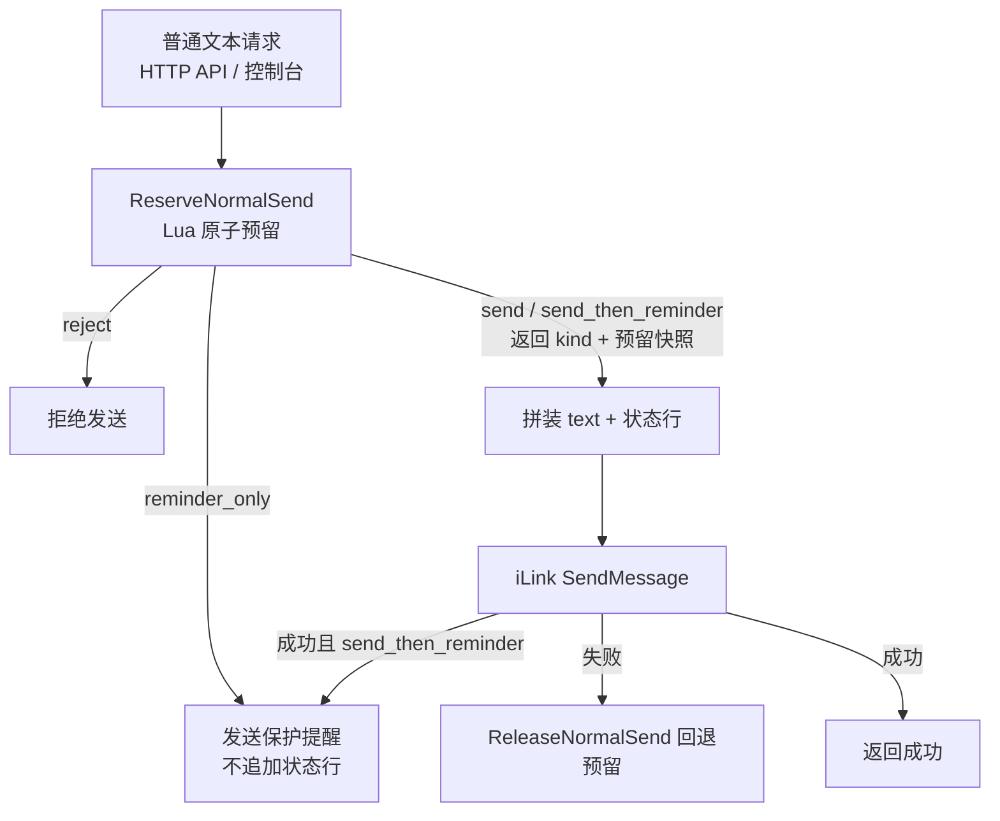

# protection-status-footer design

## 0. 术语约定

- 保护状态行（status footer）：保护模式开启时，服务端在普通文本内容末尾追加的一行状态信息，内容为本次发送计入后的剩余可发条数和距离限制触发的剩余时间。grep 结论：代码与文档中无 footer / 状态行同名概念。
- 预留快照（reservation snapshot）：`ReserveNormalSend` 的 Lua 脚本在原子预留成功时一并返回的 `out_count` 与 active key PTTL，随 `Reservation` 带回 Go 侧，是状态行的唯一数据源。grep 结论：`Reservation` 当前只有 `Kind` / `Reason` 两个字段，无冲突。
- 距离限制触发剩余时间：active key TTL 减去 `time_warning_before`，即还剩多久会真正触发时间提醒并冻结；不是 24h 窗口的原始剩余时间。用户已拍板此语义。

## 1. 决策与约束

需求摘要：保护模式（`/protection enable`）开启时，HTTP API `/bots/{botID}/messages` 和控制台发送的普通文本，由服务端在请求内容末尾追加一行保护状态行后再发往微信；状态行完全由服务端拼装，HTTP 请求的 `text` 字段语义不变。保护关闭时内容原样发送。

成功标准：
- 保护关闭（默认）时，微信收到的内容与请求 `text` 逐字节一致，无状态行。
- 保护开启、主动对话后第 N 条普通文本（N < 提醒阈值 9）：微信收到 `text + "\n" + 状态行`，剩余条数 = `9 - N`，剩余时间 = `active TTL - time_warning_before`。
- 第 9 条（触发 `send_then_reminder`）：状态行显示剩余 0 条；随后的系统保护提醒消息不带状态行。
- 状态行数据随预留脚本原子返回，不新增 Redis 调用，不新增失败路径。
- 追加后仍是同一次 iLink `sendmessage` 调用，下发计数不变（一次预留对应一次发送）。

明确不做：
- 不给保护提醒消息追加状态行（提醒文案本身已说明限制状态）。
- 不给 `/bots/{botID}/typing` 追加（无文本内容）。
- 不新增 TOML 配置 key；状态行跟随保护开关，无独立开关。
- 不修改 HTTP API 请求 / 响应 JSON 契约；响应不回显追加后的内容。
- 不改变 Redis key 结构和既有 Lua 状态机的判断语义，仅扩展 reserve 脚本的返回值。
- 不在预留之后用 `ProtectionStatus` 二次查询拼装状态行。

复杂度档位：走项目内部工具默认档位，无偏离。改动局限在既有保护编排内部，原子性沿用既有 Lua 脚本。

关键决策：
- 快照随 reserve Lua 脚本原子返回，不做预留后的二次查询。理由：换成二次查询，编排层多一次 Redis round-trip 且并发下快照可能与本次预留不一致（其他请求插队递增计数），状态行会显示错误的剩余条数。
- 拼装与追加放在 `internal/sender`（共享发送编排层）。理由：API 和控制台两条入口都收敛在 `sender.SendProtectedText`，改一处同时生效；放进 `internal/ilink` 会让外部协议适配层感知业务语义，放进 API / 控制台两端会留下不一致风险。
- 时间语义取"距离冻结触发的剩余时间"（TTL − `time_warning_before`）。理由：与剩余条数语义对齐——两个数都回答"还能正常发多少 / 多久"。用户已拍板。
- 保护关闭路径靠 `Reservation` 快照标志位（无快照即不追加）识别，不向 sender 透传 enabled 开关。理由：`NoopGuard` 返回的 `Reservation` 天然不带快照，sender 不需要新依赖。

假设：
- 状态行默认文案为中文单行（与默认提醒文案语言一致），格式见 2.1 节示例；review 时可改文案。
- 时间显示截断到分钟，不足 1 分钟显示 `<1m`；正常发送路径下该值恒大于 0（TTL ≤ warn 时预留已返回 `reminder_only`，不会走普通发送）。

## 2. 名词与编排

### 2.1 名词层

现状：
- `protection.Reservation` 只有 `Kind`（send / reject / send_then_reminder / reminder_only）和 `Reason` 两个字段，只驱动分支，不携带状态数据。来源：`internal/protection/guard.go:103`。
- reserve Lua 脚本返回 `{kind, reason}` 两元组，`runReservationScript` 按此解析。来源：`internal/protection/redis_guard.go:243`、`internal/protection/redis_guard.go:210`。
- `protection.Status` 已有 `MessagesBeforeReminder` / `TimeBeforeWarning` 字段，但只供 `/protection status` 控制台查询使用，与发送路径无关。来源：`internal/protection/guard.go:76`。
- `sender.sendProtectedText` 把入参 `text` 原样传给 `client.SendMessage`。来源：`internal/sender/protected_text.go:48`。

变化：
- 扩展 `protection.Reservation`，新增快照字段（动作：扩展；动机：让状态行数据与预留同源原子）：

```go
// 来源：internal/protection/guard.go Reservation（扩展）
type Reservation struct {
    Kind   ReservationKind
    Reason string

    HasStatus              bool          // 是否携带预留快照；NoopGuard 与 reject/reminder_only 路径为 false
    MessagesBeforeReminder int           // 本次发送计入后，距离提醒触发还可发的条数
    TimeBeforeWarning      time.Duration // 距离时间提醒触发的剩余时间（TTL − time_warning_before）
}
```

  字段命名向 `protection.Status` 已有同义字段对齐，避免一个概念两个名字。
- 扩展 reserve Lua 脚本返回值：`send` / `send_then_reminder` 分支从 `{kind, reason}` 变为 `{kind, reason, out_count, pttl_ms}`；`reject` / `reminder_only` 分支返回值不变。Go 侧解析后用 guard 配置算出 `MessagesBeforeReminder = threshold - out_count`（下限 0）和 `TimeBeforeWarning = pttl - timeWarningBefore`（下限 0）。
- 新增状态行拼装函数（`internal/sender` 新文件）：输入 `Reservation` 快照 → 输出单行文本；`HasStatus=false` 时返回空串。

接口示例：

```text
// 来源：internal/sender 状态行拼装（新增）
输入：text = "hello"，threshold = 9，本次计入后 out_count = 5，active TTL = 10h，time_warning_before = 30m
微信实际收到：
hello
[限流阈值] 剩余可发 4 条 | 距离限制还有 9h30m

// 来源：internal/sender 状态行拼装（新增），第 9 条触发提醒
输入：text = "hi"，本次计入后 out_count = 9（send_then_reminder）
微信实际收到：
hi
[限流阈值] 剩余可发 0 条 | 距离限制还有 9h25m
（随后系统提醒消息按原文案发送，不追加状态行）

// 来源：internal/protection/guard.go NoopGuard.ReserveNormalSend
输入：保护关闭，text = "hello"
微信实际收到：hello（逐字节一致，无状态行）
```

### 2.2 编排层



现状：
- `sender.sendProtectedText` 是线性流程：`ReserveNormalSend` → 按 `Reservation.Kind` 分支 → `client.SendMessage(text)` → 失败 release / 成功视情况发提醒。来源：`internal/sender/protected_text.go:29`。
- API 与控制台都经此入口：`internal/api/server.go:109`、`internal/app/app.go:359`。

变化：
- 在"预留成功 → SendMessage"之间插入一步纯计算：`reservation.HasStatus` 为真时把状态行追加到 `text` 末尾（`text + "\n" + footer`），否则原样发送。
- `reminder_only` 路径、提醒发送路径（`sendProtectionReminder`）、release 路径均不变。

流程级约束：
- 错误语义：拼装是纯计算，无新增错误路径；快照缺失（`HasStatus=false`）时静默不追加，不报错、不降级拒绝。
- 并发约束：快照必须由预留同一次 Lua 调用返回；禁止预留后再查 Redis 拼装（并发下会拿到他人预留后的计数）。
- 顺序约束：状态行反映"本次发送计入后"的剩余值；iLink 发送失败 release 回退后，重试会重新预留并重新拼装，旧快照不复用。
- 可观测点：沿用现有约束，日志不打印拼装后的完整消息正文；状态行本身不含 token 或用户内容。
- 兼容性：保护关闭（NoopGuard / disable）路径发送内容逐字节不变；HTTP 请求 / 响应 JSON 契约零变化。

### 2.3 挂载点清单

- `protection.Reservation` 快照字段与 reserve Lua 脚本返回值扩展：`internal/protection/guard.go`、`internal/protection/redis_guard.go` — 修改（删掉则状态行无数据源，feature 消失）。
- 普通文本发送前的状态行追加步骤：`internal/sender` 发送编排 — 新增（删掉则微信侧不再出现状态行，feature 消失）。
- 状态行文案格式（前缀、分隔符、时间格式）：`internal/sender` 新文件内的格式常量与拼装函数 — 新增。

### 2.4 推进策略

1. 名词扩展：`Reservation` 快照字段 + reserve Lua 脚本返回值 + Go 侧解析换算。
   退出信号：redis guard 单测覆盖 `send` / `send_then_reminder` 返回正确剩余条数与剩余时间；`reject` / `reminder_only` / `NoopGuard` 路径 `HasStatus=false`。
2. 计算节点：状态行拼装函数（条数、时间格式化、0 条 / `<1m` 边界、`HasStatus=false` 返回空串）。
   退出信号：单测覆盖正常 + 边界格式输出。
3. 编排挂接：`sendProtectedText` 在发送前按快照追加状态行。
   退出信号：sender 单测验证保护开启时 fake client 收到 `text + 状态行`、保护关闭收到原文、提醒消息无状态行、发送失败仍正确 release。
4. 测试与验收：补齐第 3 节验收场景覆盖。
   退出信号：`go test ./...` 与 `go vet ./...` 通过。

### 2.5 结构健康度与微重构

##### 评估

- 文件级 — `internal/protection/guard.go`：193 行，职责是保护值对象与接口定义；本次加 3 个字段属现有职责延伸，改动 1 处。
- 文件级 — `internal/protection/redis_guard.go`：336 行，职责单一（Redis 状态机 + Lua 脚本）；本次改 reserve 脚本返回值和 `runReservationScript` 解析两处，逻辑强相关，不算职责混杂。
- 文件级 — `internal/sender/protected_text.go`：90 行，健康；编排插入一步追加调用。拼装函数按"新逻辑默认放新文件"落 `internal/sender` 新文件。
- 目录级 — `internal/sender`：现有 2 个文件，新增 1 个不摊平。
- 目录级 — `internal/protection`：现有 7 个文件，本次不新增文件。
- compound convention 检索：`.codestable/compound` 仅有 `.gitkeep`，无可用 convention。

##### 结论：不做微重构

原因：涉及文件行数、职责、改动密度均未越线，目标目录不摊平；微重构收益不抵风险。

## 3. 验收契约

关键场景清单：
- 输入：保护关闭（默认），HTTP API / 控制台发送 `hello` → 期望：iLink 收到的内容与 `hello` 逐字节一致，无状态行。
- 输入：保护开启、主动对话后第 5 条普通文本 `hello`（TTL = 10h，warn = 30m）→ 期望：iLink 收到 `hello\n[限流阈值] 剩余可发 4 条 | 距离限制还有 9h30m`；HTTP 响应结构与现状一致。
- 输入：保护开启，控制台发送普通文本 → 期望：同样追加状态行（覆盖第二条入口）。
- 输入：第 9 条普通文本（触发 `send_then_reminder`）→ 期望：该消息状态行显示剩余 0 条；随后的保护提醒消息内容与 `reminder_text` 一致，不含状态行。
- 输入：冻结状态下发送 → 期望：HTTP 429 / 控制台锁定错误，不调用 iLink，无状态行问题（与现状一致）。
- 输入：iLink 普通文本发送失败 → 期望：预留回退（与现状一致）；下一次发送重新预留并按新快照拼装，不复用旧状态行。
- 输入：TTL − warn 不足 1 分钟但大于 0 → 期望：状态行时间显示 `<1m`。
- 输入：两条普通文本并发发送 → 期望：两条消息各自的剩余条数来自各自预留快照，互不相同且与最终计数一致。
- 输入：调用 `/bots/{botID}/typing` → 期望：行为与现状一致，无任何追加。

明确不做的反向核对项：
- 保护提醒发送路径（`sendProtectionReminder`）不应出现状态行拼装调用。
- `internal/sender` 中不应出现 `ProtectionStatus` 二次查询调用。
- runtimeconfig 不应新增 TOML key；TOML 解析契约零 diff。
- HTTP API 请求 / 响应 JSON 不应新增字段；请求 `text` 不会被改写后回显。
- `internal/ilink` 不应感知状态行或保护配置。
- 既有 Lua 脚本中 `reject` / `reminder_only` 分支的返回结构和判断逻辑不应改变。

## 4. 与项目级架构文档的关系

- `ARCHITECTURE.md` 术语"保护模式"需补充：开启时普通文本末尾由服务端追加一行保护状态行。
- `ARCHITECTURE.md` 结构与交互的 `internal/sender` 段需补充：发送编排在预留成功后按预留快照拼装状态行。
- `ARCHITECTURE.md` 已知约束需补充：状态行只在保护开启时追加，数据随预留 Lua 原子返回，HTTP 请求契约不变。
- `.codestable/requirements/bot-message-bridge.md` 在 acceptance 阶段更新用户故事：保护模式下用户在微信侧每条消息可见剩余额度与剩余时间。
