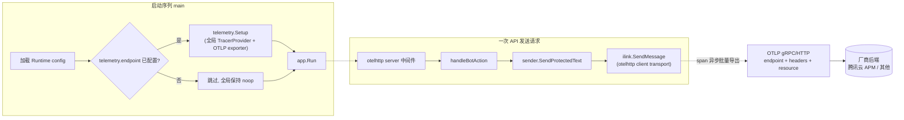

# otel-tracing design

## 0. 术语约定

| 术语 | 定义 | 防冲突结论 |
| --- | --- | --- |
| Telemetry | 本项目的 OTel traces 上报能力，由 TOML `[telemetry]` section 控制 | grep 全仓库无 `telemetry` / `otel` / `tracer` 字样，无冲突 |
| 接入点（endpoint） | OTLP 上报目标地址（`host:port`），如腾讯云 APM 的 `ap-guangzhou.apm.tencentcs.com:4317` | 与 `ilink.base_url`（业务外呼地址）是两个东西，文档与配置注释里要区分 |
| 厂商中立 | 只依赖 `go.opentelemetry.io` 官方模块和 OTLP 标准协议，不引入任何厂商私有 SDK；迁移 = 改 `[telemetry]` 配置 | 新概念，无冲突 |
| OTel SDK shutdown | 进程退出前 flush 未导出 span 的收尾调用 | 新概念，无冲突 |

## 1. 决策与约束

### 需求摘要

- **做什么**：为 webot-msg 接入 OpenTelemetry traces，HTTP API 入站请求和 iLink 出站调用产生 span，经 OTLP 上报到任意兼容厂商（首个目标：腾讯云 APM，参考 https://cloud.tencent.com/document/product/248/87124 ）。
- **为谁**：服务运维者，需要在云厂商 APM 控制台看到发送链路的调用关系和耗时。
- **成功标准**：一套代码，仅修改 TOML `[telemetry]` 的 endpoint 和认证配置（headers 或 resource_attributes）即可在腾讯云 APM 与其他 OTLP 兼容厂商之间迁移；未配置时行为与现在完全一致。
- **明确不做**：
  1. metrics 和 logs 信号（不引入 otlpmetric / otlplog 依赖）
  2. 长轮询监听循环、Redis 保护操作、控制台命令的 span（首期只埋 API 入站 + iLink 出站）
  3. `OTEL_*` 环境变量配置入口（项目决策：配置只走 TOML，见 ARCHITECTURE.md 第 4 节"配置入口保持克制"）
  4. 采样率配置（首期固定全采样，本服务消息量低）
  5. 厂商私有 SDK（腾讯云或其他厂商的专有 agent / SDK 一律不进 go.mod）

### 复杂度档位

走后端服务默认档位，无偏离。新增第三方依赖限定为 `go.opentelemetry.io` 官方模块（otel、sdk、otlptrace exporter、contrib/otelhttp）。

### 关键决策

- **默认关闭、按配置启用**：`[telemetry]` 缺失或 `endpoint` 为空 → 不初始化 SDK、不建立任何出站连接，全局 TracerProvider 保持 noop。换做"默认开启"则未配置用户会产生出站连接失败日志，违反 Never break userspace。
- **认证用通用 maps，不做厂商枚举**：`[telemetry.headers]` 和 `[telemetry.resource_attributes]` 两个自由 map。腾讯云 APM 把 token 填进 `resource_attributes.token`，header 认证的厂商填 `headers`。换做专用 `token` + `token_mode` 字段则每接一家厂商都可能要扩枚举，违背"减少特殊情况"。
- **埋点常驻、provider 切换**：otelhttp 中间件和 transport 无条件挂载，启用与否由全局 TracerProvider 决定（未启用时是 noop，开销可忽略）。换做"启用才包中间件"则编排层多一条分支且两条路径行为可能漂移。
- **协议默认 OTLP gRPC、可选 http**：腾讯云文档用 gRPC（4317）；部分厂商/网关只开 OTLP HTTP（4318），`protocol` 配置项保证迁移面完整。
- **配置非法快速失败、运行期上报失败不影响业务**：与现有严格 TOML 校验语义一致；span 导出走异步批处理，endpoint 不可达只产生日志，不阻塞发送。

### 前置依赖

无。

## 2. 名词与编排

### 2.1 名词层

**现状**：

- `runtimeconfig.Config` 持有 `api` / `storage` / `control` / `ilink` / `log` / `redis` 六个 TOML section，严格模式拒绝未知 key（`internal/runtimeconfig/config.go:35`、`config.go:154`）。
- `ilink.Client` 只有 `BaseURL` 一个字段，每个方法内部临时创建 `http.Client` 并各自设超时（`internal/ilink/client.go:23`、`client.go:62`）。
- `api.Server.Start` 用裸 `http.NewServeMux` 直接 `ListenAndServe`（`internal/api/server.go:45`）。
- 无任何遥测相关名词。

**变化**：

1. **新增** `runtimeconfig.TelemetryConfig`（TOML `[telemetry]` section）——动机：配置入口统一在 TOML：

   ```toml
   [telemetry]
   endpoint = "ap-guangzhou.apm.tencentcs.com:4317"  # 留空或整节缺失 = 不启用
   protocol = "grpc"            # grpc | http，默认 grpc
   insecure = false             # true 时明文连接（本地 collector 调试）
   service_name = "webot-msg"   # 默认 webot-msg

   [telemetry.resource_attributes]  # 自由 map；腾讯云 APM 的 token 放这里
   token = "xxxxxx"

   [telemetry.headers]              # 自由 map；header 认证的厂商放这里
   # Authorization = "Bearer xxxxxx"
   ```

2. **新增** `internal/telemetry` 包，对外只暴露一个入口——动机：把 SDK 初始化收敛成单一计算节点，main 不直接接触 OTel API：

   ```go
   // internal/telemetry
   type Config struct {
       Endpoint           string
       Protocol           string // "grpc" | "http"
       Insecure           bool
       ServiceName        string
       Headers            map[string]string
       ResourceAttributes map[string]string
   }

   // Setup 注册全局 TracerProvider 并返回 shutdown。
   // 输入 Endpoint 为空 → 返回 no-op shutdown, nil（不启用）
   // 输入 Protocol 非 grpc/http → 返回 nil, error（启动失败）
   // 正常 → 返回 flush 用 shutdown, nil
   func Setup(ctx context.Context, cfg Config) (func(context.Context) error, error)
   ```

   // 来源：全新包，无现状

3. **修改** `ilink.Client`：从"每方法临时建 client"改为构造时持有可注入的共享 `http.RoundTripper`（埋点 transport），各调用保留自己的超时语义；API 发送链路新增 context-aware 调用包装（如 `SendMessageContext`），旧无 context 方法继续用 `context.Background()` 包一层——动机：出站 span 需要统一经过 instrumented transport，且必须接收 API 请求 context 才能和入站 span 落到同一 trace；超时仍按调用各自设置，不改变长轮询行为。

### 2.2 编排层



**现状**：

- `cmd/webot-msg/main.go:19` 线性启动：加载配置 → 尝试 attach 已有 socket → 准备存储/日志 → `app.New` → `app.Run`，无遥测步骤。
- `api.Server.Start`（`internal/api/server.go:45`）mux 直挂 handler，无中间件层。
- iLink 出站调用各自临时建 `http.Client` 发请求，无统一拦截点。
- 退出路径：前台 Ctrl+C 保存配置退出（`internal/app/app.go:138`），无收尾 flush 概念。

**变化**：

- main 在 `PrepareStorage` 之后、`app.New` 之前插入 `telemetry.Setup`，并 `defer shutdown`（带超时上限）；Setup 返回 error 时走既有 `fatalStartupError` 路径。
- `api.Server.Start` 的 mux 外层包一层 otelhttp server 中间件（无条件挂载，noop 时零行为差异）。
- `ilink.Client` 全部出站请求经共享 instrumented transport；API 发送路径把请求 context 传入 iLink 调用，与入站 span 自动串成同一 trace。无入站 span 的后台调用不产生手工长轮询 span。
- 拓扑不变：仍是线性启动 + 请求级线性 pipeline，无新分支、无新协程（exporter 内部的批处理协程由 SDK 管理，shutdown 时回收）。

**流程级约束**：

- **错误语义**：`[telemetry]` 配置非法（未知 key、非法 protocol、endpoint 格式错）→ 启动失败并报具体 key，与现有严格 TOML 校验一致；运行期 OTLP 导出失败 → 只记日志，业务请求照常成功，不重试阻塞。
- **退出语义**：shutdown 必须设超时上限（秒级），endpoint 不可达时不能挂死进程退出。
- **配置入口语义**：OpenTelemetry 官方 exporter 的 `OTEL_EXPORTER_OTLP*` 环境变量读取必须被屏蔽，`telemetry.Config` / TOML 是唯一输入；否则会出现 endpoint path、headers、TLS、timeout、compression 等隐式第二配置源。
- **敏感信息约束（硬约束）**：span 属性和 resource 不得包含消息正文、`BotToken`、`APIToken`、`ContextToken`。两个具体风险点：① 本地 API 的 token 可经 URL query 传入（`internal/api/server.go:75`），服务端 span 的 URL 类属性必须剥掉 query string；② iLink 的 `BotToken` 走请求头（`internal/ilink/client.go:151`），不得开启任何 header 采集。`[telemetry.headers]` / `resource_attributes` 里的认证值不得打进日志。
- **可观测点**：启动摘要日志增加一行 telemetry 启用状态（endpoint 可以打、headers / resource_attributes 的值不打）。

### 2.3 挂载点清单

1. TOML 配置 key：`runtimeconfig` 的 `[telemetry]` section 及默认值 — 新增
2. 启动序列：`cmd/webot-msg/main.go` 中 `telemetry.Setup` + defer shutdown — 新增
3. 入站埋点：`api.Server.Start` mux 外层的 otelhttp server 中间件 — 修改
4. 出站埋点：`ilink.Client` 的共享 instrumented transport 注入 — 修改
5. 依赖注册：`go.mod` 的 `go.opentelemetry.io/*` 模块 — 新增

删掉这 5 项，feature 完全消失，行为退回现状。

### 2.4 推进策略

1. **配置骨架**：`runtimeconfig` 新增 `[telemetry]` 解析、默认值、校验 → 退出信号：单测覆盖缺省 / 合法 / 非法三类输入
2. **计算节点 telemetry.Setup**：未启用 noop、grpc / http 两种 exporter、resource 与 headers 组装 → 退出信号：单测覆盖未启用 / 启用 / 非法 protocol
3. **编排接通（入站）**：main 接 Setup + defer shutdown，api mux 包中间件 → 退出信号：编译绿灯 + 现有测试全过，未配置时启动日志无 telemetry 痕迹
4. **编排接通（出站）**：ilink.Client 注入共享 transport，保留各调用超时 → 退出信号：现有测试全过
5. **端到端验证**：本地 OTLP collector 跑通一条 API 发送链路 → 退出信号：collector 看到入站 + 出站 span 同一 trace_id
6. **测试覆盖收尾**：补齐第 3 节剩余验收场景 → 退出信号：每条场景有可观察证据

### 2.5 结构健康度与微重构

compound 目录为空，无已有 convention 可循。

##### 评估

- 文件级 — `internal/runtimeconfig/config.go`：484 行，职责单一（配置解析与校验），本次加一个 section + 一段校验，改动集中；Go 文件 500 行阈值偏松，不算胖。
- 文件级 — `cmd/webot-msg/main.go`：152 行，本次插 2-3 行启动调用，健康。
- 文件级 — `internal/api/server.go`：186 行，本次只动 `Start` 一处，健康。
- 文件级 — `internal/ilink/client.go`：375 行，本次加一个字段 + 替换各方法的 client 构造点（同一性质的机械改动），职责未混杂。
- 目录级 — `internal/`：按职责一包一目录的既有模式，新增 `telemetry` 包完全顺延该模式，无摊平。

##### 结论：不做

本次不做微重构，原因：所有被改文件行数与职责健康，新包落点符合既有目录模式，微重构无收益。

## 3. 验收契约

### 关键场景清单

| # | 输入 / 触发 | 期望可观察结果 |
| --- | --- | --- |
| 1 | 配置 endpoint 指向本地 OTLP collector，调 `POST /bots/{botID}/messages` 发送成功 | collector 收到入站 server span 和 iLink sendmessage 出站 client span，二者 trace_id 相同 |
| 2 | `[telemetry]` 整节缺失或 `endpoint = ""`，正常启动并发消息 | 无任何 OTLP 出站连接；API / 控制台行为与改动前一致 |
| 3 | `[telemetry.resource_attributes]` 配置 `token = "x"` | 导出数据的 resource 含 `token` 属性（腾讯云 APM 鉴权方式成立） |
| 4 | `[telemetry.headers]` 配置任意 header | OTLP 导出请求携带该 header（header 认证厂商成立） |
| 5 | `protocol = "tcp"` 或 `[telemetry]` 下出现未知 key | 启动失败，错误信息指明具体配置项 |
| 6 | endpoint 配置为不可达地址，调 API 发消息 | 发送返回 200，业务不受影响，仅日志可见导出失败 |
| 7 | 启用 telemetry 后前台 Ctrl+C 退出 | 进程在有限时间内退出（shutdown 超时生效），不挂死 |
| 8 | `insecure = true` + 本地无 TLS collector | 明文连接上报成功（调试路径可用） |

### 明确不做的反向核对项

- `go.mod` 中 grep 不到 `otlpmetric`、`otlplog`、任何厂商私有 telemetry SDK
- 代码中 grep 不到 `os.Getenv("OTEL`（不引入环境变量配置入口）
- 导出 span 的属性中不出现消息正文 `text`、`BotToken`、`APIToken`、`ContextToken`；服务端 span 的 URL 类属性不含 query string
- 日志输出中 grep 不到 `[telemetry.headers]` / `resource_attributes` 的配置值
- 不存在采样率相关配置 key

## 4. 与项目级架构文档的关系

acceptance 阶段需要提炼回 `ARCHITECTURE.md`：

- **名词**：术语节新增 "Telemetry"（`[telemetry]` 配置、默认关闭、厂商中立语义）；"结构与交互"节新增 `internal/telemetry` 包描述。
- **动词骨架**：启动序列描述补充 telemetry.Setup / shutdown 环节；API 请求路径补充入站/出站埋点。
- **流程级约束**："关键决策"节新增"遥测默认关闭、配置非法快速失败、上报失败不影响业务"；"已知约束"节新增 span 敏感信息约束（token / 正文 / query string 不进 span）。

requirement 留空说明：本能力面向运维者，不改变 `bot-message-bridge` 描述的用户可感消息能力；若需愿景文档，建议 acceptance 时走 `cs-req` 起草 `service-observability`（review 时一并定）。
