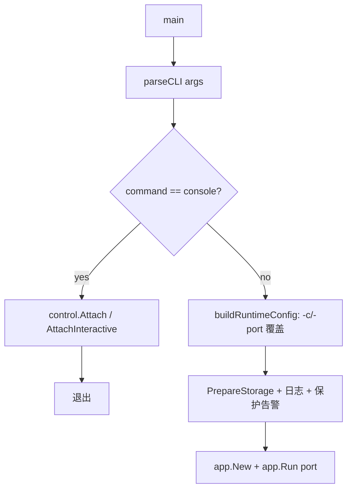
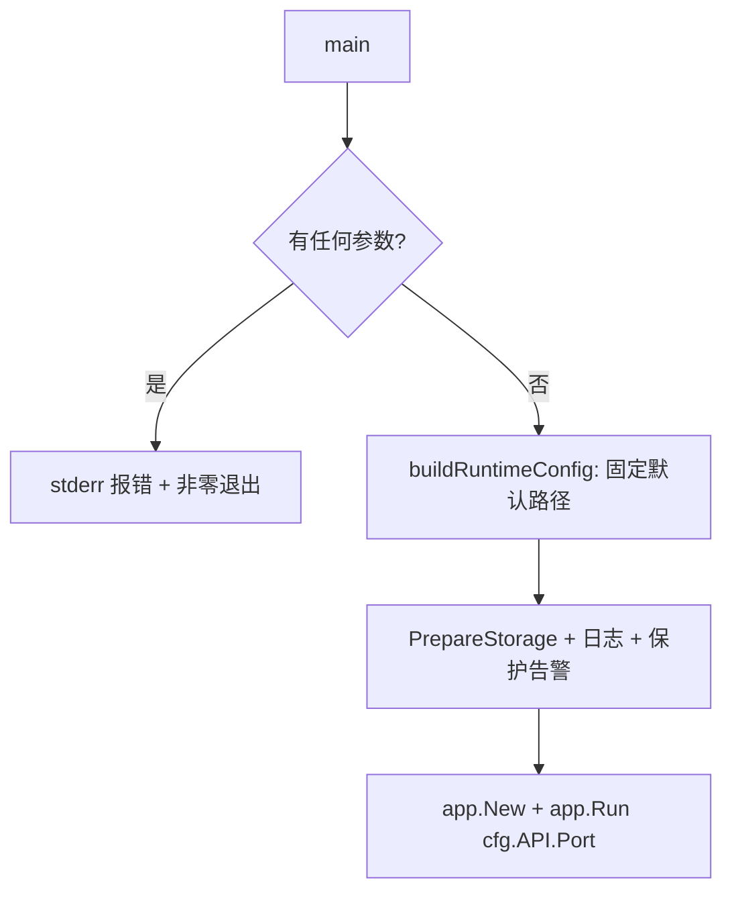

# simplify-cli-entry design

## 0. 术语

- **前台 console**：直接在 TTY 里运行 `webot-msg` 时，进程启动完整 service（监听 / HTTP API / 保护 / control socket）后进入的交互式命令循环，即当前 `serve` 默认路径。代码锚点：`internal/app/app.go:150`。
- **console 客户端入口**：当前 `webot-msg console` 子命令——一个通过 Unix socket attach 到已运行 service 的纯客户端。本 feature 移除的就是这个 CLI 入口。代码锚点：`cmd/webot-msg/main.go:31`。
- **socket server**：service 在 control socket 上监听、把连接交给 console 命令循环的服务端。**本 feature 保留它**，仅去掉第一方客户端入口；仍可用 `nc` / `socat` 连接。代码锚点：`internal/control/server.go:17`。

本节无新增与现有代码冲突的概念。

## 1. 决策与约束

**这是一次入口简化（删除为主），不是加新能力。** 原始目标：让用户只敲 `webot-msg`、不带任何参数就进 console，把多年累积的子命令 / flag / 兼容入口砍掉，降低认知与维护成本。

**放在哪儿**：改动集中在唯一可执行入口 `cmd/webot-msg/main.go`，不新建模块、不动 `internal/app` 主流程语义（前台 console 路径本就存在，只是从「默认命令」变成「唯一形态」）。

**已和用户对齐的两个方向决策（载入本设计的硬约束）**：

1. 无参 `webot-msg` = **自带 service 的前台 console**（不是连后台 service 的客户端）。即保留当前 `serve` 默认行为作为唯一形态。
2. **保留 socket server**，只去掉客户端入口（console 子命令）。socket 仍开放，以后可恢复 attach；因此 **client 端库代码（`control.Attach` / `AttachInteractive` 等）保留不删**，仅从 main.go 摘掉对它的调用。

**复杂度档位**：走默认档位。无对外 SDK、无高并发新逻辑，是一次性的 CLI 表面收敛。

**明确不做**（可被 grep / 测试反向核对）：

- 不删除 `internal/control/` 下的 client 代码（`client.go` / `interactive_client.go` / `output_splitter.go` 及其测试）——按方向决策 2 保留为休眠库。
- 不动 `internal/control/server.go`（socket server 继续在 service 内启动）。
- 不动 auth store 的 legacy 复制迁移（`runtimeconfig` 里 `./config/auth.json` → `~/.webot-msg/config/auth.json` 一次性复制）——那是数据迁移兼容，与 CLI 入口无关。
- 不动 `legacyProtectionWarning` 的判断逻辑与测试断言（`TestLegacyProtectionWarning` 只断言 `legacy [protection] config is ignored` / `/protection enable` / `once` 三个子串）；其文案里的 "in webot-msg console" 措辞属文案对齐改动，见 2.2，不影响测试。
- 不动 `scripts/linux-service.sh`——已按 `attention.md` 要求核对：`ExecStart=${INSTALL_BINARY_PATH}` 本就无参运行，与新入口天然兼容。
- 不改 Runtime config TOML schema（`api.port`、`-c` 指向的 TOML 结构本身不变，只是 CLI 不再暴露覆盖入口）。
- 不引入 `-version` / `-help` 等新 flag。

## 2. 名词层与编排层

### 2.1 名词层（现状 → 变化）

**现状**：`cmd/webot-msg/main.go` 用 `cliOptions{command, configPath, configSet, port, portSet}` 描述解析结果，`command` 取值 `serve` / `console`，由 `parseCLI` 填充。代码锚点：`cmd/webot-msg/main.go:107`、`cmd/webot-msg/main.go:117`。

**变化**：

- 删除 `cliOptions` 结构、`parseCLI`、`isCommand`。无参入口不需要解析出任何选项。
- `buildRuntimeConfig` / `loadRuntimeConfig` 去掉 `configPath` / `configSet` / `port` / `portSet` 四个参数，签名收敛为 `buildRuntimeConfig() (runtimeconfig.Config, error)`，内部固定读取默认路径 `runtimeConfigPath`、缺失时回退内置默认值。`runtimeConfigPath` 包级变量保留（测试需要可注入）。
- 端口与配置路径不再有 CLI 覆盖入口：端口只能改 TOML `api.port`，配置路径固定为默认路径。

行为示例（入口契约）：

| 输入 | 期望 |
| --- | --- |
| `webot-msg`（TTY） | 启动 service + 进入前台 console（同今日 `serve` 默认） |
| `webot-msg`（非 TTY，如 systemd） | 启动 service，不阻塞扫码，console 循环按非 TTY 处理 |
| `webot-msg serve` / `webot-msg console` | 报错退出（非零），提示不接受参数 |
| `webot-msg -port 8080` / `webot-msg -c x.toml` | 报错退出（非零） |
| `webot-msg 任意其他参数` | 报错退出（非零），一行清晰提示 |

### 2.2 编排层（现状 → 变化）

**现状主流程**：

**变化后主流程**：

**变化点**：

- `main()` 开头先做参数校验：`len(os.Args[1:]) > 0` → 向 stderr 打印一行用法错误并 `os.Exit(非零)`，不再有 console 分支。
- 删除 console attach 整段（含 `term.IsTerminal` 判断、`control.Attach` / `AttachInteractive` 调用）。
- main.go 不再 import `control` / `term` / `io`（若 `io` 仅服务于该段）；保留 `app` / `runtimeconfig` / `logfile` / `protection` 等启动所需 import。
- 端口取值从 `opts.port` 改为直接用 `resolved.API.Port`（已含 TOML 值）。
- `internal/app/app.go:117` 的提示 `Use 'webot-msg console' to open a control console and run /login.` 改写——console 子命令已移除。非 TTY（systemd）下无客户端入口，改为提示「用 socat/nc 连接 control socket 后运行 /login」或等价表述（具体措辞 implement 定）。
- `cmd/webot-msg/main.go:104` `legacyProtectionWarning` 文案中的 "in webot-msg console" 同步改写（如 "in the console"）——只改措辞不改判断逻辑，`TestLegacyProtectionWarning` 仅断言子串，不受影响。

### 2.3 挂载点清单（删了它 feature 即消失）

判据：删掉该项，「无参即进 console、无其他参数」这一可感行为是否消失。

1. `cmd/webot-msg/main.go` `main()` 的参数校验分支——删了就会重新接受参数 / 缺少拒绝逻辑。
2. `cmd/webot-msg/main.go` 删除 `parseCLI` / `isCommand` / console 分发——保留它们 feature 就没发生。
3. `internal/app/app.go:117` 用户提示文案——仍提 `webot-msg console` 就是残留旧入口的痕迹。
4. CLI 用法的活文档——`docs/user/runtime-config.md`、`docs/user/linux-systemd-deploy.md`、`AGENTS.md`（`CLAUDE.md` 为其 symlink；含 `go run ./cmd/webot-msg -port 26322`）、`skill/webot-msg-send/SKILL.md`（教调用方按 `-port N` / `-c path` 定位端口与配置）——仍写 `-c` / `-port` / `console` 即与实际不符。

（保留项 `control/server.go`、client 库代码、auth 迁移不在挂载点——它们删了 feature 也不消失，且属于「明确不做」。）

### 2.4 推进策略（按 paradigm 维度切片）

1. **入口骨架收敛**：改 `cmd/webot-msg/main.go`——删 `cliOptions`/`parseCLI`/`isCommand`、加无参校验、简化 `buildRuntimeConfig`/`loadRuntimeConfig` 签名、去掉 console 分支与相关 import。退出信号：`go build ./cmd/webot-msg` 通过，手动跑 `webot-msg`（默认配置缺失下）能进前台 console，带任意参数报错非零退出。
2. **用户提示文案对齐**：改 `internal/app/app.go:117` 文案（去掉 `webot-msg console` 指引，改为 socat/nc 表述），同步改 `cmd/webot-msg/main.go:104` `legacyProtectionWarning` 文案措辞（判断逻辑不动）。退出信号：`go build ./...` 通过，grep 全仓不再有运行期文案引用 `webot-msg console`。
3. **测试对齐**：`cmd/webot-msg/main_test.go` 删除 `parseCLI`（console / -c / 未知命令）、`-port` 覆盖、`buildRuntimeConfig` 多参数相关用例；按新签名补「默认配置回退」「显式默认路径读取」最小用例；`legacyProtectionWarning` 用例保留。退出信号：`go test ./...` 全绿。
4. **文档对齐**：更新四份活文档——`docs/user/runtime-config.md`、`docs/user/linux-systemd-deploy.md` 的 CLI 章节（去掉 `-c` / `-port` / `webot-msg console`，systemd 场景改为 socat/nc 说明或明确「需要交互操作时前台运行」）；`AGENTS.md` 运行命令改为无参 `go run ./cmd/webot-msg`（`CLAUDE.md` 是 symlink，无需另改）；`skill/webot-msg-send/SKILL.md` 去掉按 `-port N` / `-c path` 定位端口与配置的说法，改为只看默认 TOML。退出信号：四份文档不再出现 `-c` / `-port` / `webot-msg console` 作为推荐用法。

### 2.5 结构健康度与微重构

评估对象：**文件级** `cmd/webot-msg/main.go`（约 189 行）；**目录级** 无新增文件、无新目录。

先查 compound convention（关键词「目录组织 / 文件归属 / 命名约定」）——本仓库 `.codestable/compound/` 未建立相关 convention（features 流程为主），按通用判断处理。

**结论：本次不做微重构。** 原因：

- main.go 本次是**净删除**（移除 `parseCLI`/`isCommand`/`cliOptions`/console 分支），行数显著下降、职责更单一，不存在「文件偏胖 / 职责混杂」需要拆分的情况。
- 无新增文件，目录结构不变，不存在目录摊平问题。
- 删 dead client code 不在本次范围（方向决策 2 明确保留），故无「删文件」动作。

**超出范围的观察**（仅提示，不阻塞、不作前置）：

- 移除 console 客户端入口后，`control.Attach` / `AttachInteractive` / `output_splitter` 及其测试成为不再被生产路径引用的休眠库。按用户决策刻意保留以便日后恢复 attach。**若未来确认不再恢复**，可另起 `cs-refactor` 清理这批 dead code——本 feature 不处理。

## 3. 验收契约

每条为「输入 / 触发 → 期望可观察结果」，覆盖正常 + 边界 + 错误。

**正常**

- C1：TTY 下运行 `webot-msg`（无参）→ 启动 service（control socket listening 打印），进入前台交互 console，可执行 `/login`、`/bots` 等命令，行为与改动前 `webot-msg serve` 一致。
- C2：非 TTY（管道 / systemd `ExecStart=/usr/local/bin/webot-msg`）下运行无参 `webot-msg` → service 正常启动、不因扫码阻塞，control socket 正常开放（可被 socat/nc 连接）。
- C3：默认配置文件存在且含 `api.port = N` → service 监听端口 N；默认配置缺失 → 回退内置默认端口。

**边界 / 错误**

- C4：`webot-msg serve` → 非零退出 + stderr 一行错误（不接受参数）。
- C5：`webot-msg console` → 非零退出 + stderr 错误（console 子命令已移除）。
- C6：`webot-msg -port 8080`、`webot-msg -c x.toml`、`webot-msg foo bar` → 均非零退出 + stderr 错误。

**明确不做的反向核对**

- N1：`internal/control/server.go` 仍在 `app.Run` 中被启动（control socket 仍 listening）。
- N2：`internal/control/{client,interactive_client,output_splitter}.go` 文件仍存在且 `go build ./...` / `go test ./...` 通过（保留休眠库）。
- N3：auth legacy 复制迁移与 `legacyProtectionWarning` 判断逻辑保持不变、对应测试仍存在且通过（仅 2.2 所述文案措辞调整）。
- N4：Runtime config TOML schema 不变（`runtimeconfig` 包无字段增删）。

## 4. 架构影响

- `ARCHITECTURE.md` 第 2 节、第 4 节「配置入口保持克制」「systemd 交互通过本地 Unix socket」等描述需在 acceptance 阶段回写：唯一入口变为无参 `webot-msg`，不再有 `serve` / `console` 子命令与 `-c` / `-port`；socket server 保留但无第一方客户端入口。
- 第 6 节边界条目中涉及 `webot-msg console`、`-c`、`-port` 的描述同步更新。
- `requirements/bot-message-bridge.md` 已核实大量描述启动 / 控制台用法（边界与历史小节涉及 `-c` / `-port` / `serve` / `webot-msg console`），acceptance 时需更新。
- 不新增模块、不新增跨模块接口，无需在 ARCHITECTURE 加新指向。
