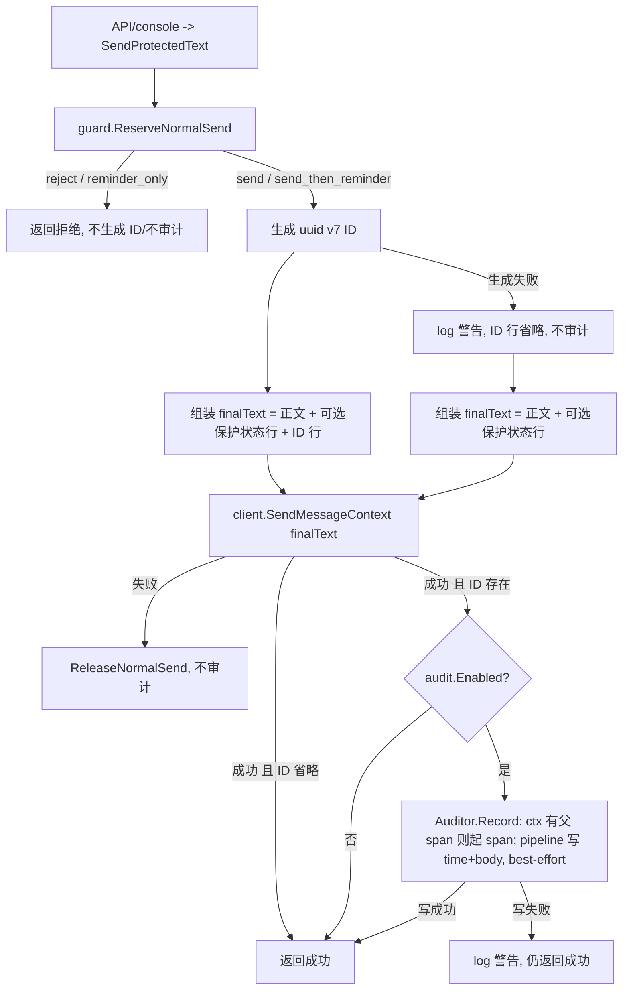

# message-id-audit 设计方案

## 0. 术语约定

- **消息 ID**：每条普通文本发送时用 `uuid.NewV7()` 生成的唯一标识，拼接在发往微信正文的最底部，并作为审计两个 key 的关联键。
  防冲突：grep `uuid` / `NewV7` / `messageID` 在仓库无既有定义；`github.com/google/uuid v1.6.0` 当前是 `go.mod` 间接依赖，本 feature 升为直接依赖，无新外部库。
- **审计能力（Audit）**：运行期默认关闭、由本地控制台 `/audit enable|disable|status` 控制、开关状态本地持久化的发送审计；开启后每条普通文本成功发送会向 Redis 写入两个 key（发送时间 + 完全体正文）。
  防冲突：grep `audit` 在 `internal/` 无既有标识，仅 issue/feature 文档出现；新建 `internal/audit` 包不与现有包重名。
- **完全体正文**：实际传给 `ilink` 发送的最终文本，即 `用户正文 + 可选保护状态行 + ID 行`，审计内容 key 存的就是这个字符串。
- **审计 Redis key**：`{prefix}:audit:time:{id}`（发送时间）和 `{prefix}:audit:body:{id}`（完全体正文），`{prefix}` 复用 `[redis].key_prefix`（默认 `webot-msg`）。
  防冲突：与保护 key `{prefix}:protect:{botID}:state|active` 不同段（`audit` vs `protect`），无重叠。
- **审计开关状态文件**：`~/.webot-msg/state/audit.json`，只存 `audit_enabled` 布尔值，与保护的 `protection.json` 并列、机制一致；由 service 运行时创建，部署脚本不写入。

## 1. 决策与约束

### 需求摘要
- **做什么**：(1) 每条普通文本发送在正文最底部拼接 uuid v7 ID；(2) 运行期可开关、本地持久化、Redis 操作接入 otel 的审计，开启后按 ID 写「发送时间 key（带 TTL）」和「`audit` 命名空间下的完全体正文 key（默认 1 天 TTL）」。
- **为谁**：需要对 bot 发出的每条消息做追溯/审计的运维与调试者。
- **成功标准**：
  - 任意普通文本发送（API 或控制台），发往微信的正文末尾都带一行 uuid v7 ID（与审计开关无关）。
  - `/audit enable` 后发送一条普通文本，Redis 中存在 `{prefix}:audit:time:{id}`（值=发送时间、有 TTL）与 `{prefix}:audit:body:{id}`（值=完全体正文、默认 24h TTL），ID 与正文末尾一致。
  - 审计开启后重启服务，审计自动恢复为开启（Redis 可用时），无需重复 `/audit enable`。
  - 经 API 触发、且 telemetry 已启用时，审计的 Redis 写在同一条 trace 下出现一个 span。
  - `/audit disable` 后再发送不写任何审计 key；`/audit status` 显示当前开关与 TTL 配置。
- **明确不做**：
  1. ID 与审计不作用于保护提醒消息（reminder）和 typing 状态——只作用于普通文本发送。
  2. 不为审计单独配置 Redis 连接，复用 `[redis]`；审计开启失败不影响保护，反之亦然。
  3. 不提供读取/检索审计内容的命令；`/audit status` 只展示开关与 TTL，不查具体消息（查内容直接用 redis-cli）。
  4. 不改变 HTTP API 请求/响应 JSON 契约——ID 只进入发往微信的正文，不写入 API 响应体。
  5. 审计 Redis span 不覆盖 console 触发的发送（无入站 span 时不追踪），与现有 iLink 出站一致；不引入 `redisotel` 自动 instrument。

### 复杂度档位
走后端本地服务默认档位，无偏离（无对外 SDK / 高并发 / 一次性工具信号）。

### 关键决策
- **ID 无条件拼接**：每条普通文本发送都生成并拼接 ID，与审计开关解耦。换成「仅审计开启时拼接」会让发出正文随审计开关变化、ID 不能作为稳定追溯锚点——名词层 ID 的语义会从「消息固有标识」退化成「审计副产物」。
- **正文兼容与迁移策略**：ID 行是有意的用户可见正文变化，不提供运行期开关；升级到包含本 feature 的版本后，所有普通文本接收方都应把最后一行 uuid v7 视为系统追加的追踪标识，自动化消费方如需保留旧正文语义，应在消费端容忍或剥离末行 uuid v7。HTTP API 请求/响应 JSON 保持不变，迁移告知落在用户文档和部署升级说明中。
- **审计用运行期 `/audit` 命令开关 + 本地持久化 + 启动一次性自动恢复**：与现有 `/protection` 完全对称——`/audit enable` 成功写 `audit.json=true`，`disable` 写 `false`；启动时读 `audit.json`，记录为开启则尝试一次 `auditor.Enable`，Redis 不可用则告警、保持关闭、**不改写文件**（修复 Redis 后手动 `/audit enable`；Redis 随后恢复不自动开启）。换成 TOML 常开会失去运行期切换；不持久化则重启需重复开启，与保护体验不一致。
- **审计 fail-open，保护 fail-closed**：审计写失败（含 Redis 不可达）只记日志，不挡发送——审计是观测附加项，不能改变消息投递结果。这与保护的 fail-closed 相反，是流程级约束的核心区别。
- **审计 Redis 操作接入 otel：手工 child span + 仅在有父 span 时创建**：在 `Auditor.Record` 内用 `otel.Tracer` 起一个包住两 key pipeline 的 span，且仅当 `oteltrace.SpanContextFromContext(ctx).IsValid()` 为真时创建（镜像 iLink 出站 filter `ilink/client.go:381`）。不引入 `redisotel` 自动 instrument——它会为 console 触发的写生成孤儿 root span，违反现有「无入站 span 不手工 root span」原则，且新增依赖。span 属性只含操作名/ID，**不含正文、BotID、密码**。这是对架构 §4「telemetry 不做 Redis 手工 span」决策的有意、受限扩展（仅 audit、仍遵守 root-span 约束）。
- **审计 Auditor 不复用保护的 generation/refcount 机制**：保护发送是「预留→发送→释放/记账」跨步事务，需要 `RuntimeGuard` 的 generation 绑定；审计写是单步 fire-and-forget，无跨步事务，用一个 mutex 保护的 client 原子替换即可，避免过度设计。
- **审计 key 带 `key_prefix` 命名空间**：用 `{prefix}:audit:time|body:{id}` 而非裸 UUID，与保护 key 风格一致，避免裸 UUID 污染共享 Redis、便于按前缀清理。
- **复用 `protection.NewRedisClient` 构造审计 Redis client**：这两个是已导出的通用连接 helper（非保护业务逻辑），复用避免重复 URL 校验，改动最小。代价：`internal/audit` 会 import `internal/protection`——见 2.5「超出范围的观察」。

## 2. 名词与编排

### 2.1 名词层

**现状**
- `internal/sender` 单一发送漏斗：`SendProtectedText(...)` 是 API 与控制台共用入口；最终发往微信的文本在 `protected_text.go:48-51` 组装为 `text (+ 可选保护状态行)`。
- `internal/protection.NewRedisClient(url, password)` / `ValidateRedisURL` 提供 Redis client 构造与 URL 校验（`redis_guard.go:32`/`47`）。
- `internal/protection.StateStore` + `PersistedState{ProtectionEnabled}` 提供保护开关的原子文件持久化（`state_store.go:16`）；`app.restoreProtectionState`/`persistProtectionState` 负责启动恢复与落盘（`app.go:247`/`258`）。
- `console.Controller`（`console.go:20`）声明控制台依赖的 app 能力，含 `EnableProtection/DisableProtection/PrintProtectionStatus`。
- telemetry 出站追踪范式：`instrumentedTransport` 用 `otelhttp.WithFilter` 仅在 ctx 有有效 span 时追踪（`ilink/client.go:380`）。

**变化**（新增，全新模块为主）
- 新增 `internal/audit` 包，核心接口：

```go
// 来源：新增 internal/audit
type Auditor interface {
    Enabled() bool
    // 关闭时为 no-op 返回 nil；开启时写两个 key（内部按需起 otel span）
    Record(ctx context.Context, in RecordInput) error
}

type RecordInput struct {
    ID     string    // uuid v7
    SentAt time.Time // 实际发送成功时间
    Body   string    // 完全体正文：text + 可选保护状态行 + ID 行
}

type EnableConfig struct {
    RedisURL, RedisPassword, KeyPrefix string
    TimeTTL, BodyTTL                   time.Duration // 默认各 24h
}
```

- `internal/audit` 提供运行期开关具体类型（如 `*Recorder`）：`Enable(ctx, EnableConfig) error`（建 client + Ping + mutex 原子换入）、`Disable()`（关 client）、`Enabled()`、`Record(...)`。Record 关闭态直接返回 nil。
  - Record 行为示例：
    - 开启 + 正常 → Redis 出现 `webot-msg:audit:time:{id}`（值=`SentAt` 的 Unix 毫秒、PTTL≈TimeTTL）与 `webot-msg:audit:body:{id}`（值=`Body`、PTTL≈BodyTTL）；ctx 有父 span 时 trace 中多一个 `audit.record` span。
    - 关闭 → 不写任何 key，返回 nil。
    - 开启 + Redis 写失败 → 返回 error（由 sender 记日志、不挡发送）。
- 审计开关持久化：新增 `DefaultAuditStatePath = "~/.webot-msg/state/audit.json"`（runtimeconfig 内置默认、不暴露 TOML key），及与 `protection.StateStore` 同形的审计状态读写（存 `audit_enabled` 布尔，原子 temp+rename，owner-only）。
- 新增 **ID 生成器**协作者：`func() (string, error)`，默认 `uuid.NewV7().String()`，注入便于测试替换为固定/失败 ID。
- `sender.SendProtectedText` 入口新增两个协作者：ID 生成器 + `audit.Auditor`，由 app/api 装配注入（签名由 implement 决定，可用 options 结构避免参数膨胀）。
- `console.Controller` 新增 `EnableAudit(out) error` / `DisableAudit(out) error` / `PrintAuditStatus(out)`，由 `app.App` 实现（含启动 `restoreAuditState`、`persistAuditState`，镜像保护对应方法）。

### 2.2 编排层

**主流程图**



启动侧（`app.Run` 开头，与保护并列）：读 `audit.json`，`audit_enabled=true` 则尝试一次 `auditor.Enable`；失败告警、保持关闭、不改写文件。

**现状**：`sender.sendProtectedText` 是线性 pipeline：预留 → 按 reservation 分支 → 发送 → 失败释放 →（必要时）发提醒。最终文本仅 `text + 可选保护状态行`。`app.Run` 启动时已调用 `restoreProtectionState`。

**变化**：
- 组装最终文本前插入「生成 ID」，最终文本追加 ID 行（保护状态行之后、最底部）。
- 发送成功后插入「审计 Record」支线（仅 send / send_then_reminder 的正文，不含其后 reminder）。
- `app.Run` 启动时新增 `restoreAuditState`，与保护恢复并列。
- 拓扑仍线性 pipeline，仅新增一个发送后 best-effort 支线，不升级为分支/DAG。

**流程级约束**：
- **审计 fail-open**：`Auditor.Record` 出错只 `log.Printf` 警告，不改变 `SendProtectedText` 返回值。
- **ID 生成 fail-open**：`uuid.NewV7()` 出错（仅 rand 失败，极罕见）则省略 ID 行、跳过审计、记日志，仍正常投递消息。
- **作用范围**：ID + 审计仅作用于普通文本成功发送（`ReservationSendNormal` / `SendNormalThenReminder` 的正文）；reject、reminder_only、保护提醒、typing 一律不带 ID、不审计。
- **顺序**：ID 先于发送生成；审计 `SentAt` 取发送成功后时间；审计只在 `SendMessageContext` 成功后写。
- **持久化语义**：`/audit enable|disable` 成功后落 `audit.json`；启动恢复只尝试一次，Redis 不可用不改写文件（同保护）。
- **持久化失败语义**：`/audit enable|disable` 已经切换运行态但 `audit.json` 落盘失败时，不回滚运行态，但返回 partial-success 错误并明确说明重启恢复语义不可靠。
- **可观测点**：审计 Redis 写在 ctx 有有效父 span 时起一个 span，属性不含正文/凭据；写失败、ID 生成失败各打一条 `log` 警告（不含正文/凭据）。
- **审计两 key 写入**：一次 pipeline 写 `SET ... PX ttl` 两条；非强原子，整体失败记日志即可。

### 2.3 挂载点清单

- `/audit enable|disable|status` 命令注册：`internal/console/commands.go` CommandSpec + `internal/console/console.go` 派发分支 — 新增
- `[audit]` TOML 配置 section（`time_ttl` / `body_ttl`，可选、缺省 24h）：`internal/runtimeconfig/config.go` — 新增
- 审计开关状态文件 `~/.webot-msg/state/audit.json`（持久化产物，与 `protection.json` 并列）— 新增
- 审计 Redis key schema：`{prefix}:audit:time:{id}` / `{prefix}:audit:body:{id}`（系统级外部产物）— 新增
- 发送编排注入：`internal/sender` 最终正文拼接 ID 行 + 发送成功后调用 `Auditor.Record`（删掉此项整个 feature 消失）— 新增
- 部署脚本默认 `[audit]` 段：`scripts/linux-service.sh` install 写默认、upgrade 补全（为一致性/可发现性，非正确性必须）— 修改

### 2.4 推进策略

```
1. 编排骨架：sender 接入 ID 生成器 + Auditor（先用 no-op Auditor + 注入式 idGen），跑通"生成 ID → 拼 finalText → 成功后 Record"
   退出信号：现有发送测试全绿；发出正文末尾带 ID 行；Record 在 no-op 下不报错
2. 计算节点：实现 internal/audit（Enable/Disable/Enabled/Record + key 构造 + TTL pipeline 写入 + 按需 otel span）
   退出信号：audit 包单测（miniredis）覆盖"开启写两 key + TTL""关闭 no-op""Redis 写失败返回 error""有父 span 时产生 span、无父 span 时不产生"
3. 运行期开关 + 持久化装配：app 持有 Auditor + EnableAudit/DisableAudit/PrintAuditStatus + restoreAuditState/persistAuditState（镜像保护）；console 加 /audit 命令与派发；api server 注入 idGen + Auditor
   退出信号：/audit enable|disable|status 端到端可用；enable→重启→自动恢复开启；disable 后不写
4. 配置接通：runtimeconfig 加 [audit]（默认 24h、正数校验）+ DefaultAuditStatePath；main.go 装配 audit.EnableConfig（复用 [redis]）；部署脚本写/补默认 [audit]
   退出信号：TOML 改 TTL 生效；缺 [audit] 回退默认；非法 TTL 启动失败；install/upgrade 产出含 [audit]
5. 测试覆盖：补齐验收场景剩余条目
   退出信号：所有验收场景有可观察证据；go test ./... 全绿；go vet 通过
```

### 2.5 结构健康度与微重构

##### 评估
- 文件级 — `internal/sender/protected_text.go`（93 行）：职责单一，本次只在最终文本组装处加 ID、发送成功处加 Record，改动密度低。健康。
- 文件级 — `internal/app/app.go`（661 行）：偏长，但本次新增 `EnableAudit/DisableAudit/PrintAuditStatus` + `restoreAuditState/persistAuditState`，均沿用既有保护对应方法的形态，单处独立。健康（不达"职责混杂"拆分标准）。
- 文件级 — `internal/runtimeconfig/config.go`（549 行）：偏长，本次只加 `[audit]` struct + 一段 resolve 校验 + `DefaultAuditStatePath`，沿用 `resolveProtection`/`resolveTelemetry` 模式。健康。
- 文件级 — `internal/console/console.go`、`commands.go`、`internal/api/server.go`、`cmd/webot-msg/main.go`、`scripts/linux-service.sh`：均沿用 `/protection` 与 `[redis]/[telemetry]` 既有模式增量加分支/字段/段，量小独立。健康。
- 目录级 — `internal/audit/`：全新目录，无摊平。`internal/` 新增 1 个子包不构成摊平。

##### 结论：不做
本次不做微重构。要改文件职责清晰、改动量小且沿用现有 `/protection`、`resolveXxx`、`ensure_*_config_section` 模式；新文件落入全新 `internal/audit` 包，目录不挤。微重构收益不抵风险。

##### 超出范围的观察（仅提示不阻塞）
- `internal/audit` 复用 `protection.NewRedisClient` / `ValidateRedisURL` 会形成 `audit → protection` 的 import 依赖；这两个其实是通用 Redis 连接 helper，语义上不属于保护。
- `internal/audit` 的审计状态文件读写与 `protection.StateStore` 的原子 temp+rename 逻辑高度重复（仅 JSON 字段不同）。
  → 以上两点若后续有第三方复用需求，建议走 `cs-refactor` 把「Redis 连接 helper」与「布尔开关状态文件」分别抽到中性包（如 `internal/redisclient`、`internal/statefile`），让 protection / audit 共用。本 feature 不动，保持最小改动。

## 3. 验收契约

### 关键场景清单
- **ID 总是拼接（审计关）**：审计关闭时发送一条普通文本 → 传给 ilink 的正文末尾有一行合法 uuid v7；ID 不进 API 响应体。
- **ID 在最底部**：保护开启且带状态行时发送 → 正文顺序 `用户正文` → `保护状态行` → `ID 行`，ID 为最后一行。
- **审计开启写两 key**：`/audit enable` 后发送 → Redis 存在 `{prefix}:audit:time:{id}`（值=发送时间 Unix 毫秒、PTTL≈time_ttl）与 `{prefix}:audit:body:{id}`（值=完全体正文、PTTL≈body_ttl 默认 24h）；ID 与正文末尾一致。
- **审计关闭不写**：`/audit disable` 后发送 → 无新增 `audit:*` key。
- **持久化恢复**：`/audit enable` 后重启服务（Redis 可用）→ 审计自动恢复开启、发送即写审计 key，无需重新 enable；`audit.json` 记 `audit_enabled=true`。
- **恢复失败保持关闭**：`audit.json=true` 但启动时 Redis 不可用 → 服务正常启动、审计保持关闭、告警、`audit.json` 不被改写。
- **审计 fail-open**：审计开启但 Redis 写失败 → 发送仍返回成功（API 200 / 控制台 Send success），仅日志告警。
- **ID 生成 fail-open**：注入失败的 idGen → 正文不带 ID 行、不写审计、发送仍成功。
- **otel span**：telemetry 启用 + 经 API 发送 → 同一 trace 下出现审计 Redis 写的 span，且 span 属性不含正文/密码；经控制台发送 → 不产生审计 root span。
- **范围排除**：保护提醒消息与 typing 不带 ID、不审计；reservation reject/reminder_only 不生成 ID、不审计。
- **TTL 可配**：`[audit] time_ttl/body_ttl` 改值后对应 key PTTL 变化；缺 `[audit]` 默认 24h；非法 duration 启动失败。
- **`/audit status`**：展示审计开关状态与 time_ttl/body_ttl，不查询具体消息内容。
- **升级兼容说明**：用户文档明确普通文本正文会新增末行 uuid v7；自动化接收方需要容忍或剥离该末行；HTTP API 响应仍无 ID 字段。

### 明确不做的反向核对项
- ID/审计相关代码不在 `sendProtectionReminder` 与 typing 路径出现。
- `internal/audit` 不出现独立的 redis url/password 配置项；仅从 `[redis]` 取连接。
- HTTP API 响应 JSON 不新增 ID 字段（`handleSendMessage` 成功响应仍为 `{code,message}`）。
- 无读取审计内容的命令/接口（`/audit status` 输出不含消息正文）。
- 代码不 import `redisotel`/`go-redis/extra`；审计 span 仅在 `oteltrace.SpanContextFromContext(ctx).IsValid()` 时创建（无父 span 不产生 root span）。

## 4. 与项目级架构文档的关系

acceptance 阶段需提炼回 `architecture/ARCHITECTURE.md`：
- **名词** → §0 术语新增「消息 ID」「审计能力」「审计 Redis key」「审计开关状态文件」；§2 新增 `internal/audit` 模块描述。
- **数据与状态** → §3 增补审计 key schema（`{prefix}:audit:time|body:{id}` + TTL）与 `audit.json`（与 `protection.json` 并列、运行时创建）。
- **关键决策** → §4 增补：ID 无条件拼接、审计 fail-open（对比保护 fail-closed）、审计运行期开关+本地持久化+启动一次性恢复、审计复用 `[redis]` 连接；并**修订**原「telemetry 不做 Redis 手工 span」条为「audit Redis 在有入站 span 时追踪、仍不产生 root span」。
- **已知约束** → §6 增补：ID/审计仅作用于普通文本成功发送，排除 reminder/typing；ID 生成与审计写均 fail-open；审计恢复只尝试一次。
- **部署/文档** → `scripts/linux-service.sh` 写/补 `[audit]`；`docs/user/runtime-config.md`、`docs/user/linux-systemd-deploy.md` 补 `[audit]` 配置说明（参见 `attention.md` 同步要求）。

关联已有 doc：`requirements/bot-message-bridge.md`（acceptance 阶段补「消息 ID + 可选持久化审计」用户故事）；与 `internal/sender` 既有保护状态行编排同处一个发送漏斗。
