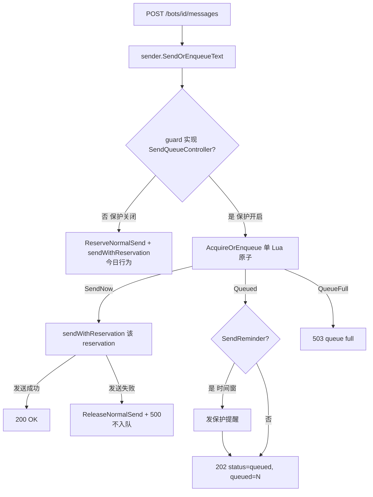
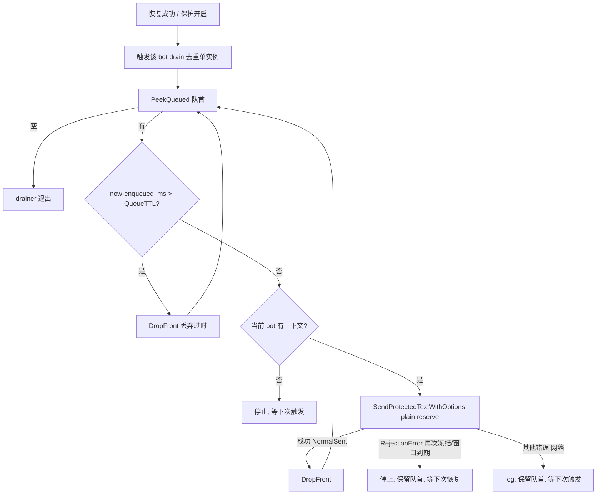

# protection-send-queue 设计方案

## 0. 术语约定

- **发送队列（send queue）**：保护模式冻结期，按 bot 缓存待发普通文本的 Redis List，key 为 `{prefix}:protect:{botID}:queue`，`{prefix}` 复用 `[redis].key_prefix`，`{botID}` 用 hash tag 与既有 `:state` / `:active` 落同一 slot。元素是序列化的待发负载（正文 + 入队时间）。
  防冲突：grep `queue` / `enqueue` / `drain` / `backlog` 在 `internal/`、`cmd/` 无既有标识（仅 `console` 的 `BufferedLineReader` 用到 `Buffer`，与本 feature 命名不冲突）；`:queue` 段与既有 `:state` / `:active` / `audit:*` 段不重叠。
- **入队（enqueue）**：把一条 API 普通文本发送请求 RPUSH 到发送队列尾部，不真正调用 iLink。
- **重放 / drain**：恢复后由单 drainer goroutine 按 FIFO（队首先出）逐条把队列里的消息走正常发送漏斗投递，直到队列空或再次触限。
  防冲突：grep `Drain` / `replay` 在仓库无既有定义。
- **恢复（recovery）**：沿用既有定义——微信 App 主动消息被监听到后触发 `RecordActiveConversation`，重置该 bot 的下发计数与 24h 主动对话窗口（`internal/app/app.go:748`）。本 feature 在此点额外触发 drain。
- **队列负载（queued payload）**：入队元素的序列化结构，含「用户正文」与「入队 Unix 毫秒」（供 TTL 判定）；**不缓存入队时的 `ContextToken`**，重放时统一用当前 bot 上下文（见 §1 关键决策）。
- **队列上限 / 队列 TTL**：队列长度上限（默认 1000）与单条存活时长（默认对齐 `ActiveWindow`=24h）；均为内置默认，不暴露 TOML key（与 protection 既有限额一致）。

## 1. 决策与约束

### 需求摘要

- **做什么**：保护模式开启且进入冻结后，**HTTP API** 收到的普通文本发送请求不再被拒绝，而是按 bot 缓存到 Redis 队列并返回「已入队」；恢复后先按 FIFO 把队列里堆积的消息重放投递，堆积清空前新到的 API 请求也继续入队（保证顺序）；队列有界（上限 + TTL）。
- **为谁**：把 bot 接入自动化流程、依赖本地 HTTP 入口发消息的调用方——希望冻结期消息不丢、恢复后按序补发，而不是自己实现重试与排序。
- **成功标准**：
  - 保护开启 + 冻结时，`POST /bots/{id}/messages` 返回 `202`（body 含 `status=queued` 与当前队列长度），且消息进入 Redis `{prefix}:protect:{botID}:queue`，不调用 iLink。
  - 冻结期连续发 N 条 → 队列内 N 条且顺序与到达一致。
  - 微信 App 主动发一条消息（恢复）后，队列内消息按 FIFO 依次真实投递到当前上下文，每条带 uuid v7 ID（审计开启时按 ID 落审计），队列随之清空。
  - 重放未清空期间到达的新 API 请求排在堆积之后（不插队）。
  - 重放途中再次触发次数/时间限制 → drain 停止，剩余消息留在队列，下次恢复继续。
  - 队列达到上限时新入队返回 `503`；单条超过 TTL 在重放时被丢弃不投递。
- **明确不做**：
  1. 控制台 `/send`（`app.SendText`）路径**不入队**：冻结时保持现有"立即拒绝/报错"行为（人工交互需要即时反馈）。
  2. typing 与保护提醒消息不入队。
  3. 网络 / iLink 发送失败（非冻结）**不入队**：仍 `ReleaseNormalSend` + 返回 `500`，由调用方重试——队列只承接"保护冻结"导致的延迟，不承接传输失败。
  4. 不新增 TOML 配置项：队列上限 / TTL 用内置默认（沿用"配置入口克制"与 protection 限额不暴露 TOML 的惯例）。
  5. 不做多会话独立队列：沿用单 bot 单 `IlinkUserID` / `ContextToken` 模型，全队列共用 drain 时刻的当前上下文。
  6. 不保证 exactly-once：peek→send→pop 在 crash 窗口为 at-least-once，可能重复投递；不引入去重标记。
  7. `/protection disable` 不自动 flush 队列：队列留存 Redis，重新 enable + 下次恢复后再 drain（受 TTL 约束最终过期）。
  8. 不新增清空 / 导出队列的控制台命令；`/protection status` 只增展队列长度。

### 复杂度档位

走后端本地服务默认档位，无偏离（非对外 SDK、非高并发、非一次性工具）。但**顺序与原子性是本 feature 的核心正确性约束**（见 §2.2 流程级约束），用「Redis 单 Lua 决策 + 单 drainer」保证，不属于高并发档位。

### 关键决策

- **冻结语义从"拒绝"改为"入队重放"，仅作用于 API**：这是对架构 §4 / §6「冻结期 HTTP API 返回 429」决策的有意修订。保留 429 会让外部自动化在冻结期丢消息、各自实现重试与排序；入队重放把"等待微信主动对话"的等待期对调用方透明化。控制台仍 fail-closed 拒绝，因为人工交互需要即时反馈——这也是 API 与控制台行为有意分叉的点。迁移策略：用户文档明确旧客户端需把 `202 status=queued` 视为"服务已接收、稍后补发"，不要再按旧 `429` 逻辑立即重试同一条消息；队满 `503` 才是调用方可退避重试的背压信号。不加兼容开关，避免和"不新增 TOML 配置项"约束冲突。
- **入队决策与预留必须单 Lua 原子**：ingress 的"是否延迟（frozen 或队列非空）→ 要么 RPUSH、要么预留计数"在**一个 Lua** 内完成。换成"先查队列再预留"两步会在两步之间被并发请求插队，破坏"堆积清空前新消息排队"的顺序保证。
- **顺序保证用 peek→send→pop-on-success，而非 pop→send**：drain 处理时让队首在其发送期间**留在队列**（`LLEN` 保持 >0），并发新请求在 ingress 看到 `LLEN>0` 而入队，从而杜绝队尾边界重排——无需额外的 draining 标志。代价：进程在"发送成功后、pop 前"崩溃会重发该条（at-least-once）。选 pop→send 则可能在边界重排；顺序是本 feature 的硬需求，故取 at-least-once 这一较轻代价。
- **drain 复用 `sender.SendProtectedTextWithOptions`（plain reserve 路径）**：每条重放消息走与普通发送完全相同的漏斗（uuid v7 ID、保护状态行、审计、必要时提醒都在**实际投递时刻**生成），ID / 审计时间反映真实投递。drain **不能**用 ingress 的队列感知预留——否则会看到自身 `LLEN>0` 而自我入队、死锁。
- **drain 触发点 = 恢复 + 保护开启/自动恢复**：`RecordActiveConversation` 成功后触发该 bot 的 drain；保护 `enable` / 启动 auto-restore 时也对每个 bot 触发一次，覆盖"重启后 Redis 仍有积压"。单 bot 单 drainer，去重并发触发。
- **重放途中再次触限即停**：drain 中某条预留得到 reject / reminder_only（再次冻结或时间窗到期）就停止 drain、保留队首，等下次恢复；不在 drain 内自旋等待。
- **有界：上限 + TTL，内置默认不暴露 TOML**：队列长度满则拒绝新入队（API `503`，保留既有 FIFO 不丢老消息）；每条带 `enqueued_ms`，drain 时超过队列 TTL（默认对齐 `ActiveWindow`=24h）即丢弃不投递，RPUSH 同时刷新队列 key 的 `PEXPIRE` 作粗粒度兜底。无界会在"恢复长期不来"时无限堆积并最终重放大量过时消息。
- **队列状态走类型断言扩展，不污染 `Guard` 核心接口**：新增 `SendQueueController`（`AcquireOrEnqueue` / `PeekQueued` / `DropFront` / `QueueLen`），由 `RedisGuard` 实现、`RuntimeGuard` 经 operation 委托，镜像现有 `ProtectionStatus` 的断言式扩展（`runtime_guard.go:115` / `:207`）。避免 `NoopGuard` 等被迫实现队列方法；保护关闭（NoopGuard，无此接口）时 ingress 退化为普通发送，无队列。
- **重放用当前上下文而非入队时上下文**：恢复由一条新微信消息触发，它会把 `IlinkUserID` / `ContextToken` 更新为最新会话；沿用单 bot 单上下文模型，重放统一用当前上下文。缓存旧 context token 反而可能因 token 失效发送失败。

## 2. 名词与编排

### 2.1 名词层

**现状**

- `internal/sender.sendProtectedText`（`protected_text.go:67`）是线性发送漏斗：`ReserveNormalSend` → 按 `Reservation.Kind` 分支（send / send_then_reminder / reminder_only / reject）→ 拼状态行 + ID 行 → `SendMessageContext` → 失败 `ReleaseNormalSend`、成功写审计、必要时发提醒。API 与控制台共用 `SendProtectedTextWithOptions`。
- `protection.Guard`（`guard.go:40`）核心接口含 `ReserveNormalSend` / `ReleaseNormalSend` / `RecordReminderSend` / `RecordActiveConversation` / `CheckTimeWindow`；`Reservation`（`guard.go:103`）带 `Kind` 与状态快照。
- `protection.RedisGuard`（`redis_guard.go:22`）持有 client、`keyPrefix`、限额参数，用 `keys(botID)`→`[:state, :active]` 与 Lua 脚本原子处理预留/释放/提醒/重置；额外实现 `ProtectionStatus`（`redis_guard.go:125`），经 `RuntimeGuard.RuntimeStatus` 的断言式扩展暴露（`runtime_guard.go:111/207`）。
- `protection.Status`（`guard.go:76`）是 `/protection status` 的数据载体。
- `protection.RedisGuardConfig` / `EnableConfig`（`redis_guard.go:14` / `runtime_guard.go:24`）承载限额；`runtimeconfig.ProtectionConfig`（`config.go:93`，`toml:"-"` 内置默认）是其上游，`MessageLimit=10` 等在 `Default()`（`config.go:162`）写死、`resolveProtection`（`config.go:275`）校验。
- `api.Server.handleSendMessage`（`server.go:132`）：调用 `sender.SendProtectedTextWithOptions`，`RejectionError` → `429`（`sendProtectionLocked`），成功 → `200`。

**变化**

- **新增队列负载序列化结构**（`internal/protection` 内，JSON）：

```go
// 来源：新增 internal/protection/queue.go
type queuedPayload struct {
    Text       string `json:"text"`        // 用户正文（不含状态行/ID 行，发送时再拼）
    EnqueuedMs int64  `json:"enqueued_ms"` // 入队 Unix 毫秒，供 TTL 判定
}
```

- **新增 `SendQueueController` 接口**（断言式扩展，不进 `Guard`）：

```go
// 来源：新增 internal/protection/queue.go；RedisGuard 实现，RuntimeGuard 经 operation 委托
type SendQueueController interface {
    // 原子：若 frozen 或队列非空 → 入队(未满)；否则按既有 reserve 逻辑预留
    AcquireOrEnqueue(ctx context.Context, botID, text string) (Ingress, error)
    PeekQueued(ctx context.Context, botID string) (text string, enqueuedMs int64, ok bool, err error)
    DropFront(ctx context.Context, botID string) error // 成功投递或丢弃过时后弹出队首
    QueueLen(ctx context.Context, botID string) (int, error)
}

type IngressOutcome int
const (
    IngressSendNow   IngressOutcome = iota // 直接发送，用 Reservation
    IngressQueued                          // 已入队
    IngressQueueFull                       // 队列满，拒绝入队
)

type Ingress struct {
    Outcome      IngressOutcome
    Reservation  Reservation // Outcome==SendNow 时有效（含状态快照）
    QueueLen     int         // Outcome==Queued 时为入队后长度
    SendReminder bool        // Outcome==Queued 且因时间窗触发 reminder 时为真
    Reason       string
}
```

  - `AcquireOrEnqueue` 行为示例（保护开启）：
    - 未冻结 + 队列空 + 计数未到阈值 → `{SendNow, Reservation(send, 状态快照)}`
    - 未冻结 + 队列空 + 这条触发次数阈值 → `{SendNow, Reservation(send_then_reminder)}`（这条仍直接发，发后冻结，下一条起入队）
    - 已冻结 或 队列非空 → 未满则 `{Queued, len}`；满则 `{QueueFull}`
    - 未冻结 + 队列空 + 这条触发时间窗（ttl≤warn）→ 未满则 `{Queued, len, SendReminder=true}`（入队 + 发提醒）；满则 `{QueueFull}`
    - 未冻结 + 队列空 + 主动窗口缺失/过期（ttl=-1/-2）→ 未满则 `{Queued, len}`（入队 + 冻结，无提醒）；满则 `{QueueFull}`

- **Redis 键与命令设计**（脚本为决策示意，最终以 implement 落定）：

  键（均带 `{botID}` hash tag，同 slot，可在一个 Lua 内多键操作）：

  | 键 | 类型 | 用途 | 状态 |
  |---|---|---|---|
  | `{prefix}:protect:{botID}:state` | Hash | `out_count`/`frozen`/`reason`/`reminder_pending`/`last_active_ms` | 现状，不变 |
  | `{prefix}:protect:{botID}:active` | String(PX) | 24h 主动对话窗口 | 现状，不变 |
  | `{prefix}:protect:{botID}:queue` | List | 待发负载 FIFO（队尾 RPUSH 入、队首 LPOP 出） | 新增 |

  队列元素：Go 端序列化的 `{"text":"...","enqueued_ms":...}`，Lua 视为不透明字符串（TTL 判定在 Go 端做）。

  **命令分配（为何大部分不用 Lua）**：不变量是「ingress 只 RPUSH 队尾、单 drainer 只在队首 LINDEX/LPOP」，故队首在 drainer 处理期间不会被他人移动，peek/pop/llen 用普通命令即可、无需 draining 标志；唯一需要原子的是 ingress 的"判延迟 + 预留 + 入队"复合决策。

  - `AcquireOrEnqueue` → **单 Lua**（KEYS=[state,active,queue]，ARGV=[threshold,warn_ms,payload,max_len,ttl_ms]）
  - `PeekQueued` → `LINDEX queue 0`（Go 解析 + `now-enqueued_ms>QueueTTL` 判过时）
  - `DropFront` → `LPOP queue`（投递成功 / 丢弃过时各一次）
  - `QueueLen` → `LLEN queue`

  `AcquireOrEnqueue` 决策（在既有 reserveNormalSend 外套队列判定，并把原 reject/reminder_only 改为入队）：

  ```lua
  -- KEYS=[state,active,queue]  ARGV=[threshold,warn_ms,payload,max_len,ttl_ms]
  local function enqueue()                          -- 有界入队
    if redis.call("LLEN", queue) >= max_len then return {"full"} end
    redis.call("RPUSH", queue, payload)
    redis.call("PEXPIRE", queue, ttl_ms)           -- 刷新粗粒度兜底过期
    return {"queued", redis.call("LLEN", queue)}
  end

  -- 1) 已冻结 或 队列非空 → 一律入队（保证顺序、不插队）
  if HGET(state,"frozen")=="1" or LLEN(queue)>0 then return enqueue() end

  -- 2) 未冻结且队列空 → 既有预留逻辑，"发不出去"的分支改为入队
  ttl = PTTL(active)
  if ttl==-2 or ttl==-1 then HSET frozen=1,reason=time,reminder_pending=0; return enqueue() end
  if ttl<=warn_ms      then HSET frozen=1,reason=time,reminder_pending=1
                            local r=enqueue(); if r[1]=="queued" then return {"queued_reminder",r[2]} end; return r end
  count = HGET(out_count)+1; HSET out_count=count
  if count>=threshold  then HSET frozen=1,reason=count,reminder_pending=1; return {"send_then_reminder","count",count,ttl} end
  return {"send","",count,ttl}
  ```

  返回 → Ingress 映射：`send`/`send_then_reminder`→SendNow(带状态快照)；`queued`→Queued；`queued_reminder`→Queued+SendReminder；`full`→QueueFull。

  **与既有脚本的关系**：`recordActiveConversationScript`（恢复重置）**不动 :queue**——恢复只重置计数/窗口，队列留给 drain 消费；`releaseNormalSendScript`（失败回退）也不涉及队列。drain 路径用既有 `ReserveNormalSend`(plain)，与 ingress 的队列感知决策分离，避免 drainer 看到自身 `LLEN>0` 而自我入队死锁。

- **`protection.Status` 新增 `QueuedCount int`**：`ProtectionStatus` 增 `LLEN(:queue)`，`/protection status` 增展一行。
- **`RedisGuardConfig` / `EnableConfig` / `runtimeconfig.ProtectionConfig` 新增 `QueueMaxLen int` 与 `QueueTTL time.Duration`**：内置默认（`QueueMaxLen=1000`、`QueueTTL=ActiveWindow`），`resolveProtection` 内赋值，不新增 TOML key。
- **`internal/sender` 拆出可复用发送步**与新增 API 入口：
  - 抽 `sendWithReservation(ctx, client, op, user, text, reminder, reservation, opts)`（现 `sendProtectedText` 中"拿到 reservation 之后"的部分），`SendProtectedTextWithOptions` = `BeginOperation` + `ReserveNormalSend` + `sendWithReservation`（**行为零变化**，控制台与 drainer 用它）。
  - 新增 `SendOrEnqueueText(...) (Outcome, error)`（API 用）：`BeginOperation`；若实现 `SendQueueController` → `AcquireOrEnqueue` → 按 Outcome 走（Queued/QueueFull 直接返回；SendNow → `sendWithReservation`；SendReminder 时补发提醒）；否则（NoopGuard，保护关闭）退化为 `ReserveNormalSend` + `sendWithReservation`（= 今日行为）。
- **`api.Server.handleSendMessage` 改用 `SendOrEnqueueText`**，新增响应分支：Queued→`202`、QueueFull→`503`；Sent→`200`（不变）。

### 2.2 编排层

**主流程图（API ingress 决策）**



**重放子流程（单 drainer / bot，触发于恢复 与 保护 enable/restore）**



**现状**：`sender.sendProtectedText` 是线性 pipeline（预留→分支→发送→失败释放/成功审计/提醒）。`api.handleSendMessage` 直接调它，freeze→429。恢复在 `app.persistUpdateState`（`app.go:719`）里：监听到主动消息 → 写回上下文 → `RecordActiveConversation`。`app` 已有 `runningMonitors` / `runningProtectionCheckers` 的 per-bot goroutine 去重范式（`app.go:557`）。

**变化**：

- API 入口从"reserve→发送/429"升级为"原子决策→发送/入队/满"三分支（拓扑仍以 ingress 单 Lua 为决策点，新增 Queued/QueueFull 两条出边）。
- 新增**重放子流程**：per-bot 单 drainer goroutine（去重范式镜像 `runningMonitors`），在 `RecordActiveConversation` 成功后与保护 enable/auto-restore 后触发。
- `protection.RedisGuard` 新增 `:queue` key 的 Lua（ingress 决策 / peek / pop / llen / 入队带 PEXPIRE）。
- `sender` 抽 `sendWithReservation` + 新增 `SendOrEnqueueText`，**不改控制台 / drainer 的既有发送语义**。

**流程级约束**：

- **顺序（FIFO + 不插队）**：入队走队尾 RPUSH，重放走队首 peek/pop；ingress 在「frozen 或 LLEN>0」时一律入队；drain 用 peek→send→pop-on-success 使队首发送期间 LLEN 恒 >0，从而堆积清空前的并发新请求必然入队、不插队。
- **原子性**：ingress 的"判延迟 + 预留 + RPUSH"在单 Lua 完成（key 用 {botID} hash tag 同 slot，含 :state/:active/:queue）。
- **at-least-once**：peek→send→pop 在「发送成功后、pop 前」crash 会重发；接受重复，不去重。
- **错误语义**：API 直接发送途中网络失败 → `ReleaseNormalSend` + `500`，**不入队**；drain 途中网络失败 → 释放后停止 drain、保留队首、记日志，等下次触发；drain 途中 RejectionError（再冻结/窗口到期）→ 停止 drain、保留队首。
- **有界**：入队前检查 `LLEN < QueueMaxLen`，满则不 RPUSH、返回 QueueFull；每次 RPUSH 刷新 `:queue` 的 PEXPIRE=QueueTTL；drain peek 后用 `now-enqueued_ms>QueueTTL` 精确丢弃过时条目。
- **去重 drain**：同一 bot 至多一个 drainer；恢复/enable 的并发触发被合并；drainer 退出窗口内到达的新触发能拉起新 drainer（不丢唤醒）。
- **作用范围**：仅 API 普通文本入队/重放；控制台 `/send`、typing、保护提醒不入队。
- **持久化语义**：队列 source of truth 是 Redis，不进 auth store / 状态文件；`/protection disable` 不 flush，队列留存待重新 enable + 恢复或 TTL 过期。
- **可观测点**：入队 / 重放每条、丢弃过时、drain 因再冻结或网络停止，各打一条 `log`（不含密码；正文打印沿用既有发送日志策略，不新增正文日志）。`/protection status` 展示 `QueuedCount`。

### 2.3 挂载点清单

- API ingress：`internal/api/server.go handleSendMessage` 改调 `sender.SendOrEnqueueText` + 新增 `202`(queued) / `503`(queue full) 响应分支 — 修改（删掉→API 冻结期回到 429，不缓存）
- 重放子系统：`internal/app` per-bot 单 drainer goroutine + 在 `RecordActiveConversation` 成功后与保护 enable/auto-restore 后触发 — 新增（删掉→队列永不重放）
- Redis 发送队列：`{prefix}:protect:{botID}:queue`（List）+ 队列 Lua（ingress 原子决策 / peek / pop / llen / 入队带 PEXPIRE），位于 `internal/protection` — 新增（系统级外部产物 / 持久化锚点）
- `/protection status` 增展 `Queued messages: N`：`internal/app` 状态打印 + `protection.Status.QueuedCount` — 修改（可选观测，非正确性必须）

### 2.4 推进策略

```
1. 编排骨架（sender 抽取）：抽 sendWithReservation；SendProtectedTextWithOptions 改为其 + reserve 的组合（行为零变化）；新增 SendOrEnqueueText 先在"无 SendQueueController"分支退化为今日行为
   退出信号：go test ./internal/sender ./internal/api ./internal/app 全绿；API/控制台发送行为与改动前一致（含 freeze→429 仍走旧分支）
2. 计算节点（protection 队列）：实现 internal/protection/queue.go——queuedPayload、SendQueueController（RedisGuard 实现）、ingress 决策 Lua（含 frozen/LLEN/阈值/时间窗/上限分支）、peek/pop/llen/PEXPIRE；Status 加 QueuedCount
   退出信号：protection 队列单测（miniredis）覆盖：空队列直发/计数阈值/冻结入队/队列非空入队/上限满 QueueFull/时间窗入队带 SendReminder/peek-pop FIFO/QueueLen
3. API 接入：handleSendMessage 改调 SendOrEnqueueText，映射 Queued→202、QueueFull→503、Sent→200；保护开启冻结时入队不调 iLink
   退出信号：httptest 覆盖 保护关闭→200直发、保护开启未冻结→200直发、冻结→202入队、队满→503；冻结时不产生 iLink 调用
4. 重放接通（app drainer）：per-bot 单 drainer（去重镜像 runningMonitors）；RecordActiveConversation 成功后 + EnableProtection/restoreProtectionState 后触发；drain 复用 SendProtectedTextWithOptions + peek→send→pop，再冻结/网络/无上下文即停，过时丢弃
   退出信号：端到端——冻结期入队 N 条 → 模拟恢复 → 队列按序投递并清空；重放途中再触限 → 停止且剩余保留；过时条目被丢弃
5. RuntimeGuard 委托 + 配置 + 状态展示 + 测试/文档收尾：RuntimeGuard 经 operation 暴露 SendQueueController（镜像 ProtectionStatus 断言）；ProtectionConfig/EnableConfig/RedisGuardConfig 加 QueueMaxLen/QueueTTL 内置默认 + main.go 装配；/protection status 展示 QueuedCount；补齐验收场景 + 文档
   退出信号：所有验收场景有可观察证据；go test ./... 全绿；go vet 通过；go fmt 无 diff
```

### 2.5 结构健康度与微重构

##### 评估

- 文件级 — `internal/sender/protected_text.go`（143 行）：职责单一；本次抽 `sendWithReservation`（纯函数拆分，编译器可证）+ 新增 `SendOrEnqueueText`，改动密度中等但局部。健康。
- 文件级 — `internal/api/server.go`（220 行）：本次只改 `handleSendMessage` 一处 + 加 2 个响应分支。健康。
- 文件级 — `internal/protection/redis_guard.go`（372 行）：已聚集全部保护 Lua，再加队列 Lua 会显著变长且混入"队列"这一新概念——故**队列逻辑落新文件 `internal/protection/queue.go`**（同包，复用 `keys`/client/prefix），不塞进 redis_guard.go。
- 文件级 — `internal/app/app.go`（781 行）：已偏大、聚合监听/保护检查/审计/console 输出等多子系统；本次 drainer 子系统**落新文件 `internal/app/send_queue.go`**（同包、方法挂 `*App`），仅在 `persistUpdateState` / `EnableProtection` / `restoreProtectionState` 各加一行触发调用，不在 app.go 内堆积 drain 逻辑。
- 文件级 — `internal/runtimeconfig/config.go`（591 行）、`internal/protection/runtime_guard.go`（225 行）：仅加字段 + 一两行赋值/委托，沿用既有模式。健康。
- 目录级 — `internal/protection/`（5 个非测试文件）、`internal/app/`（1 个非测试文件）：各加 1 个新文件，不构成摊平。

##### 结论：不做

本次不做微重构（不拆既有文件、不重组目录）。要改的既有文件职责清晰、改动量小；新逻辑遵循"新逻辑放新文件"落入 `internal/protection/queue.go` 与 `internal/app/send_queue.go`，目录不挤。`sendWithReservation` 的抽取是 feature 主体内的 provable 拆分（编译器 + 现有测试自证），不单列为微重构步。

##### 超出范围的观察（仅提示不阻塞）

- `internal/app/app.go`（781 行）已聚合监听、保护检查、审计开关、console 输出广播等多个子系统，持续偏大。本 feature 通过新文件规避继续堆积，但 app.go 的职责切分（如把"监听 + 保护检查 + drain"这类 per-bot 后台子系统统一抽出）值得后续单独评估。
  → 建议后续走 `cs-refactor` 处理，本 feature 不动。

## 3. 验收契约

### 关键场景清单

- **保护关闭直发**：保护未开启时 API 发送 → `200`，正常投递（与改动前一致，无队列参与）。
- **保护开启未冻结直发**：保护开启、未冻结、队列空时 API 发送 → `200`，正常投递并计数。
- **冻结入队**：保护开启且已冻结时 API 发送 → `202`，body 含 `status=queued` 与队列长度；Redis `{prefix}:protect:{botID}:queue` 多一条；**不产生 iLink 发送调用**。
- **冻结期顺序**：冻结期连发 3 条 → 队列内 3 条，顺序与到达一致。
- **恢复重放 FIFO**：冻结期入队 N 条后模拟微信主动消息（恢复）→ 队列内消息按 FIFO 真实投递到当前上下文、队列清空；每条带 uuid v7 ID；审计开启时按 ID 落审计（发送时间为投递时刻）。
- **堆积清空前不插队**：重放未清空期间到达的新 API 请求被入队（排在堆积后），不抢先于堆积投递。
- **重放途中再触限即停**：重放途中某条触发次数/时间限制 → drain 停止，剩余消息留在队列，下次恢复继续。
- **队列上限**：队列达 `QueueMaxLen` 时新入队 → `503`，已有 FIFO 不丢失。
- **TTL 丢弃**：单条 `enqueued_ms` 早于 `now-QueueTTL` → 重放时被丢弃，不投递；`:queue` key 带 PEXPIRE。
- **网络失败不入队**：保护开启未冻结、直发途中 iLink 失败 → `500` + `ReleaseNormalSend`，该消息不进队列。
- **drain 触发覆盖重启积压**：保护 auto-restore（Redis 有遗留队列、bot 未冻结且窗口就绪）→ 启动后触发 drain 清空。
- **`/protection status`**：保护开启且选中 bot 时展示 `Queued messages: N`。
- **send_then_reminder 边界**：触发次数阈值的"最后一条"经 API 直发成功（`200`），其后才冻结；下一条 API 请求才入队（`202`）。

### 明确不做的反向核对项

- 控制台 `/send`（`app.SendText`）路径代码不出现入队调用；冻结时控制台仍返回保护锁定错误。
- typing（`handleTyping` / `SendTypingContext`）与保护提醒（`sendProtectionReminder`）路径不出现入队调用。
- `sender.SendOrEnqueueText` 在网络/iLink 失败（非冻结）分支不 RPUSH，仍 `ReleaseNormalSend` + 返回错误。
- `runtimeconfig` / TOML 不新增队列相关 key（`grep queue` 在 config TOML 解析字段为空）；`QueueMaxLen` / `QueueTTL` 为内置默认。
- `protection.Guard` 核心接口不新增队列方法（队列方法仅在 `SendQueueController` 断言接口上）。
- `AcquireOrEnqueue` 的"判延迟 + 预留 + RPUSH"为单 Lua 脚本（不是多次 Redis 往返）。

## 4. 与项目级架构文档的关系

acceptance 阶段需提炼回 `architecture/ARCHITECTURE.md`：

- **名词** → §0 新增「发送队列」「重放 / drain」「队列负载」「队列上限/TTL」；§2 `internal/protection` 增「队列 Lua + SendQueueController」、`internal/app` 增「per-bot drainer」、`internal/sender` 增「SendOrEnqueueText / sendWithReservation 拆分」、`internal/api` 增「冻结期 202 入队 / 503 队满」。
- **数据与状态** → §3 增补发送队列 key schema（`{prefix}:protect:{botID}:queue` List + PEXPIRE）与"队列 source of truth 在 Redis、不进 auth store / 状态文件"。
- **关键决策** → §4 **修订**原「冻结期间 HTTP API 返回 429」为「保护开启时 API 冻结期入队并返回 202（控制台仍 fail-closed 拒绝）」；新增：ingress 单 Lua 原子决策、peek→pop 顺序保证（at-least-once）、drain 复用普通发送漏斗、有界（上限+TTL）、SendQueueController 断言式扩展。
- **已知约束** → §6 **修订**「冻结期 API 返回 429」相关条目；新增：仅 API 入队（控制台/ typing /提醒排除）、网络失败不入队、at-least-once 可能重复、`/protection disable` 不 flush、队列上限/TTL 为内置默认。

关联已有 doc：`requirements/bot-message-bridge.md`（acceptance 阶段补「冻结期 API 缓存重放」用户故事与边界、修订 429 描述、加变更记录）；与 `internal/sender` 既有保护状态行 / ID / 审计同处一个发送漏斗。
